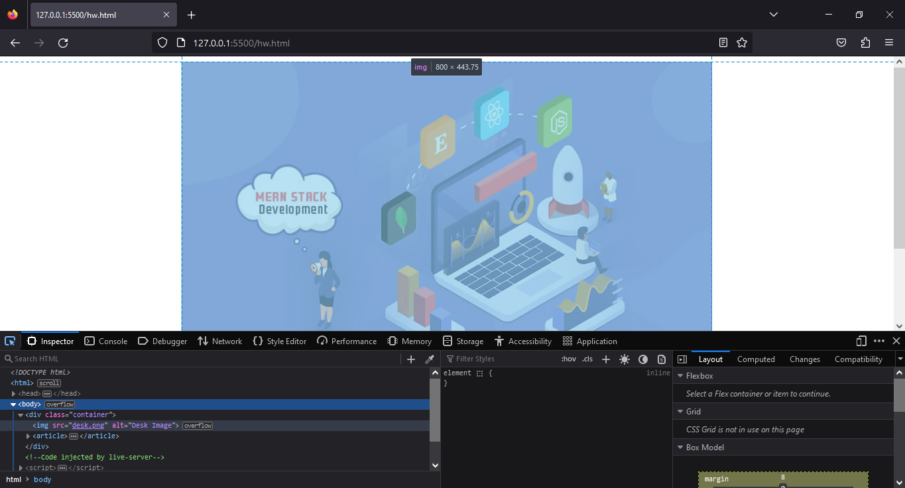
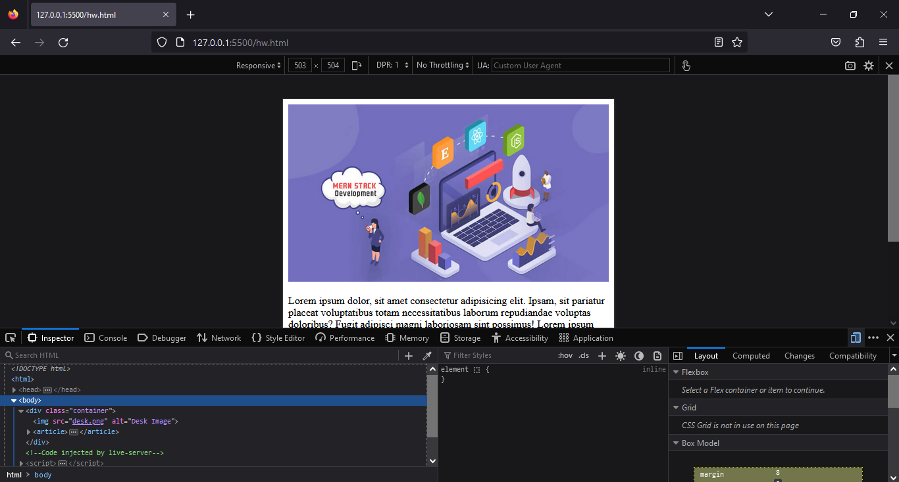
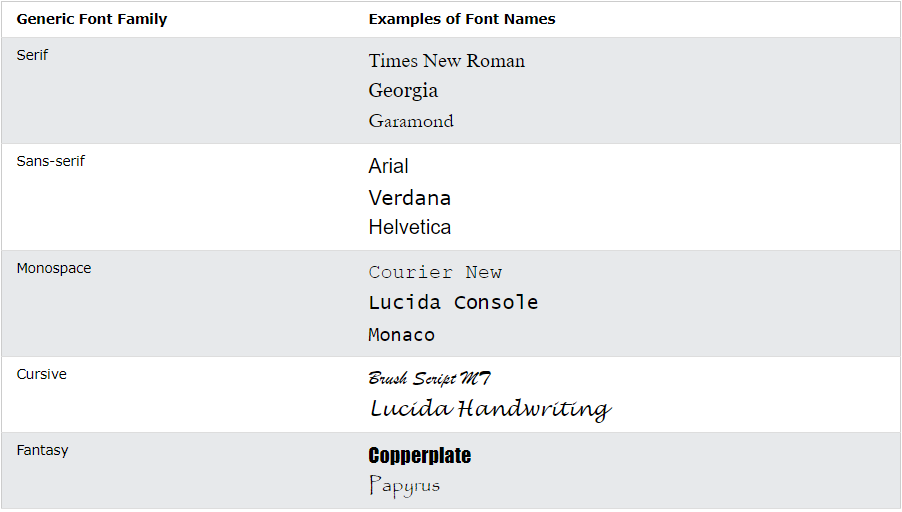

<h1 align="center">CSS Bangla Documentation</h1>

- ## CSS কি?
    
    CSS এর Full Meaning “**Cascading Style Sheets**”. এটি ব্যবহার করা হয় HTML Or XML Document এর Presentation এবং Formatting করতে। CSS এর মাধ্যমে আমরা Web Page এর Layout, Colors, Fonts এবং Animations ইত্যাদি Control করতে পারি। CSS এর মাধ্যমে আমরা Individual HTML Element অথবা Group of HTML Element কে একসাথে Style করতে পারি। CSS Associating Style Rules মেনে Selectors এর মাধ্যমে HTML Element এর উপর Style Provide করে। আমরা  Selectors এর মাধ্যমে যেকোন HTML Element যেমন Heading, Paragraph অথবা Class Assigned করা যেকোন Element এর মধ্যে Style Properties গুলো Apply করতে পারি। CSS এর মাধ্যমে আমরা চাইলে Multiple Web Pages Layout একসাথে Control করতে পারব। CSS Cascading Hierarchy  অনুসরণ করে থাকে, যেটার মাধ্যমে আমরা একটা Element এ Multiple Style Rules Apply করতে পারি। এবং Browser এই Rules গুলোকে নিয়ে একটা Final Style Display করে থাকে। 
    
    মূলত HTML Use করা হয় Website এর Structure তৈরি করতে আর CSS Use করা হয় Creative and Dynamic Webpage design করতে। 
    
    CSS3 হচ্ছে বর্তমানে Latest Version. এখানে আমরা এইটা নিয়েই আলোচনা করব। 
    
- ## CSS আমরা কেন ব্যবহার করব?
    
    CSS ব্যবহার করার জন্য বেশ কিছু গুরুত্বপূর্ণ কারণ রয়েছে। এর মাধ্যমে আমরা HTML ডকুমেন্টের উপস্থাপনা এবং ডিজাইন নিয়ন্ত্রণ করতে পারি। নিচে CSS ব্যবহারের কিছু মূল কারণ উল্লেখ করা হলো:
    
    - CSS ব্যবহার করে HTML ডকুমেন্টের বিভিন্ন উপাদান যেমন Text, Button, Image, Link ইত্যাদির Style (color, font-family, font-size, font-weight, margin, padding etc.) নিয়ন্ত্রণ করা যায়। আমরা বলতে পারি HTML কেবল Content তৈরি করে, আর CSS সেই Content এর  Design নিয়ন্ত্রণ করে থাকে।
    - একই CSS কোড একাধিক পৃষ্ঠায় ব্যবহার করা যায়, যা কোডের পুনঃব্যবহারযোগ্যতা নিশ্চিত করে। এটি ওয়েবসাইট ডিজাইনকে সহজ এবং সংক্ষিপ্ত করে তোলে।
    - CSS ব্যবহার করার ফলে Webpage এর Loading Speed বাড়ে। কারণ, CSS Code একবার Browser এ Load হওয়ার পর, তা Website এর সব অংশে পুনরায় ব্যবহার করা যায়, ফলে Browser এর ওপর চাপ কমে যায়।
    - CSS এর মাধ্যমে বিভিন্ন Browser এবং Device এ Website এর প্রদর্শন সামঞ্জস্যপূর্ণ রাখা সম্ভব। যেমন, Responsive Design বা Media Query ব্যবহার করে Mobile, Tablet, Desktop ইত্যাদি Device এ Website উপযুক্তভাবে প্রদর্শিত করা যায় খুব সহজে।
    - CSS এর মাধ্যমে আমরা ব্যবহারকারীকে Website এ আরও সহজে Navigate(এক webpage থেকে আরেক webpage যাওয়া) করতে সাহায্য করতে পারি। এছাড়া Text Contrast বাড়ানো, বা Font-Size পরিবর্তন করা যাতে যারা দৃষ্টি প্রতিবন্ধী বা বয়স্ক, তারা সহজে পড়তে পারে।
    - CSS এর মাধ্যমে বিভিন্ন ধরনের Visual Effects যেমন Hover Effect, Transition, Animation ইত্যাদি যোগ করা যায়, যা Website কে আরও Attractive এবং Interactive করে তোলে।
    - CSS ব্যবহারে Code আরও সহজ এবং পরিষ্কার হয়। CSS এর মাধ্যমে HTML কোড থেকে Styling আলাদা রাখা সম্ভব, যা Code এর পঠনযোগ্যতা এবং রক্ষণাবেক্ষণ সহজ করে। অর্থাৎ আমরা চাইলে CSS Code আলাদা একটা File এ সংরক্ষণ করতে পারি। এতে HTML File টি পরিষ্কার থাকে যা Code এর পঠনযোগ্যতা সহজ করে দেয়।
    - একই কনটেন্টের জন্য বিভিন্ন ধরনের Design তৈরি করা সম্ভব CSS এর মাধ্যমে। এটি ব্যবহারকারীর জন্য ভিন্ন ভিন্ন Theme বা Layout তৈরি করতে সাহায্য করে।
    
    এইসব কারণে, CSS ওয়েব ডিজাইন এবং ডেভেলপমেন্টের একটি অত্যন্ত গুরুত্বপূর্ণ এবং অপরিহার্য অংশ। আমরা নিচের উদাহারণের মাধ্যমে বিষয়গুলো আরও ভালভাবে বুঝতে পারব। 
    
    আমরা যখন HTML ব্যবহার করে একটা Web Page তৈরি করি তখন এটি সাধারণ Webpage তৈরি হয়ে থাকে যার শুধুমাত্র Content থাকে কিন্তু কোন Style থাকে না। Example:
    
    ```html
    <!DOCTYPE html>
    <html lang="en">
      <head>
        <meta charset="UTF-8" />
        <meta name="viewport" content="width=device-width, initial-scale=1.0" />
        <title>Home</title>
      </head>
      <body>
        <!-- ========== Start Header Section ========== -->
        <header>
          <div>
            <div>
              <h2><a href="#">Logo</a></h2>
            </div>
            <nav>
              <li><a href="#">Home</a></li>
              <li><a href="#">About</a></li>
              <li><a href="#">Services</a></li>
              <li><a href="#">Blog</a></li>
              <li><a href="#">Contact</a></li>
            </nav>
          </div>
        </header>
        <!-- ========== End Header Section ========== -->
    
        <!-- ========== Start Hero Section ========== -->
        <main>
          <div>
            <!-- hero left side start -->
            <div>
              <div>
                <p>Pro.Beyond</p>
                <p>IPhone 14 <span>Pro</span></p>
              </div>
              <p>Created to change everything for the better. For everyone</p>
              <div>
                <button>Shop Now</button>
              </div>
            </div>
            <!-- hero left side end -->
            <!-- hero right side start -->
            <div>
              
            </div>
            <!-- hero right side end -->
          </div>
        </main>
        <!-- ========== End Hero Section ========== -->
    
        <!-- ========== Start footer Section ========== -->
        <footer>
          <p>&copy; Copyright 2024</p>
        </footer>
        <!-- ========== End footer Section ========== -->
      </body>
    </html>
    
    ```
    
    আর আমরা যখন এই সাধারণ Webpage কে রঙ্গিন এবং আকষর্ণীয় করতে চাইব তখন আমাদের এটা করতে সাহায্য করবে CSS. CSS এর মাধ্যমে আমরা একটা Webpage এর চেহেরা সম্পূর্ণ পরিবর্তন করে ফেলতে পারি। উপরের Example টিকে যদি আমরা CSS এর মাধ্যমে Design করি তাহলে যে Look টি হবে সেটা হলঃ
    
    ```html
    <!DOCTYPE html>
    <html lang="en">
      <head>
        <meta charset="UTF-8" />
        <meta name="viewport" content="width=device-width, initial-scale=1.0" />
        <title>Home</title>
        <style>
          * {
            margin: 0;
            padding: 0;
            box-sizing: border-box;
          }
    
          /* basic */
          body {
            font-family: "Segoe UI", Tahoma, Geneva, Verdana, sans-serif;
          }
    
          a {
            text-decoration: none;
          }
    
          li {
            list-style: none;
          }
    
          /* reusable code */
          .container {
            max-width: 1140px;
            height: auto;
            margin: auto;
            height: inherit;
          }
    
          /* header section */
          header {
            height: 70px;
            width: 100%;
            background: lightseagreen;
            box-shadow: 0 2px 5px 0 rgba(0, 0, 0, 0.16),
              0 2px 10px 0 rgba(0, 0, 0, 0.12);
          }
    
          header .container {
            display: flex;
            height: 70px;
            justify-content: space-between;
            align-items: center;
          }
    
          .logo a {
            font-size: 24px;
            line-height: 30px;
            color: white;
          }
    
          nav {
            display: flex;
            justify-content: center;
            align-items: center;
            gap: 12px;
          }
    
          nav li {
            padding: 0px 12px;
            border-radius: 5px;
            transition: all 0.2s ease-in-out;
          }
          nav li:hover {
            & a {
              color: black;
            }
          }
    
          nav li a {
            color: white;
            font-size: 20px;
          }
    
          .active {
            color: black;
          }
    
          /* main Section  */
          main {
            height: 500px;
            width: 100%;
            background-image: linear-gradient(to right, #654ea3, #daafc8);
          }
    
          main .container {
            display: flex;
            align-items: center;
            gap: 10px;
          }
    
          main .hero-left {
            flex-basis: 50%;
          }
          main .hero-right {
            flex-basis: 50%;
            height: 80%;
          }
    
          .hero-img {
            height: 100%;
            width: 100%;
          }
    
          .hero-title {
            display: flex;
            flex-direction: column;
            gap: 8px;
          }
    
          .hero-title .small-title {
            color: white;
            font-size: 20px;
            font-weight: 600;
          }
    
          .hero-title .big-title {
            color: white;
            font-size: 90px;
            font-weight: 100;
            & span {
              font-weight: 600;
            }
          }
    
          .hero-description {
            color: white;
            font-size: 18px;
            font-weight: 500;
          }
    
          .hero-btn {
            height: 56px;
            width: 181px;
            margin-top: 16px;
            font-size: 16px;
            font-weight: 600;
            background: transparent;
            color: white;
            border: 1px solid #ddd;
            border-radius: 8px;
            transition: all 300ms ease-in-out;
            outline: none;
            &:hover {
              background: #eeccff;
              color: #1a1a1a;
              border: 1px solid #dd99ff;
            }
          }
    
          /* footer section */
          footer {
            width: 100%;
            height: 60px;
            background: lightseagreen;
            display: flex;
            justify-content: center;
            align-items: center;
          }
          footer p {
            font-size: 18px;
            font-weight: 600;
          }
    
          /* responsive design */
          @media (max-width: 1140px) {
            .container {
              padding: 0 12px;
            }
          }
    
          /* responsive for tablet devices */
          @media (max-width: 767px) {
            .container {
              padding: 0 12px;
            }
    
            /* main section */
            main {
              height: auto;
            }
            main .container {
              padding-top: 50px;
              flex-direction: column;
            }
            .hero-title {
              align-items: center;
            }
    
            .hero-title .big-title {
              font-size: 75px;
              text-align: center;
            }
    
            .hero-description {
              text-align: center;
            }
    
            .hero-btn-div {
              display: flex;
              justify-content: center;
            }
    
            .hero-right {
              text-align: center;
            }
    
            .hero-img {
              width: 70%;
            }
          }
    
          /* responsive for mobile device */
          @media (max-width: 640px) {
            nav {
              display: flex;
              justify-content: end;
              align-items: center;
              gap: 0px;
            }
    
            nav li {
              padding: 8px 8px;
            }
    
            nav li a {
              font-size: 14px;
            }
    
            /* main section */
            .hero-img {
              width: 100%;
            }
    
            /* footer section */
            footer p {
              font-size: 14px;
            }
          }
        </style>
      </head>
      <body>
        <!-- ========== Start Header Section ========== -->
        <header>
          <div class="container">
            <div>
              <h2 class="logo"><a href="#">Logo</a></h2>
            </div>
            <nav>
              <li><a href="#" class="active">Home</a></li>
              <li><a href="#">About</a></li>
              <li><a href="#">Services</a></li>
              <li><a href="#">Contact</a></li>
            </nav>
          </div>
        </header>
        <!-- ========== End Header Section ========== -->
    
        <!-- ========== Start Hero Section ========== -->
        <main>
          <div class="container">
            <!-- hero left side start -->
            <div class="hero-left">
              <div class="hero-title">
                <p class="small-title">Pro.Beyond</p>
                <p class="big-title">IPhone 14 <span>Pro</span></p>
              </div>
              <p class="hero-description">
                Created to change everything for the better. For everyone
              </p>
              <div class="hero-btn-div">
                <button class="hero-btn">Shop Now</button>
              </div>
            </div>
            <!-- hero left side end -->
            <!-- hero right side start -->
            <div class="hero-right">
              
            </div>
            <!-- hero right side end -->
          </div>
        </main>
        <!-- ========== End Hero Section ========== -->
    
        <!-- ========== Start footer Section ========== -->
        <footer>
          <p>&copy; Copyright 2024</p>
        </footer>
        <!-- ========== End footer Section ========== -->
      </body>
    </html>
    
    ```
    
    ---
    
- ## চলুন জেনে নিই CSS Syntax কিভাবে লিখতে হয়?
    
    CSS Syntax:
    
    
    
    CSS ব্যবহার করার জন্য আমাদের এই Syntax অনুসারে Code লিখতে হবে। এখানে Selector Point করে HTML Element কে। আমরা HTML যেই Element কে Style করতে চাই সেটাকে প্রথমে ধরতে হবে এই Selector এর মাধ্যমে। এই Selector যেকোন HTML Tag হতে পারে বা CSS Class বা CSS Id হতে পারে। এরপর রয়েছে Declaration Block. এক বা একাধিক Declaration Block থাকতে পারে একটা Syntax এর মধ্যে। প্রতিটি  Declaration Block Semicolon(;) দ্বারা আলাদা করা থাকে। প্রতিটি Declaration Block আবার দুইটা অংশে বিভিক্ত Property Name এবং Property Value. এগুলো colon(:) এর মাধ্যমে Separate করা থাকে। Example:
    
    ```css
    p {
      color: red;
      text-align: center;
    }
    ```
    
    - এখানে **`p`**   হচ্ছে CSS Selector. (আমরা যে HTML Element কে Style করতে চায় তাকে নির্দেশ করে।)
    - **`color`** হচ্ছে Property Name. আর **`red`** হচ্ছে Property Value.
    - **`text-align`** হচ্ছে Property Name. আর **`center`** হচ্ছে Property Value.
    
    ---
    
- ## চলুন জেনে নিই CSS Selectors সম্পর্কে।
    
    CSS Selectors ব্যবহার করা হয় HTML Element কে Select করে তার মধ্যে Style প্রধান করতে। CSS Rule Set এর অংশ হচ্ছে এই Selectors. CSS Selectors এর মাধ্যমেই আমরা HTML এর কোন Element এ Style দিতে পারি বা Design করতে পারি। CSS এ বিভিন্ন ধরণের Selector রয়েছে। সেগুলো হলঃ
    
    - CSS Element Selector.
    - CSS Id Selector.
    - CSS Class Selector.
    - CSS Universal Selector.
    - CSS Group Selector.
    - CSS Attribute Selector
    
    ### CSS Element Selector:
    
    CSS Element Selector মূলত HTML Element এর Name ধরেই Select করাকে বুঝায়। যেমন আমরা যদি **`<p>`** Tag এর মধ্যে কোন Style দিতে চাই তাহলে Element Name **`p`** ধরেই আমরা তাকে  Style দিব। Example: 
    
    ```html
    <!DOCTYPE html>
    <html>
      <head>
        <style>
          p{
              text-align: center;
              color: red;
            } 
        </style>
      </head>
      <body>
        <p>Every paragraph will be affected by the style.</p>
        <p>Me too!</p>
        <p>And me!</p>
      </body>
    </html>
    ```
    
    এখানে `p` হচ্ছে CSS Element Selector. এবং এর মধ্যে দুইটা  Declaration আছে। এইভাবে আমরা চাইলে যেকোন Element এর Name ধরে Style দিতে পারি। 
    
    
   > 💡 _Note_: CSS Element Selector এর একটা প্রবলেম আছে সেটা হচ্ছে আমরা যদি কোন HTML Element এর Name ধরে একটা Style দিয়ে থাকি, তাহলে সম্পূর্ণ Website এ সকল Same Element একই Style পাবে। এই সমস্যা সমাধানের জন্য আমরা Id এবং Class Selector ব্যবহার করে থাকি।

    
    ### CSS Id Selector:
    
    CSS Id Selector মূলত HTML Element এর Id Attribute এর মাধ্যমে একটা Specific Element কে ধরে Style করার জন্য ব্যবহার করা হয়। Id Attribute এর মাধ্যমে আমরা Unique Element Select করে Style দিতে পারি। Id Attribute মূলত Single Element কে Style করতে ব্যবহার করা হয়। CSS Id Selector একটা Web Page এ, Unique হতে হয়। অর্থাৎ একটা Page এ Same নামের একটাই Id থাকতে পারবে। CSS Id Selector Use করার জন্য Id Name এর আগে(#) ব্যবহার করতে হবে। Example:
    
    ```css
    <!DOCTYPE html>
    <html>
      <head>
        <style>
          #para1 {
            text-align: center;
            color: red;
          }
        </style>
      </head>
      <body>
        <p id="para1">Hello World!</p>
        <p>This paragraph is not affected by the style.</p>
      </body>
    </html>
    ```
    
    - এখানে **`#para1`** একটা CSS Id Selector এবং এর মধ্যে দুইটা Declaration আছে। (#) এর মাধ্যমে Browser বুজতে পারবে এটা একটা Id Selector  এবং মনে রাখতে হবে এই Website HTML file এর মধ্যে  **`#para1`** নামে শুধুমাত্র একটাই Id Selector থাকবে।
    
    ### **CSS Class Selector:**
    
    CSS Class Selector মূলত HTML Element এর Class Attribute এর মাধ্যমে এক বা একাধিক Element কে ধরে Style করার জন্য ব্যবহার করা হয়। Class Selector এর মাধ্যমে আমরা চাইলে একটা Element বা একাধিক Element কে Same Style প্রধান করতে পারি মাত্র একবার Code লিখে। এজন্য Website তৈরিতে CSS Class Selector বেশি ব্যবহার করা হয়। CSS Class Selector Use করার জন্য Class Name এর আগে(.) ব্যবহার করতে হবে। Example:
    
    ```html
    <!DOCTYPE html>
    <html>
      <head>
        <style>
          .center {
            text-align: center;
            color: red;
          }
        </style>
      </head>
      <body>
        <h1 class="center">Red and center-aligned heading</h1>
        <p class="center">Red and center-aligned paragraph.</p>
      </body>
    </html>
    ```
    
    - এখানে **`.center`** একটা CSS Class Selector এবং এর মধ্যে দুইটা  Declaration আছে। (.) এর মাধ্যমে Browser বুজতে পারবে এটা একটা Class Selector.
    
    আমরা যদি চাই Class Selector এর মাধ্যমে শুধুমাত্র একটা HTML Element কে নির্দিষ্ট করে Style করতে, তাহলে Element Name এর সাথে Class Selector টা ব্যবহার করতে হবে। Example:
    
    ```html
    <!DOCTYPE html>
    <html>
      <head>
        <style>
          p.center {
            text-align: center;
            color: red;
          }
        </style>
      </head>
      <body>
        <h1 class="center">This heading will not be affected</h1>
        <p class="center">This paragraph will be red and center-aligned.</p>
      </body>
    </html> 
    ```
    
    আমরা HTML Element এর **`Class`** Attribute এর মধ্যে একাধিক Class কে Refer করতে পারি। অর্থাৎ একটি **`Class`** Attribute এর মধ্যে একাধিক Class কে reference হিসেবে ব্যবহার করতে পারব।  Example:
    
    ```html
    <!DOCTYPE html>
    <html>
        <head>
          <style>
            p.center {
                text-align: center;
                color: red;
              }
            p.large {
                font-size: 300%;
              }
          </style>
        </head>
        <body>
          <h1 class="center">This heading will not be affected</h1>
          <p class="center">This paragraph will be red and center-aligned.</p>
          <p class="center large">This paragraph will be red, center-aligned, and in a large font-size.</p> 
        </body>
    </html>
    ```
    
    ### **CSS Universal Selector:**
    
    Universal Selector(*) এর মাধ্যমে আমরা একটা Page এর সবগুলো Elements কে একসাথে Style দিতে পারি। Example:
    
    ```html
    <!DOCTYPE html>
    <html>
        <head>
          <style>
            *{
              text-align: center;
              color: blue;
            }
          </style>
        </head>
        <body>
          <h1>Hello world!</h1>
          <p>Every element on the page will be affected by the style.</p>
          <p id="para1">Me too!</p>
          <p>And me!</p>
        </body>
    </html>
    ```
    
    ### **CSS Group Selector:**
    
    CSS Group Selector ব্যবহার করা হয় সকল Element কে একসাথে Same Style দিতে এবং Code Minimize করতে। Group Selector কে Comma( , ) দ্বারা আলাদা করা হয়। 
    
    যেমন আমরা যদি **`<h1>`** Tag কে একটা Design দিয়ে থাকি, এবং Same Design আমরা **`<h2>`** Tag ও **`<p>`** Tag এর মধ্যেও ব্যবহার করব। তাহলে আমাদের কিন্তু Same code অনেকবার লিখতে হবে। Example:
    
    ```css
    h1 {
      text-align: center;
      color: red;
    }
    
    h2 {
      text-align: center;
      color: red;
    }
    
    p {
      text-align: center;
      color: red;
    }
    ```
    
    এখানে Same Declarations প্রতিটি Element Selector এ ব্যবহার করা হয়েছে। আমরা চাইলে  Group Selector এর মাধ্যমে Code গুলো Minimize করে ফেলতে পারি। Example:
    
    ```html
    <!DOCTYPE html>
    <html>
        <head>
          <style>
            h1, h2, p {
                  text-align: center;
                  color: red;
              }
          </style>
        </head>
        <body>
          <h1>Hello World!</h1>
          <h2>Smaller heading!</h2>
          <p>This is a paragraph.</p>
        </body>
    </html>
    ```
    
    ### CSS Attribute Selector:
    
    **CSS Attribute Selector** হলো একটি CSS সিলেক্টর যা HTML Element এর Attribute এর মানের ভিত্তিতে সেগুলিকে Select করে থাকে। সাধারণত, আমরা CSS Class বা Id Selector দিয়ে উপাদানগুলোকে নির্বাচন করি, কিন্তু Attribute Selector দিয়ে আমরা নির্দিষ্ট Attribute বা তাদের মানের ওপর ভিত্তি করে উপাদানগুলোকে Style করতে পারি।
    
    **CSS Attribute Selector এর ধরনসমূহ:**
    
    - **[attribute]** → যদি নির্দিষ্ট Attribute থাকে।
    - **[attribute="value"]** → যদি নির্দিষ্ট Attribute এর মান সমান হয়।
    - **[attribute~="value"]** → যদি Attribute এর Value এর শব্দের মধ্যে নির্দিষ্ট মান থাকে।
    - **[attribute^="value"]** → যদি Attribute এর Value নির্দিষ্ট Word দিয়ে শুরু হয়।
    - **[attribute$="value"]** → যদি Attribute এর Value নির্দিষ্ট Word দিয়ে শেষ হয়।
    - **[attribute\*="value"]** → যদি Attribute এর Value এর শব্দের মধ্যে নির্দিষ্ট  কিছু অংশ থাকে।
    - **[attribute|="value"]** → যদি Attribute এর Value নির্দিষ্ট Word দিয়ে শুরু হয়।
    
    1. **CSS `[attribute]` Selector:** 
    
        এই Selector টি ব্যবহার করা হয় যখন আমরা কোন Element এর একটি নির্দিষ্ট Attribute এর উপস্থিতি চেক করতে চাই, Value যাই হোক না কেন।  Example: 
        
        ```html
        <!DOCTYPE html>
        <html lang="en">
          <head>
            <style>
              /* যেকোনো <a> ট্যাগ যেটির href Attribute রয়েছে */
              a[href] {
                color: green;
              }
            </style>
          </head>
          <body>
            <a href="https://www.example.com">Visit Example</a>
            <a>No Link</a>
          </body>
        </html>
        ```
        
        এখানে, প্রথম **`<a>`** Tag টি যেটির **`href`** Attribute রয়েছে, সেটি Green Color এ প্রদর্শিত হবে। দ্বিতীয় **`<a>`** ট্যাগটি যেটিতে **`href`** Attribute নেই, সেটিতে কোনো Color প্রদর্শিত হবে না।
    
    2. **CSS `[attribute="value"]` Selector:**
    
        এই Selector টি ব্যবহার করা হয় যখন আমরা একটি নির্দিষ্ট Attribute এর মানের জন্য Select করতে চাই। Example:
        
        ```html
        <!DOCTYPE html>
        <html lang="en">
          <head>
            <style>
              /* যেকোনো <input> ট্যাগ যেটির type Attribute "text" রয়েছে */
              input[type="text"] {
                background-color: lightblue;
              }
            </style>
          </head>
          <body>
            <input type="text" placeholder="Enter your name" />
            <input type="password" placeholder="Enter password" />
          </body>
        </html>
        ```
        
        এখানে, প্রথম **`<input>`** ট্যাগটি যেটি **`type="text"`** Attribute রয়েছে, সেটি হালকা নীল background পাবে। দ্বিতীয় **`<input>`** ট্যাগে **`type="password"`** Attribute রয়েছে, তাই সেটি পরিবর্তিত হবে না।

    3. **CSS `[attribute~="value"]` Selector:**
    
        এই Selector টি ব্যবহার করা হয় যখন আমরা একটি Attribute এর Value তে নির্দিষ্ট Word টি উপস্থিত থাকলে Select করতে চাই। এখানে **`~`** ব্যবহার করা হয়, যা Value এর মধ্যে Word এর মিল খোঁজে থাকে। Example:
        
        ```html
        <!DOCTYPE html>
        <html lang="en">
          <head>
            <style>
              /* যেকোনো <a> ট্যাগ যেটির class অ্যাট্রিবিউটের মধ্যে "active" word রয়েছে */
              a[class~="active"] {
                color: red;
              }
            </style>
          </head>
          <body>
            <a class="active nav-link">Home</a>
            <a class="nav-link">About</a>
            <a class="nav-link">Contact</a>
          </body>
        </html>
        ```
        
        এখানে, প্রথম **`<a>`** Tag এর **`class`** Attribute Value এর মধ্যে **`"active"`**  word টি রয়েছে, তাই সেটি Red Color এ প্রদর্শিত হবে। দ্বিতীয় ও তৃতীয়  **`<a>`** Tag এর **`class`** Attribute Value এর মধ্যে **`"active"`** Word টি নেই, তাই সেটির Color পরিবর্তন হবে না।

    4. **CSS `[attribute^="value"]` Selector:**
    
        এই Selector টি ব্যবহার করা হয় যখন আমরা একটি Attribute এর Value এর শুরুতে নির্দিষ্ট Word  উপস্থিত থাকলে Select করতে চাই। এখানে `^` ব্যবহার করা হয়, যা Value এর মধ্যে শুরুতে Word এর মিল খোঁজে থাকে। Example:
        
        ```html
        <!DOCTYPE html>
        <html lang="en">
          <head>
            <style>
              /* যেকোনো <a> ট্যাগ যেটির href অ্যাট্রিবিউট "https://" দিয়ে শুরু হয় */
              a[href^="https://"]
              {
                color: green;
              }
            </style>
          </head>
          <body>
            <a href="https://www.example.com">Example 1</a>
            <a href="http://www.test.com">Test 1</a>
          </body>
        </html>
        ```
        
        এখানে, প্রথম **`<a>`** Tag টি যেটির **`href`** Attribute Value  **`https://`** দিয়ে শুরু হয়, সেটি Green Color এ প্রদর্শিত হবে। দ্বিতীয় **`<a>`** Tag টি যেটির **`href`** Attribute Value  **`http://`** দিয়ে শুরু হয়, তাই সেটির কোন পরিবর্তন হবে না।

    5. **CSS `[attribute$="value"]` Selector:**
    
        এই Selector টি ব্যবহার করা হয় যখন আমরা একটি Attribute এর Value এর শেষের দিকে নির্দিষ্ট Word  উপস্থিত থাকলে Select করতে চাই। এখানে **`$`** ব্যবহার করা হয়, যা Value এর মধ্যে শেষের দিকে Word এর মিল খোঁজে থাকে। Example:
        
        ```html
        <!DOCTYPE html>
        <html lang="en">
          <head>
            <style>
              /* যেকোনো <a> ট্যাগ যেটির href অ্যাট্রিবিউট ".com" দিয়ে শেষ হয় */
              a[href$=".com"] {
                font-weight: bold;
              }
            </style>
          </head>
          <body>
            <a href="https://www.example.com">Example Link</a>
            <a href="https://www.test.org">Test Link</a>
          </body>
        </html>
        ```
        
        এখানে, প্রথম **`<a>`** Tag টি যেটির **`href`** Attribute Value **`.com`** দিয়ে শেষ হয়, সেটি Bold হবে। দ্বিতীয় **`<a>`** Tag টি যেটির **`href`** Attribute Value **`.org`** দিয়ে শেষ হয়, সেটি Bold হবে না।

    6. **CSS `[attribute*="value"]` Selector:**
    
        এই Selector টি ব্যবহার করা হয় যখন আমরা একটি Attribute এর Value এর মধ্যে নির্দিষ্ট Word  উপস্থিত থাকলে Select করতে চাই। এখানে **`*`** ব্যবহার করা হয়, যা Value এর মধ্যে নির্দিষ্ট Word এর মিল খোঁজে থাকে। Example:
        
        ```html
        <!DOCTYPE html>
        <html lang="en">
          <head>
            <style>
              /* যেকোনো <a> ট্যাগ যেটির href অ্যাট্রিবিউটে "example" শব্দ রয়েছে */
              a[href*="example"] {
                color: green;
              }
            </style>
          </head>
          <body>
            <a href="https://www.example.com">Example Link</a>
            <a href="https://www.testexample.com">Test Example Link</a>
            <a href="https://www.othertest.com">Other Test Link</a>
          </body>
        </html>
        ```
        
        এখানে, প্রথম দুটি **`<a>`** Tag এর **`href`** Attribute Value এর মধ্যে **`"example"`** শব্দটি রয়েছে, তাই সেগুলোর লেখা Green Color এ প্রদর্শিত হবে। তৃতীয় **`<a>`** Tag এর **`href`** Attribute Value এর মধ্যে **`"example"`** শব্দটি নেই, তাই সেটি পরিবর্তিত হবে না।

    6. **CSS `[attribute|="value"]` Selector:**

        এই Selector টি এমন Element Select করতে ব্যবহৃত হয় যেগুলোর একটি নির্দিষ্ট Attribute এর মান যেকোনো একটি নির্দিষ্ট Word দিয়ে শুরু হয় এবং এর পরে কোনো অন্যান্য অংশ (যেমন হাইফেন `-`) থাকতে পারে। এটি সাধারণত ভাষার কোড (language code) বা জাতিগত কোডের মতো মানের জন্য ব্যবহার করা হয়। Example:
        
        ```html
        <!DOCTYPE html>
        <html lang="en">
          <head>
            <style>
              /* যেকোনো উপাদান যাদের lang অ্যাট্রিবিউট "en" অথবা "en-" দিয়ে শুরু হয় */
              p[lang|="en"] {
                font-family: Arial, sans-serif;
                color: blue;
              }
            </style>
          </head>
          <body>
            <p lang="en">English Heading</p>
            <p lang="en-US">This is English (United States)</p>
            <p lang="en-GB">This is English (Great Britain)</p>
            <p lang="fr">Ceci est un texte en français.</p>
          </body>
        </html>
        ```
        
        এখানে প্রথম, দ্বিতীয়, তৃতীয় **`p`** Tag এর **`lang`** Attribute value এর মধ্যে **`en`** এবং **`en-`** আছে তাই তাদের font এবং color পরিবর্তন হবে। কিন্তু ৪র্থ **`p`** Tag এর **`lang`** Attribute value এর মধ্যে **`fr`** আছে তাই এর font এবং color পরিবর্তন হবে না।
        
        সুতারাং CSS Attribute Selectors খুবই শক্তিশালী একটি Tool যা HTML Element গুলোর Attribute  এবং  Value এর উপর ভিত্তি করে সিলেকশন এবং Styling করতে সাহায্য করে। এই Selector গুলোর মাধ্যমে আমরা Element গুলোকে আরও নির্দিষ্টভাবে Customize করতে পারি। যেমন কোন নির্দিষ্ট Attribute এর Value বা Value এর মধ্যে উপস্থিত অংশের ভিত্তিতে।
    
        ---
    
- ## চলুন জেনে নিই কিভাবে HTML Documents এর মধ্যে CSS লিখতে হয়?
    
    HTML Document কে Style করতে চাইলে আমাদেরকে অবশ্যই CSS ব্যবহার করতে হবে। আমরা তিনভাবে CSS কে HTML Document এর মধ্যে লিখতে পারি। 
    
    - Inline CSS
    - Internal CSS
    - External CSS.
    
    ### **Inline CSS:**
    
    Inline CSS এর ব্যবহার আমরা HTML শিখার সময় দেখেছি। Inline CSS মূলত Element এর ভিতরেই **`style`** Attribute এর মধ্যে CSS Syntax লেখা হয়। এটি Single Element এর Unique Style হিসেবে ব্যবহার করা হয়। Example:
    
    ```html
    <!DOCTYPE html>
    <html>
        <body>
            <h1 style="color:blue;text-align:center;">This is a heading</h1>
            <p style="color:red;">This is a paragraph.</p>
        </body>
    </html>
    ```
    
    ---
    
    ### **Internal CSS:**
    
    Internal CSS ব্যবহার করা হয় কোন একটা Single Document বা Page এর Style এর জন্য। Internal CSS এই Page এর সকল Elements কে Style প্রধান করত পারে। Internal CSS লেখা হয় HTML Document এর **`<head>`** Element এর ভিতরে **`<style>`** Element এর মধ্যে। Example:
    
    ```html
    <!DOCTYPE html>
    <html>
        <head>
          <style>
            body {
                background-color: linen;
              }
            h1 {
                color: maroon;
                text-align:center;
              } 
          </style>
        </head>
        <body>
          <h1>This is a heading</h1>
          <p>This is a paragraph.</p>
        </body>
    </html>
    ```
    
    ---
    
    ### External CSS:
    
    External CSS ব্যবহার করা হয় Multiple Pages বা সকল Page কে Style প্রধান করতে। External CSS লেখার জন্য আমাদেরকে আলাদা একটি File নিতে হবে যেভাবে আমরা একটা HTML File নিয়েছি ঠিক সেইভাবে। এটার ক্ষেত্রে Extension হিসেবে আমরা দিব **`.css`** । যেমন File Path হবে **`style.css`** । এখানে **style** হচ্ছে File Name এবং **`.css`**  হচ্ছে File Extension. File Name আমরা যেকোন কিছু দিতে পারি কিন্তু File Extension অবশ্যই **`.css`** দিতে হবে। File নেওয়ার পরে আমরা সেই File এর মধ্যে আমাদের সকল CSS Style লিখতে পারব। Example:
    
    ```css
    body {
      background-color: lightblue;
    }
    
    h1 {
      color: navy;
      text-align:center;
    }
    ```
    
    Inline এবং Internal CSS এ **`<style>`** Tag ব্যবহার করতে হয়। কিন্তু এইটার ক্ষেত্রে সেটা ব্যবহারের দরকার নেই। এখন এই File টিকে আমরা যদি HTML Document এ ব্যবহার করতে চাই তাহলে আমাদেরকে এই File টি HTML File এর সাথে Link করতে হবে। Link করার জন্য আমরা **`<link>`** Tag টি ব্যবহার করব। CSS File টি Link করার জন্য **`<head>`** Element এর মধ্যে **`<link>`** Tag ব্যবহার করতে হবে। Example:
    
    ```html
    <!DOCTYPE html>
    <html>
        <head>
          <link rel="stylesheet" href="style.css">
        </head>
        <body>
          <h1>This is a heading</h1>
          <p>This is a paragraph.</p>
        </body>
    </html>
    ```
    
    Link Complete করার জন্য আমাদেরকে **`<link>`** Tag এর মধ্যে **`rel`** Attribute এর মাধ্যমে বলে দিতে হবে যেই File টি Link করব সেটা কি ধরণের File(যেমন আমরা এখানে বলে দিয়েছি এটা stylesheet File.) এবং **`href`** Attribute এর মাধ্যমে File path টি দেখিয়ে দিতে হবে।
    

    > 💡 **_Note_:** Inline CSS খুবই কম ব্যবহার হয়। কারণ এটা ব্যবহার করলে আমরা পরবর্তীতে বাইরে থেকে কোন Style এই Element এর উপর Apply করতে পারব না। CSS Rules এর মধ্যে এই  Element এর জন্য যেটা সবার শেষে Style দেওয়া আছে সেটায় Browser Display করবে। যেমন আমরা **`<h1>`** Tag এর জন্য External CSS File(**style.css**) এ Style লিখলাম `color: red;` আবার Internal CSS এর মধ্যে **`<h1>`** Tag এর জন্য Style লিখলাম `color: blue;` এবং  **`<h1>`** Tag এর মধ্যে Inline CSS এ Style লিখলাম `color: green;` এখন প্রশ্ন হচ্ছে Browser কোন Color টাকে Display করবে। উত্তর হচ্ছে inline CSS কে প্রাধান্য দিবে অর্থাৎ **`<h1>`** Tag এর Color **green** দেখাবে। কারন Browser Always শেষের CSS টা Display করে। এখন আমরা যদি Inline CSS ব্যবহার না করতাম থাহলে কোনটা দেখাবে? উত্তর হচ্ছে Internal CSS কে প্রাধান্য দিবে অর্থাৎ **`<h1>`** Tag এর Color **blue** দেখাবে। কারণ Internal CSS টা এইক্ষেত্রে সবার শেষে আছে। যেটা সবার শেষে থাকবে সেটা আগের Code গুলোকে Override করে দিবে। মোটকথা Highest Priority পাবে Inline CSS. এইজন্য Inline CSS কম ব্যবহার করা হয়।
   
    ---
    
- ## চলুন জেনে নিই কিভাবে Comment লিখতে হবে CSS এর মধ্যে?
    
    HTML Comments এর মত CSS Comments ও Browser এ Display হয় না। অর্থাৎ Browser এটাকে Ignore করে। HTML এর মত CSS এর মধ্যেও যদি আমরা Code এর Explanation লিখে রাখতে চাই তাহলে আমরা CSS Comment ব্যবহার করতে পারব। Comment করে রাখলে Developer যখন Code টা পড়বে তখন তার Code বুঝতে সুবিধা হবে। CSS Comment লিখতে হয় **`/* …….. */`**  এর মধ্যে। Example:
    
    ```html
    <!DOCTYPE html>  
    <html>  
        <head>  
          <style>  
              p {  
                  color: blue;   /* This is a single-line comment */  
                  text-align: center; /* This is a single-line comment */ 
                }   
              /* This is  
                  a multi-line  
                  comment */  
          </style>  
        </head>  
        <body>  
          <p>Hello</p>  
          <p>This statement is styled with CSS.</p>  
          <p>CSS comments are ignored by the browsers and not shown in the output.</p>  
        </body>  
    </html>
    ```
    
    ---
    
- ## চলুন জেনে নিই CSS Colors সম্পর্কে।
    
    CSS এ Color Property ব্যবহার করা হয় কোন Element এর Color Set করতে। মূলত এটা ব্যবহার করা হয় কোন Element এর Font Color এবং Background Color Set করতে। এছাড়া আমরা আরও বিভিন্ন জায়গায় ব্যবহার করতে পারি। যেমন CSS Border Color দিতেও এটা ব্যবহার করা হয়। 
    
    আমরা নিম্নলিখিত উপায়গুলি ব্যবহার করে একটি Element এর Color নির্ধারণ করতে পারি:
    
    - RGB format.
    - RGBA format.
    - Hexadecimal notation.
    - HSL.
    - HSLA.
    - Built-in color.
    
    ### RGB Format:
    
    RGB ফরম্যাট হল 'RED, GREEN এবং BLUE'-এর সংক্ষিপ্ত রূপ। যা 0 থেকে 255-এর মধ্যে R, G, B-এর Value গুলি নির্দিষ্ট করে একটি HTML Element এর Color Define করার জন্য ব্যবহৃত হয়। এই Format Use করার জন্য **`rgb()`** Property ব্যবহার করতে হয়। এই Property তিন ধরণের Values গ্রহণ করে থাকে। এই Property Value Percentage অথবা Integer(0 থেকে 255) হয়ে থাকে। Example: 
    
    RGB Syntax: **`rgb(red, green, blue)`**  
    
    - Black Color: **`rgb(0,0,0)`**
    - White Color: **`rgb(255,255,255)`**
    - Red Color: **`rgb(255, 0 , 0)`**
    
    এভাবে আমরা Value Change করে বিভিন্ন Color তৈরি করতে পারব।
    
    ---
    
    ### RGBA Format:
    
    RGBA Format সম্পূর্ণ RGB Format এর মত। এখানে শুধু Extra ভাবে আমরা Alpha Value Add করতে পারব যেটার মাধ্যমে কোন Element এর Color Transparency বাড়াতে বা কমাতে পারব। সাধারণত Alpha Value Range 0.0 থেকে 1 পর্যন্ত হয়ে থাকে। Alpha Value 0.0 মানে হচ্ছে Element Color সম্পূর্ণ Transparent হয়ে যাবে আর Alpha Value 1 মানে হচ্ছে Transparent নয়। Example:
    
    **RGBA Syntax:** **`rgba(red,green,blue,alpha)`**   **`rgba(255,99,71,0.6)`**
    
    ---
    
    ### Hexadecimal Notation:
    
    আমরা চাইলে Hexadecimal Value এর মাধ্যমেও CSS Color দিতে পারি। Hexadecimal Notation শুরু হয় (#) Symbol এর মাধ্যমে এবং এর পরে Six Digit বসে যা Color Representation হিসেবে কাজ করে। এই Six Digit Characters এর Range  হয়ে থাকে 0 থেকে F এর মধ্যে। প্রথম দুইটা Digit Represent করে Red(RR) Color Value কে, পরের দুইটা Digits Represent করে Green(GG) Color Value কে এবং শেষের দুইটা Digit Represent করে Blue(BB) Color Value কে. Example:
    
    HEX Value Syntax: **`#(0-F)(0-F)(0-F)(0-F)(0-F)(0-F)`**
    
    - Black Color: **`#000000`**
    - White Color: **`#ffffff`**
    - Red Color: **`#ff0000`**
    
    এভাবে আমরা Value Change করে বিভিন্ন Color তৈরি করতে পারব। এছাড়া আমরা চাইলে 3 Digit দিয়েও HEX Color তৈরি করতে পারব। এইটাকে Short HEX Value বলা হয়। Example:
    
    - Black Color: **`#000`**
    - White Color: **`#fff`**
    - Red Color: **`#f00`**
    
    ---
    
    ### HSL Value:
    
    HSL হচ্ছে Hue, Saturation এবং Lightness এর Short form. 
    
    **Hue:**  এটি হল 0 থেকে 360 পর্যন্ত Color Wheel এর একটি ডিগ্রী। এখানে 0 হচ্ছে Red Color, 120 হচ্ছে Green Color এবং 240 হচ্ছে Blue Color. 
    
    **Saturation:** এটি হল একটি Percentage Value. এখানে 0% মানে হচ্ছে Shade of Gray Color এবং 100% মানে হচ্ছে সম্পূর্ণ Color.
    
    **Lightness**: এটিও Saturation এর মত Percentage Value হিসেবে কাজ করে। তবে এটার 0% মানে বুঝায় Black, 50% মানে বুঝায় Not Light, Not Dark এবং 100% মানে বুঝায় সম্পূর্ণ White Color.
    
    Example: 
    
    HSL Value Syntax: **`hsl(*hue*, *saturation*, *lightness*)`**
    
    - Red Color: **`hsl(0,100%,50%)`**
    - Blue Color: **`hsl(240,100%,50%)`**
    - Green Color: **`hsl(150,50%,50%)`**
    
    ---
    
    ### HSLA Value:
    
    HLSA Value ও HSL Value এর মত কাজ করে। এখানে RGBA Value এর মত শুধু Alpha Value Add করতে হয় যেটার মাধ্যমে কোন Element এর Color Transparency বাড়াতে বা কমাতে পারব। সাধারণত Alpha Value Range 0.0 থেকে 1 পর্যন্ত হয়ে থাকে। Alpha Value 0.0 মানে হচ্ছে Element Color সম্পূর্ণ Transparent হয়ে যাবে আর Alpha Value 1 মানে হচ্ছে Transparent নয়। Example: 
    
    HSLA Value Syntax: **`hsla(*hue,* *saturation*, *lightness, alpha*)`  `hsla(9, 100%, 64%, 0.8)`**
    
    ---
    
    ### **Build-in Color:**
    
    Build-in Color বলতে যেসকল Color এর সরাসরি নাম থাকে সেগুলোকে বুঝায়। যেমন Red, Green, Blue, Orange ইত্যাদি। Example:
    
    Build-in Color Syntax: **`color: color-name;`**  **`color: red;`**  
    
    নিচে কিছু Build-in Color এবং তার সাথে সেই Color এর HEX Value এবং RGB Value এর একটা Table দেওয়া হল:
    
    | S.no. | Color name | Hexadecimal Value |     RGB value |
    | --- | --- | --- | --- |
    | **1.** | Red | #FF0000 | rgb(255,0,0) |
    | **2.** | Orange | #FFA500 | rgb(255,165,0) |
    | **3.** | Yellow | #FFFF00 | rgb(255,255,0) |
    | **4.** | Pink | #FFC0CB | rgb(255,192,203) |
    | **5.** | Green | #008000 | rgb(0,128,0) |
    | **6.** | Violet | #EE82EE | rgb(238,130,238) |
    | **7.** | Blue | #0000FF | rgb(0,0,255) |
    | **8.** | Aqua | #00FFFF | rgb(0,255,255) |
    | **9.** | Brown | #A52A2A | rgb(165,42,42) |
    | **10.** | White | #FFFFFF | rgb(255,255,255) |
    | **11.** | Gray | #808080 | rgb(128,128,128) |
    | **12.** | Black | #000000 | rgb(0,0,0) |
    
    > সকল Browser Support করে এই রকম ১৪০টি Colors Name and HEX Value Link নিচে দেওয়া হল।
    
    
    [HTML Color Names](https://www.w3schools.com/colors/colors_names.asp)
    
    
    > 💡 **_Note_:** RGB Value সকল Browser Support করে না। তাই এটি ব্যবহার করতে নিষেধ করা হয় যদি সকল Browser Support কোন কিছু তৈরি করার Plan থাকে।
    
    ---
    
- ## চলুন জেনে নিই CSS Background Property সম্পর্কে।
    
    CSS Background Property ব্যবহার করা হয় কোন Element এর Background Effects দেওয়ার জন্য। CSS এ ৫ ধরণের Background Properties রয়েছে যেগুলোর মাধ্যমে কোন Element এর Background Effects দেওয়া যায়। সেগুলো হলঃ
    
    - background-color
    - background-image
    - background-repeat
    - background-position
    - background-attachment
    - background-size
    
    ### CSS background-color:
    
    CSS **`background-color`**  Property ব্যবহার করা হয় কোন Element এর Background Color নির্দিষ্ট করে দিতে। Example:
    
    ```html
    <!DOCTYPE html>
    <html>
        <head>
          <style>
            body {
                background-color: lightblue;
            }
          </style>
        </head>
        <body>
          <h1>Hello World!</h1>
          <p>This page has a light blue background color!</p>
        </body>
    </html>
    ```
    
    এখানে আমরা চাইলে CSS Color এর যেকোন Color ব্যবহার করতে পারব। যেমন HEX Color, HSL Color ইত্যাদি।
    
    ---
    
    ### CSS background-image:
    
    CSS **`background-image`** ব্যবহার করা হয় কোন Element এর Background Image Set করতে। By Default Image Repeated হয়ে পুরু Element কে Cover করার চেষ্টা করে যদি Image এর Size Element এর Size Ratio থেকে ছোট হয় সেইক্ষেত্রে। Background এ Image Set করতে হলে CSS Property Value তে **`url(”image path”)`** এর মাধ্যমে Set করতে পারব। Example:
    
    ```html
    <!DOCTYPE html>
    <html>
        <head>
          <style>
            body {
                background-image: url("paper.gif");
              }
          </style>
        </head>
        <body>
          <h1>Hello World!</h1>
          <p>This page has an image as the background!</p>
        </body>
    </html>
    ```
    
    Background Image নির্বাচন করার সময় মাথায় রাখতে হবে Text Color আর Background Image Color যেন এক হয়ে না যায়। অর্থাৎ এমন যেন না হয়ে যায় যে Website এর  Text পড়তে User এর অসুবিধা হয়। Example:
    
    ```html
    <!DOCTYPE html>
    <html>
        <head>
          <style>
            body {
                background-image: url("bgdesert.jpg");
              }
          </style>
        </head>
        <body>
          <h1>Hello World!</h1>
          <p>This text is not easy to read on this background image.</p>
        </body>
    </html>
    ```
    
    এটা Text এবং Background Image এর জন্য Bad Combination. এখানে Text পড়তে অনেক অসুবিধা হবে। এইজন্য আমাদের এমন Background Image Use করা উচিত যেটা Text পড়াকে Disturb করবে না।
    
    ---
    
    ### CSS background-repeat:
    
    By Default, Background Image Size যদি Element এর Size Ratio থেকে ছোট হয় তখন **`background-image`** Property Image টাকে Repeats করে Horizontally(আড়া-আড়িভাবে) এবং Vertically(লম্বা-লম্বিভাবে). কিছু Image আছে যেগুলো Repeat হয় শুধু Horizontally Or Vertically. তখন এটাকে দেখতে খুবই বাঝে দেখায়। Example:
    
    ```html
    <!DOCTYPE html>
    <html>
        <head>
          <style>
            body {
                background-image: url("gradient_bg.png");
              }
          </style>
        </head>
        <body>
          <h1>Hello World!</h1>
          <p>Strange background image...</p>
        </body>
    </html>
    ```
    
    যদি উপরের Image কে শুধুমাত্র Horizontally Repeat করাতে চাই তাহলে (**`background-repeat: repeat-x;`**) এর মাধ্যমে করতে পারি। এতে Background Image দেখতে অনেক ভাল দেখাবে। Example:
    
    ```html
    <!DOCTYPE html>
    <html>
        <head>
          <style>
            body {
                background-image: url("gradient_bg.png");
                background-repeat: repeat-x;
              }
          </style>
        </head>
        <body>
          <h1>Hello World!</h1>
          <p>Here, a background image is repeated only horizontally!</p>
        </body>
    </html>
    ```
    
    
    >💡 **_Note_:** আমরা Background Image টিকে যদি Vertically Set করতে চাই থাহলে (**`background-repeat: repeat-y;`**) Use করতে হবে।
    
    এছাড়া আমরা যদি **`background-image`** টার Repeating বন্ধ করে দিতে চাই থাহলে (**`background-repeat: no-repeat;`**) ব্যবহার করে সেটা করতে পারি। Example:
    
    ```html
    <!DOCTYPE html>
    <html>
        <head>
            <style>
                    body {
                      background-image: url("img_tree.png");
                      background-repeat: no-repeat;
                    }
            </style>
        </head>
        <body>
                <h1>Hello World!</h1>
                <p>W3Schools background image example.</p>
                <p>The background image only shows once, but it is disturbing the reader!</p>
        </body>
    </html>
    ```
    
    ---
    
    ### **CSS background-position:**
    
    CSS **`background-position`** Property ব্যবহার করা হয় Background Image এর Initial Position(অর্থাৎ ছবিটি কোন জায়গায় দেখাবে) Define করে দিতে। By Default Webpage এ Background Image Top-Left(উপরে বামদিকে) অবস্থানে থাকে। আমরা নিচের দেখানো Value গুলো Background Position Value হিসেবে ব্যবহার করতে পারি।
    
    - center
    - top
    - bottom
    - left
    - right
    
    Example:
    
    ```html
    <!DOCTYPE html>
    <html>
        <head>
            <style>
                    body {
                          background: white url('good-morning.jpg');
                            background-repeat: no-repeat;
                            background-position: center;
                        }
            </style>
        </head>
        <body>
                <p>This is a fixed background-image. Scroll down the page.</p>
                <p>This is a fixed background-image. Scroll down the page.</p>
                <p>This is a fixed background-image. Scroll down the page.</p>
                <p>This is a fixed background-image. Scroll down the page.</p>
                <p>This is a fixed background-image. Scroll down the page.</p>
                <p>This is a fixed background-image. Scroll down the page.</p>
                <p>This is a fixed background-image. Scroll down the page.</p>
                <p>This is a fixed background-image. Scroll down the page.</p>
                <p>This is a fixed background-image. Scroll down the page.</p>
                <p>This is a fixed background-image. Scroll down the page.</p>
                <p>This is a fixed background-image. Scroll down the page.</p>
                <p>This is a fixed background-image. Scroll down the page.</p>
                <p>This is a fixed background-image. Scroll down the page.</p>
                <p>If you do not see any scrollbars, Resize the browser window.</p>
        </body>
    </html>
    ```
    
    ---
    
    ### CSS background-attachment:
    
    CSS **`background-attachment`** Property ব্যবহার করা হয় Web Page Scroll করার সময় Background Image Scroll করবে নাকি Fixed থাকবে সেটা বলে দেওয়ার জন্য। Background Image Fixed করে দিতে চাইলে (**`background-attachment: fixed;`**) এই Property Value টি ব্যবহার করতে হবে। Example:
    
    ```html
    <!DOCTYPE html>
    <html>
        <head>
            <style>
                    body {
                      background-image: url("img_tree.png");
                      background-repeat: no-repeat;
                      background-position: right top;
                      background-attachment: fixed;
                        margin-right: 200px;
                    }
            </style>
        </head>
        <body>
                    <h1>The background-attachment Property</h1>
                    <p>The background-attachment property specifies whether the background image should scroll or be fixed (will not scroll with the rest of the page).</p>
                    <p><strong>Tip:</strong> If you do not see any scrollbars, try to resize the browser window.</p>
    
                    <p>The background-image is fixed. Try to scroll down the page.</p>
                    <p>The background-image is fixed. Try to scroll down the page.</p>
                    <p>The background-image is fixed. Try to scroll down the page.</p>
                    <p>The background-image is fixed. Try to scroll down the page.</p>
                    <p>The background-image is fixed. Try to scroll down the page.</p>
                    <p>The background-image is fixed. Try to scroll down the page.</p>
                    <p>The background-image is fixed. Try to scroll down the page.</p>
                    <p>The background-image is fixed. Try to scroll down the page.</p>
                    <p>The background-image is fixed. Try to scroll down the page.</p>
                    <p>The background-image is fixed. Try to scroll down the page.</p>
                    <p>The background-image is fixed. Try to scroll down the page.</p>
                    <p>The background-image is fixed. Try to scroll down the page.</p>
                    <p>The background-image is fixed. Try to scroll down the page.</p>
                    <p>The background-image is fixed. Try to scroll down the page.</p>
                    <p>The background-image is fixed. Try to scroll down the page.</p>
                    <p>The background-image is fixed. Try to scroll down the page.</p>
                    <p>The background-image is fixed. Try to scroll down the page.</p>
                    <p>The background-image is fixed. Try to scroll down the page.</p>
                    <p>The background-image is fixed. Try to scroll down the page.</p>
                    <p>The background-image is fixed. Try to scroll down the page.</p>
                    <p>The background-image is fixed. Try to scroll down the page.</p>
                    <p>The background-image is fixed. Try to scroll down the page.</p>
        </body>
    </html>
    ```
    
    Background Image Page Scroll এর সাথে Scroll করাতে চাইলে (**`background-attachment: scroll;`**) এই Property Value টি ব্যবহার করতে হবে। Example:
    
    ```html
    <!DOCTYPE html>
    <html>
        <head>
            <style>
                    body {
                      background-image: url("img_tree.png");
                      background-repeat: no-repeat;
                      background-position: right top;
                      background-attachment: scroll;
                        margin-right: 200px;
                    }
            </style>
        </head>
        <body>
                    <h1>The background-attachment Property</h1>
                    <p>The background-attachment property specifies whether the background image should scroll or be fixed (will not scroll with the rest of the page).</p>
                    <p><strong>Tip:</strong> If you do not see any scrollbars, try to resize the browser window.</p>
    
                    <p>The background-image is fixed. Try to scroll down the page.</p>
                    <p>The background-image is fixed. Try to scroll down the page.</p>
                    <p>The background-image is fixed. Try to scroll down the page.</p>
                    <p>The background-image is fixed. Try to scroll down the page.</p>
                    <p>The background-image is fixed. Try to scroll down the page.</p>
                    <p>The background-image is fixed. Try to scroll down the page.</p>
                    <p>The background-image is fixed. Try to scroll down the page.</p>
                    <p>The background-image is fixed. Try to scroll down the page.</p>
                    <p>The background-image is fixed. Try to scroll down the page.</p>
                    <p>The background-image is fixed. Try to scroll down the page.</p>
                    <p>The background-image is fixed. Try to scroll down the page.</p>
                    <p>The background-image is fixed. Try to scroll down the page.</p>
                    <p>The background-image is fixed. Try to scroll down the page.</p>
                    <p>The background-image is fixed. Try to scroll down the page.</p>
                    <p>The background-image is fixed. Try to scroll down the page.</p>
                    <p>The background-image is fixed. Try to scroll down the page.</p>
                    <p>The background-image is fixed. Try to scroll down the page.</p>
                    <p>The background-image is fixed. Try to scroll down the page.</p>
                    <p>The background-image is fixed. Try to scroll down the page.</p>
                    <p>The background-image is fixed. Try to scroll down the page.</p>
                    <p>The background-image is fixed. Try to scroll down the page.</p>
                    <p>The background-image is fixed. Try to scroll down the page.</p>
        </body>
    </html>
    ```
    
    ---
    
    ### **CSS background - Shorthand property:**
    
    CSS Background এ আমরা চাইলে এখন CSS background Property নিয়ে যা শিখলাম তা সবগুলোকে এক Line এ লিখতে পারব। আর এইটাকে বলা হয় Shorthand Property. Shorthand Property এর মাধ্যমে Code লিখলে, CSS Code অনেক কম লিখতে হয়। CSS এ এইরকম Shorthand Property আরও অনেক আছে। Shorthand Property Syntax: **`background: background-color background-image background-repeat background-attachment background-position`**   Example:
    
    ```html
    <!DOCTYPE html>
    <html>
        <head>
                <style>
                        body {
                      background: #ffffff url("img_tree.png") no-repeat fixed right top;
                      margin-right: 200px;
                    }
                </style>
        </head>
        <body>
                <h1>The background Property</h1>
                <p>The background property is a shorthand property for specifying all the background properties in one declaration.</p>
                <p>Here, the background image is only shown once, and it is also positioned in the top-right corner.</p>
                <p>We have also added a right margin, so that the text will not write over the background image.</p>
        </body>
    </html>
    ```
    
    এখানে সবগুলো Property একসাথে লিখতে হবে এমন কোন কথা নেই। Example:
    
    ```html
    <!DOCTYPE html>
    <html>
        <head>
            <style>
                    body {
                      background: skyblue;
                }
            </style>
        </head>
        <body>
                <h1>The background Property</h1>
                <p>The background property is a shorthand property for specifying all the background properties in one declaration.</p>
                <p>Here, the background image is only shown once, and it is also positioned in the top-right corner.</p>
                <p>We have also added a right margin, so that the text will not write over the background image.</p>
        </body>
    </html>
    ```
    
    ---
    
    ### CSS Background-size:
    
    CSS **`background-size`** Property এর মাধ্যমে আমরা Background Image এর Size Define করে দিতে পারি। Example:
    
    ```html
    <!DOCTYPE html>
    <html>
        <head>
            <style>
                #example2 {
                      border: 2px solid black;
                      padding: 25px;
                      background: url(mountain.jpg);
                      background-repeat: no-repeat;
                      background-size: 300px 100px;
                    }
                #example1 {
                      border: 2px solid black;
                      padding: 25px;
                      background: url(mountain.jpg);
                      background-repeat: no-repeat;
                      background-size: auto;
                    }
                #example3 {
                      border: 2px solid black;
                      padding: 25px;
                      background: url(mountain.jpg);
                      background-repeat: no-repeat;
                      background-size: cover;
                    }
                #example4 {
                      border: 2px solid black;
                      padding: 25px;
                      background: url(mountain.jpg);
                        background-repeat: no-repeat;
                      background-size: contain;
                    }
                #example5 {
                      border: 2px solid black;
                      padding: 25px;
                      background: url(mountain.jpg);
                      background-repeat: no-repeat;
                      background-size: 50%;
                    }
            </style>
        </head>
        <body>
          <h2>background-size: 300px 100px:</h2>
                <div id="example2">
                      <h2>Hello World</h2>
                      <p>Here, the background image is set to 300px wide and 100px high.</p>
                </div>
    
                <h2>background-size: auto (default):</h2>
                <div id="example1">
                      <h2>Hello World</h2>
                      <p>The background image is displayed in its original size.</p>
                </div>
    
                <h2>background-size: cover</h2>
                <div id="example3">
                      <h2>Hello World</h2>
                      <p>The background image is displayed in its cover size.</p>
                </div>
    
                <h2>background-size: contain</h2>
                <div id="example4">
                      <h2>Hello World</h2>
                      <p>The background image is displayed in its contain size.</p>
                </div>
    
                <h2>background-size: percentage</h2>
                <div id="example5">
                      <h2>Hello World</h2>
                      <p>The background image is displayed in its contain size.</p>
                </div>
        </body>
    </html>
    ```
    
    ---
    
- ## চলুন জেনে নিই CSS এর সবচেয়ে গুরুত্বপূর্ণ  অংশ Box Model সম্পর্কে।
    
    প্রতিটি HTML Elements কে আমরা একটা Box হিসেবে চিন্তা করতে পারি। CSS এ যখন Design এবং Layout নিয়ে কথা হয় তখন “box-model” এর কথা শুনা যায়। এই Box-Model মূলত একটি Box যেটি প্রতিটি HTML Elements এর চারপাশে মোড়ানো থাকে। এটা গঠিত হয় margin, border, padding and actual Content of Element নিয়ে। নিচে Box-Model এর একটি ছবি দেওয়া হলঃ
    
    
    
    এখানে ৪টা অংশ রয়েছেঃ
    
    - Content → এখানে Content বলতে Box এর ভিতর Text বা Image কে বুঝানো হয়।
    - Padding → এখানে Padding বলতে বুঝানো হয় Content এবং Border এর মধ্যবর্তী জায়গাকে। এখানে Padding থাকে Transparent হিসেবে। অথাৎ Padding দেখা যায় না বা এটার কোন Color দেওয়া যায়না।
    - Border → এখানে Border বলতে বুঝায় Content এবং Padding এর চারপাশের area কে।
    - Margin → এখানে Margin বলতে বুঝায় Border এর Outside Area কে। এখানে Margin থাকে Transparent হিসেবে। অথাৎ Margin দেখা যায় না বা এটার কোন Color দেওয়া যায়না।
    
    Example:
    
    ```html
    <!DOCTYPE html>
    <html>
        <head>
            <style>
              *{
                            box-sizing: border-box;
                 }
                    .other-box1{
                        border: 5px solid black;
                    }
                    .box1 {
                          background-color: lightgrey;
                          border: 5px solid green;
                          padding: 30px;
                          margin: 20px;
                    }
                .other-box2{
                     border: 5px solid black;
                    }
                .box2 {
                       background-color: lightgrey;
                       border: 5px solid green;
                       padding: 30px;
                    }
                .other-box3{
                     border: 5px solid black;
                    }
                .box3 {
                          background-color: lightgrey;
                          border: 5px solid green;
                          margin: 30px;
                    }
            </style>
        </head>
        <body>
                <h2>Demonstrating the Box Model</h2>
                <h3> With Margin, Border,Padding </h3>
                <div class="other-box1">
                        <div class="box1"> This is My Content</div>
                </div>
    
                <h3>With Border and Padding But Without Margin </h3>
                <div class="other-box2">
                        <div class="box2"> This is My Content</div>
                </div>
    
                <h3>With Border and Margin But Without Padding </h3>
                <div class="other-box3">
                        <div class="box3"> This is My Content</div>
                </div>
        </body>
    </html>
    ```
    
    - ## চলুন CSS Padding Properties সম্পর্কে জেনে নিই।
        
        ### CSS Padding:
        
        CSS **`padding`** Properties ব্যবহার করা হয় Border এবং Content এর মাঝে Space তৈরি করার জন্য। Padding মূলত Transparent অবস্থায় থাকে। কিন্তু আমরা চাইলে এর Setting Control করতে পারি। অর্থাৎ একটা Element এর Padding দেওয়া যায় Top, Right, Bottom এবং Left Side এ। আমরা Individual এগুলোকে Control করতে পারি। 
        
        - **padding-top** : এটার মাধ্যমে আমরা শুধু Element এর উপরে Padding দিতে পারব।
        - **padding-right**: এটার মাধ্যমে আমরা শুধু Element এর ডানে Padding দিতে পারব।
        - **padding-bottom** : এটার মাধ্যমে আমরা শুধু Element এর নিচে Padding দিতে পারব।
        - **padding-left**: এটার মাধ্যমে আমরা শুধু Element এর বামে Padding দিতে পারব।
        
        আমরা Padding Properties এর Values দুইভাবে দিতে পারি।
        
        - **length আকারে**: Length আকারে বলতে আমরা Padding Value `px`, `pt`, `cm` ইত্যাদিতে দিতে পারব।
        - **percentage হিসাবে**: Element এর Width এর উপর নির্দিষ্ট করে % আকারে এই Value দেওয়া যায়।
        
        Example:
        
        ```html
        <!DOCTYPE html>
        <html>
            <head>
                    <style>
                            div {
                                  border: 1px solid black;
                                  background-color: lightblue;
                                  padding-top: 50px;
                                  padding-right: 30px;
                                  padding-bottom: 50px;
                                  padding-left: 80px;
                            }
                </style>
            </head>
            <body>
                    <h2>Using individual padding properties</h2>
                    <div>This div element has a top padding of 50px, a right padding of 30px, a bottom padding of 50px, and a left padding of 80px.</div>
            </body>
        </html>
        ```
        > 💡 Note: Negative Value এখানে Allow করে না।
        
        ### Padding Shorthand Property:
        
        Background Shorthand Property এর মত Padding এর ও Shorthand Property রয়েছে। আমরা Padding Property এর মাধ্যমে উপরের ৪টি Value কে একসাথে লিখতে পারব।
        
        **Padding 4 Value  Shorthand Syntax**:  **`padding: top right bottom left`  `padding: 25px 50px 75px 100px;`**
        
        **Padding 3 Value  Shorthand Syntax:**  **`padding: top (right and left) bottom`   `padding: 25px 50px 75px;`**
        
        **Padding 2 Value  Shorthand Syntax:**  **`padding: (top and  bottom) (right and left)`  `padding: 25px 50px;`**
        
        **Padding 1 Value  Shorthand Syntax:**  **`padding: (All Sides)`  `padding: 25px;`**

        ---

    - ## চলুন CSS Border Properties সম্পর্কে জেনে নিই।
        
        ### CSS Border:
        
        CSS **`border`** Properties এর মাধ্যমে আমরা কোন Element এর Border তৈরি করতে পারি। এই Property এর মাধ্যমে আমরা Border এর Style, Color এবং Size নির্দিষ্ট করে দিতে পারি। CSS **`border`** Properties গুলো নিচে দেওয়া হলঃ
        
        - border-style
        - border-color
        - border-width
        - border-radius
        
        ### CSS Border Style:
        
        CSS **`border-style`** Property ব্যবহার করা হয় Web Page এ Border কি ধরণের  Type এ দেখাবে সেটা নির্দিষ্ট করার জন্য। নিচে **`border-style`** Values গুলো দেওয়া হলঃ
        
        | Value | Description |
        | --- | --- |
        | none | এটা কোন border প্রদর্শন করে না।  |
        | dotted | এটা একটা dotted border প্রদর্শন করে। |
        | dashed | এটা একটা dashed border প্রদর্শন করে। |
        | solid | এটা একটা solid border প্রদর্শন করে। |
        | double | এটা একসাথে double border প্রদর্শন করে। |
        | groove | এটা একটা 3d grooved border প্রদর্শন করে। তবে effect টা তৈরি হয় border-color value অনুসারে। |
        | ridge | এটা একটা 3d ridged border প্রদর্শন করে। তবে effect টা তৈরি হয় border-color value অনুসারে। |
        | inset | এটা একটা 3d inset border প্রদর্শন করে। তবে effect টা তৈরি হয় border-color value অনুসারে। |
        | outset | এটা একটা 3d outset border প্রদর্শন করে। তবে effect টা তৈরি হয় border-color value অনুসারে। |
        
        Example:
        
        ```html
        <!DOCTYPE html>
        <html>
            <head>
              <style>
                p.dotted {border-style: dotted;}
                p.dashed {border-style: dashed;}
                p.solid {border-style: solid;}
                p.double {border-style: double;}
                p.groove {border-style: groove;}
                p.ridge {border-style: ridge;}
                p.inset {border-style: inset;}
                p.outset {border-style: outset;}
                p.none {border-style: none;}
                p.hidden {border-style: hidden;}
              </style>
            </head>
            <body>
              <h2>The border-style Property</h2>
              <p>এই Property নির্দিষ্ট করে কি ধরণের Border Display হবে:</p>
        
              <p class="dotted">A dotted border.</p>
              <p class="dashed">A dashed border.</p>
              <p class="solid">A solid border.</p>
              <p class="double">A double border.</p>
              <p class="groove">A groove border.</p>
              <p class="ridge">A ridge border.</p>
              <p class="inset">An inset border.</p>
              <p class="outset">An outset border.</p>
              <p class="none">No border.</p>
              <p class="hidden">A hidden border.</p>	
            </body>
        </html>
        ```
        
        আমরা চাইলে Mix Border Style ও ব্যবহার করতে পারব। অর্থাৎ Top, Right, Bottom, Left Side এ Individual আলাদা আলাদা Style দিতে পারব। Example:
        
        ```html
        <!DOCTYPE html>
        <html>
            <head>
              <style>
                .mix {
                      border-style: dotted dashed solid double;
                    }
              </style>
            </head>
            <body>
              <h2>The border-style Property</h2>
              <p class="mix">A mixed border.</p>
            </body>
        </html>
        ```
        
        **Mix 4 value Border Style Syntax**: **`border-style: top-border right-border bottom-border left-border`** Example: **`border-style: dotted solid double dashed;`**
        
        **Mix 3 value Border Style Syntax**: **`border-style: top-border (right-border and left-border) bottom-border`**  Example: **`border-style: dotted solid double;`**
        
        **Mix 2 value Border Style Syntax**: **`border-style: (top-border and bottom-border) (right-border and left-border)`** Example:  **`border-style: solid double;`**
        
        আমরা চাইলে  **`border-top-style`**, **`border-right-style`**, **`border-bottom-style`** ,**`border-left-style`** এর মাধ্যমে Border এর প্রতিটি Side কে আলাদাভাবে Style দিতে পারব। Example:
        
        ```html
        <!DOCTYPE html>
        <html>
            <head>
              <style>
                p {
                  border-top-style: dashed;
                  border-right-style: solid;
                  border-bottom-style: dotted;
                  border-left-style: double;
                }
              </style>
            </head>
            <body>
              <h2>Individual Border Side Style</h2>
              <p>4 different border styles.</p>
            </body>
        </html>
        ```
        
        ---
        
        ### CSS border-color:
        
        CSS **`border-color`** Property ব্যবহার করা হয় Border এর Color প্রধান করার জন্য। CSS Color এর যেকোন Color আমরা এখানে Use করতে পারব। যেমন Solid Color(color name), `**hex`, `hsl`** ইত্যাদি। Example:
        
        ```html
        <!DOCTYPE html>
        <html>
            <head>
              <style>
                p.one {
                  border-style: solid;
                  border-color: red;
                }
                
                p.two {
                  border-style: solid;
                  border-color: green;
                } 
      
                p.three {
                  border-style: dotted;
                  border-color: blue;
                } 
              </style>
            </head>
            <body>
              <h2>The border-color Property</h2>
              <p>This property specifies the color of the four borders:</p>
              
              <p class="one">A solid red border</p>
              <p class="two">A solid green border</p>
              <p class="three">A dotted blue border</p>
              
              <p><b>Note:</b> The "border-color" property একা কাজ করে না। যদি না আমরা "border-style" Property ব্যবহার না করি। সবসময় Color দেওয়ার আগে "border-style" Property সেট করে দিতে হবে। </p>
            </body>
        </html>
        ```
        
        এখানেও আমরা চাইলে Mix Border Color ব্যবহার করতে পারব।  অর্থাৎ Top, Right, Bottom, Left Side এ Individual আলাদা আলাদা Color দিতে পারব। Example:
        
        ```html
        <!DOCTYPE html>
        <html>
            <head>
              <style>
                p.one {
                  border-style: solid;
                  border-color: red green blue yellow; /* red top, green right, blue bottom and yellow left */
                }
              </style>
            </head>
            <body>
              <h2>The border-color Property</h2>
              <p>The border-color property can have from one to four values (for the top border, right border, bottom border, and the left border):</p>
              <p class="one">A solid multicolor border</p>
            </body>
        </html>
        ```
        
        আমরা চাইলে **`border-top-color`**,**`border-right-color`**,**`border-bottom-color`** ,**`border-left-color`** এর মাধ্যমে Border এর প্রতিটি Side কে আলাদাভাবে Color দিতে পারব। Example:
        
        ```html
        <!DOCTYPE html>
        <html>
            <head>
              <style>
                p {
                  border-style: dashed;
                  border-top-color: orange;
                  border-right-color: red;
                  border-bottom-color: blue;
                  border-left-color: green;
                }
              </style>
            </head>
            <body>
              <h2>Individual Border Side Color</h2>
              <p>4 different border Color.</p>
            </body>
        </html>
        ```
        
        ---
        
        ### CSS border-width:
        
        CSS **`border-width`** এর মাধ্যমে আমরা Border এর Width নির্দিষ্ট করে দিতে পারি। Width দেওয়ার ক্ষেত্রে আমরা **`in`**, **`px`**, **`cm`**, **`em`** ইত্যাদি ব্যবহার করে Width Size নির্দিষ্ট করে দিতে পারি। অথবা তিন ধরণের Pre-Define Value আছে, সেগুলোর মাধ্যমেও Size বলে দিতে পারি। সেগুলো হল **thin**, **medium**, **thick**. Example:
        
        ```html
        <!DOCTYPE html>
        <html>
            <head>
                <style>
                  p.one {
                    border-style: solid;
                    border-width: 5px;
                  }
                  
                  p.two {
                    border-style: solid;
                    border-width: medium;
                  }
                  
                  p.three {
                    border-style: dotted;
                    border-width: 2px;
                  }
                  
                  p.four {
                    border-style: dotted;
                    border-width: thick;
                  }
                  
                  p.five {
                    border-style: double;
                    border-width: 15px;
                  }
                  
                  p.six {
                    border-style: double;
                    border-width: thick;
                  }
                </style>
            </head>
            <body>
              <h2>The border-width Property</h2>
              <p>This property specifies the width of the four borders:</p>
              
              <p class="one">5px border-width</p>
              <p class="two">medium border-width</p>
              <p class="three">2px border-width</p>
              <p class="four">thick border-width</p>
              <p class="five">15px border-width</p>
              <p class="six">thick border-width</p>
              
              <p><b>Note:</b> "border-width" Property একা কাজ করে না। যদি না আমরা "border-style" Property ব্যবহার না করি। সবসময় Width দেওয়ার আগে "border-style" Property সেট করে দিতে হবে। </p>
            </body>
        </html>
        ```
        
        এখানেও আমরা চাইলে Mix Border Width ব্যবহার করতে পারব।  অর্থাৎ Top, Right, Bottom, Left Side এ Individual আলাদা আলাদা Width দিতে পারব। Example:
        
        ```html
        <!DOCTYPE html>
        <html>
            <head>
                <style>
                  p.one {
                    border-style: solid;
                    border-width: 5px 20px; /* 5px top and bottom, 20px on the sides */
                  }
                  
                  p.two {
                    border-style: solid;
                    border-width: 20px 5px; /* 20px top and bottom, 5px on the sides */
                  }
                  
                  p.three {
                    border-style: solid;
                    border-width: 25px 10px 4px 35px; /* 25px top, 10px right, 4px bottom and 35px left */
                  }
                </style>
            </head>
            <body>
              <h2>The border-width Property</h2>
              <p>The border-width property can have from one to four values (for the top border, right border, bottom border, and the left border):</p>
          
              <p class="one">Some text.</p>
              <p class="two">Some text.</p>
              <p class="three">Some text.</p>
            </body>
        </html>
        ```
        
        আমরা চাইলে **`border-top-width`**,**`border-right-width`**,**`border-bottom-width`**,**`border-left-width`** এর মাধ্যমে Border এর প্রতিটি Side কে আলদাভাবে Width দিতে পারব। Example:
        
        ```html
        <!DOCTYPE html>
        <html>
            <head>
              <style>
                p {
                  border-style: dashed;
                  border-top-width: 5px;
                  border-right-width: 10px;
                  border-bottom-width: 15px;
                  border-left-width: 20px;
                }
              </style>
            </head>
            <body>
              <h2>Individual Border Side Width</h2>
              <p>4 different border width.</p>
            </body>
        </html>
        ```
        
        **CSS Border Shorthand Property:**
        
        আমরা চাইলে CSS Border Shorthand Property ব্যবহার করে উপরে দেখা সব Properties গুলোকে একসাথে এক Line এ লিখতে পারি। Example:
        
        **CSS Border Shorthand Property Syntax**: **`border: border-width border-style(অবশ্যই দিতে হবে) border-color`** Example: **`border: 5px solid red;`  `border: 10px dashed blue;`**
        
        এছাড়া আমরা চাইলে **`border-top`**, **`border-right`**, **`border-bottom`**, **`border-left`** Property ব্যবহার করে Individual Style দিতে পারি। Example:
        
        ```html
        <!DOCTYPE html>
        <html>
            <head>
              <style>
                .left {
                  border-left: 6px solid red;
                  background: skyblue;
                }
                .top {
                  border-top: 6px solid red;
                  background: skyblue;
                }
                .right {
                  border-right: 6px solid red;
                  background: skyblue;
                }
                .bottom {
                  border-bottom: 6px solid red;
                  background: skyblue;
                }
              </style>
            </head>
            <body>
              <h2>The border-left Property</h2>
              <p class="left">This property is a shorthand property for border-left-width, border-left-style, and border-left-color.</p>
              
              <h2>The border-top Property</h2>
              <p class="top">This property is a shorthand property for border-top-width, border-top-style, and border-top-color.</p>
              
              <h2>The border-right Property</h2>
              <p class="right">This property is a shorthand property for border-right-width, border-right-style, and border-right-color.</p>
              
              <h2>The border-bottom Property</h2>
              <p class="bottom">This property is a shorthand property for border-bottom-width, border-bottom-style, and border-bottom-color.</p>
            </body>
        </html>
        ```
        
        ---
        
        ### CSS Border Radius:
        
        CSS **`border-radius`** Property এর মাধ্যমে আমরা Border এর Corner Side গুলোকে Round করতে পারি। Example:
        
        ```html
        <!DOCTYPE html>
        <html>
            <head>
              <style>
                p.normal {
                  border: 2px solid red;
                  padding: 5px;
                }
                
                p.round1 {
                  border: 2px solid red;
                  border-radius:8px;
                  padding: 5px;
                }
                
                p.round2 {
                  border: 2px solid red;
                  border-radius: 10px;
                  padding: 5px;
                }
                
                p.round3 {
                  border: 2px solid red;
                  border-radius: 15px;
                  padding: 5px;
                }
              </style>
            </head>
            <body>
              <h2>The border-radius Property</h2>
              <p>This property is used to add rounded borders to an element:</p>
              
              <p class="normal">Normal border</p>
              <p class="round1">Round border 5px</p>
              <p class="round2">Rounder border 10px</p>
              <p class="round3">Roundest border 15px</p>
            </body>
        </html>
        ```
        
        আমরা চাইলে Shorthand Property দিয়ে Border এর ৪টি Corner কে Control করতে পারব। Example:
        
        ```html
        <!DOCTYPE html>
        <html>
            <head>
            <style>
              .four{
                border: 2px solid red;
                border-radius: 5px 8px 12px 15px;
                padding: 5px;
              }
              .three{
                border: 2px solid red;
                border-radius: 5px 10px 15px;
                padding: 5px;
              }
              .two{
                border: 2px solid red;
                border-radius: 5px 10px;
                padding: 5px;
              }
            </style>
            </head>
            <body>
              <h2>The border-radius Property</h2>
              <p>This property is used to add rounded borders to an element:</p>
              
              <p class="four">Normal Text</p>
              <p class="three">Normal Text</p>
              <p class="two">Normal Text</p>
            </body>
        </html>
        ```
        
        ---
        
    - ## চলুন CSS Margin Properties সম্পর্কে জেনে নিই।
        
        ### CSS Margin:
        
        CSS **`margin`** Property ব্যবহার করা হয় border এর outside এ space তৈরি করতে। CSS Margin, Padding এর মত transparent থাকে। তবে এটার setting এর মাধ্যমে আমরা each Side control করতে পারি। CSS **`margin`** Properties গুলো হলঃ 
        
        - margin-top → এটার মাধ্যমে Element এর উপরের Side এ Margin দেওয়া যায়।
        - margin-right → এটার মাধ্যমে Element এর ডানের Side এ Margin দেওয়া যায়।
        - margin-bottom → এটার মাধ্যমে Element এর নিচের Side এ Margin দেওয়া যায়।
        - margin-left → এটার মাধ্যমে Element এর বামের Side এ Margin দেওয়া যায়।
        
        আমরা **`margin`** Properties এর Values চার ভাবে দিতে পারি।
        
        - **auto** → Browser নিজেই Margin Calculate করবে।
        - **length আকারে**: Length আকারে বলতে আমরা Margin Value `px`, `pt`, `cm` ইত্যাদিতে দিতে পারব।
        - **percentage হিসাবে**: Element এর Width এর উপর নির্দিষ্ট করে % আকারে এই Value দেওয়া যায়।
        - **inherit** → এটা height/width মূলত Parent Value থেকে পেয়ে থাকে।
        
        Example: 
        
        ```html
        <!DOCTYPE html>
        <html>
          <head>
            <style>
              div {
                background-color: lightblue;
                border: 1px solid black;
                margin-top: 100px;
                margin-bottom: 100px;
                margin-right: 150px;
                margin-left: 80px;
              }
            </style>
          </head>
          <body>
            <h2> Using individual margin properties </h2>
            <div> This div element has a top margin of 100px, a right margin of 150px, a bottom margin of 100px, and a left margin of 80px.
            </div>
          </body>
        </html>
        ```
        
        > 💡 Note: Negative Value এখানে Allow করে।
        
        **CSS Margin Shorthand Property:**
        
        আমরা চাইলে Shorthand Property এর মাধ্যমে উপরের সবগুলো Property কে একসাথে লিখতে পারব। 
        
        **Margin 4 value Shorthand Property Syntax** : **`margin: top right bottom left`** Example:  **`margin: 25px 50px 75px 100px`**
        
        **Margin 3 value Shorthand Property Syntax** : **`margin: top right and left bottom`** Example:  **`margin: 25px 50px 75px`**
        
        **Margin 2 value Shorthand Property Syntax** : **`margin: (top and bottom) (right and left)**` Example:  **`margin: 25px 50px`**
        
        **Margin 1 value Shorthand Property Syntax**: **`margin: (All Sides)**` Example:  **`margin: 25px`**
        
        ### **The auto Value:**
        
        কোন Element কে তার Parent Container এর মধ্যে Horizontally Center এ আনতে আমরা Margin **`auto`** Property ব্যবহার করতে পারি। এইক্ষেত্রে Element টির একটা নির্দিষ্ট Width দিতে হবে যদি Element টি Block Element হয়। Margin auto Property যেইকাজটি করবে সেটা হল Parent Element এর বাকি খালি Space টুকু সমানভাবে ভাগ হয়ে Left এবং Right Side Margin এর মাধ্যমে Element টি Center এ অবস্থান করবে। Example:
        
        ```html
        <!DOCTYPE html>
        <html>
            <head>
            <style>
              div {
                width: 300px;
                margin: auto;
                border: 1px solid red;
              }
            </style>
            </head>
            <body>
            <h2>Use of margin: auto</h2>
            <div>
                This div will be horizontally centered because it has margin: auto;
            </div>
            </body>
        </html>
        ```
        
        ---
        
        ### The inherit Value:
        
        CSS **`margin`** Property Value **`inherit`** ব্যবহার করা হয় Parent Element এর Margin Inherit করার জন্য। নিচে একটি উদাহরণ দেওয়া হল যেখানে `<p class =”ex1”>` Element এর Left Margin তার Parent Element `<div>` এর থেকে Inherited করে। Example:
        
        ```html
        <!DOCTYPE html>
        <html>
            <head>
            <style>
              div {
                border: 1px solid red;
                margin-left: 100px;
              }
              
              p.ex1 {
                margin-left: inherit;
              }
            </style>
            </head>
            <body>
            <h2>Use of the inherit value</h2>
            <p>Let the left margin be inherited from the parent element:</p>
            
            <div>
            <p class="ex1">This paragraph has an inherited left margin (from the div element).</p>
            </div>
            </body>
        </html>
        ```
        
        ---
        
    - ## চলুন CSS Height, Width and Max-width Properties সম্পর্কে জেনে নিই।
        
        CSS **`height`** এবং **`width`** Properties ব্যবহার করা হয় কোন Element এর Height এবং Width Set করার জন্য। **`height`** এবং **`width`** Properties Set করার সময় এর সাথে কিন্তু Padding, Margin Border এগুলো যুক্ত করা থাকে না। এটা Element টির Padding, Border এবং Margin এর ভিতরে Area এর Height/Width Set করে।
        
        CSS **`height`** এবং **`width`** Properties কি কি Value Support করে তা নিচে দেওয়া হল:
        
        - **auto** - এটা Default হিসেবে থাকে। এখানে Browser নিজে Device অনুসারে Height এবং Width Value Calculate করে থাকে।
        - **length** → এটার মাধ্যমে আমরা Height/Width এর Value **`px`**, **`cm`**, **`in`** ইত্যাদিতে দিতে পারি।
        - **percentage(%)** → এটার মাধ্যমে আমরা Element Container Block এর Percentage হিসাব করে Height/Width দিতে পারি।
        - **initial** → এখানে height/width এর Value হচ্ছে Element এর Default Value.
        - **inherit** → এখানে height/width মূলত Parent এর Value থেকে পেয়ে থাকে।
        
        Example:
        
        ```html
        <!DOCTYPE html>
        <html>
        <head>
            <style>
                *{
                    margin: 0;
                    padding: 0;
                    box-sizing: border-box;
                }
                .parent-div{
                    height: 100px;
                    width: 100%;
                    border: 2px solid blue;
                }
                .child-div{
                    width: auto;
                    height: initial;
                    border: 2px solid rgb(8, 177, 50);
                    margin: 20px;
                }
            </style>
        </head>
        <body>
            <h1>CSS Height Width property</h1>
            <div class="parent-div">
                <div class="child-div">
                      <p>Lorem ipsum dolor sit amet, consectetur adipisicing elit. Nulla, in?</p>
                </div>
            </div>
        </body>
        </html>
        ```
        
        ---
        
        ### **CSS max-width and min-width Property:**
        
        CSS **`max-width`** এবং **`min-width`** Property ব্যবহার করা হয় Website এ Element এর Maximum এবং Minimum Width Select করে দেওয়ার জন্য। Normally আমরা যখন Element এর Width দিয়ে থাকি তখন এটি Static Width হিসেবে কাজ করে। অর্থাৎ আমাদের যখন Browser এর Window Size বাড়ানো বা কমানো হবে তখন আমরা Element এর যেই Width দিব সেটি ওই Width থেকে বাড়বেও না কমবেও না। যখন Browser এর  Window Size কমানো হবে তখন এটি window এর ভিতরে একটি Scrollbar Add করে দিবে, কিন্তু Set করে দেওয়া Width Adjustment করবে না অর্থাৎ Static থাকবে। কিন্তু আমরা যখন এই Element টাকে Dynamic করতে যাব বা Responsive(অর্থাৎ যেকোন Device এর Screen Size অনুসারে এইটার Width Adjustment করা) বানাতে যাব তখন আমাদের এই **`max-width`** এবং **`min-width`** Property ব্যবহার করতে হবে। আর এই Property গুলো বেশি ব্যবহার করা হয় Image যুক্ত Element এ।  Example:
        
        ```html
        <!DOCTYPE html>
        <html>
          <head>
            <style>
              .container{
                width: 800px;
                margin: 0 auto;
              }
              
              .container img{
                width: 100%;
              }
            </style>
          </head>
          <body>
            <div class="container">
              
              <article>
                <p>
                  Lorem ipsum dolor, sit amet consectetur adipisicing elit. Ipsam, sit pariatur placeat voluptatibus totam necessitatibus laborum repudiandae voluptas doloribus? Fugit adipisci magni laboriosam sint possimus! Lorem ipsum dolor, sit amet consectetur adipisicing elit. Ipsam, sit pariatur placeat voluptatibus totam necessitatibus laborum repudiandae voluptas doloribus? Fugit adipisci magni laboriosam sint possimus!
                </p>
              </article>
            </div>
          </body>
        </html>
        ```
        
        এখানে একটা **`div`** নেওয়া হয়েছে যেটার Class Name নিয়েছি Container. এই Container এর মধ্যে একটা Image আছে এবং কিছু Text আছে। আমরা এই Container এর Width `800px` Set করে দিলাম। এই Code টি Run করে Browser এ গিয়ে Keyboard থেকে **`Ctrl+Shift+C`** দিলে Developer Tools Open হবে নিচের ছবির মত।
        
        
        
        তারপর Developers Tools Select করা অবস্থায়  **`Ctrl+Shift+M`** দিলে Responsive Mode Open হবে নিচের ছবির মত।
        
        
        
        সামনে আসা Screen Width টাকে Mouse এর সাহায্যে কমিয়ে বাড়িয়ে দেখলে দেখা যাবে Element টির Width Static আছে। এখন আমরা Width এর পরবর্তীতে **`max-width`** এবং **`min-width`** Property ব্যবহার করব। Example:
        
        ```html
        <!DOCTYPE html>
        <html>
          <head>
            <style>
              .container{
                max-width: 800px;
                min-width: 300px;
                margin: 0 auto;
              }
              
              .container img{
              width: 100%;
              }
            </style>
          </head>
          <body>
            <div class="container">
              
              <article>
                <p>
                  Lorem ipsum dolor, sit amet consectetur adipisicing elit. Ipsam, sit pariatur placeat voluptatibus totam necessitatibus laborum repudiandae voluptas doloribus? Fugit adipisci magni laboriosam sint possimus! Lorem ipsum dolor, sit amet consectetur adipisicing elit. Ipsam, sit pariatur placeat voluptatibus totam necessitatibus laborum repudiandae voluptas doloribus? Fugit adipisci magni laboriosam sint possimus!
                </p>
              </article>
            </div>
          </body>
        </html>
        ```
        
        এখানে **`max-width`** Property ব্যবহার করার কারণে এখন Browser এর Window Width বাড়ালে Element এর Width বাড়বে না কিন্তু Window Width কমানো হলে Element এর Width, Window এর Width এর সাথে Adjustment করে কমতে থাকবে অর্থাৎ Responsive হিসেবে কাজ করবে। এখন আরেকটা বিষয় হচ্ছে আমরা চাই Window Width একটা নির্দিষ্ট  Width এ যাওয়ার পর Element এর Width আর না কমাতে। তখন এই কাজটা করার জন্য আমরা **`min-width`** Property টা ব্যবহার করতে পারব। উপরের Example এ আমরা Min-width Value `300px` Set করে দিয়েছি। এইটার অর্থ হল Browser এর Window এর Width `300px` এর নিচে কমে গেলেও Element এর Width আর কমবে না তখন একটা Scrollbar Add হয়ে যাবে।
        
        ---
        
        ### **CSS max-height and min-height Property:**
        
        CSS **`max-height`** and **`min-height`** Property ব্যবহার করা হয় কোন Element এর Maximum এবং Minimum Height Set করার জন্য। আমরা যদি কোন Element এর `min-height` `100px` Set করি, তাহলে ওই Element এর Content এর Height যদিও কম হয় তারপরেও Minimum Height `100px` ই থাকবে। Example:
        
        ```html
        <!DOCTYPE html>
        <html>
            <head>
            <style>
              *{
                margin: 0;
                padding: 0;
              }
              .container{
                max-width:500px;
                border:1px solid blue;
                margin: 10px auto;
                padding: 5px;
                min-height:100px;
              }
          </style>
            </head>
            <body>
              <h1>The min-height Property</h1>
              <div class="container">
                  <p> Lorem ipsum dolor sit amet, consectetur adipiscing elit. Etiam semper diam at erat pulvinar, at pulvinar felis blandit.</p>
              </div>
            </body>
        </html>
        ```
        
        এখন যদি আমাদের Content এর Height বাড়তে থাকি তখন **`min-height`** Property এর উপর কোন Effects আসবে না। যখন Content এর Height Minimum Height এর থেকে বেড়ে যাবে তখন Container এর Height Automatic ভাবে Content বাড়ার সাথে সাথে বাড়তে থাকবে। Example:
        
        ```html
        <!DOCTYPE html>
        <html>
            <head>
            <style>
              *{
                  margin: 0;
                  padding: 0;
                }
              .container{
                  max-width:500px;
                  border:1px solid blue;
                  margin: 10px auto;
                  padding: 5px;
                  min-height:100px;
              }
            </style>
            </head>
            <body>
            <h1>The min-height Property</h1>
            <div class="container">
              <p> Lorem ipsum dolor sit amet, consectetur adipiscing elit. Etiam semper diam at erat pulvinar, at pulvinar felis blandit. Lorem ipsum dolor sit amet, consectetur adipiscing elit. Etiam semper diam at erat pulvinar, at pulvinar felis blandit. Lorem ipsum dolor sit amet, consectetur adipiscing elit.Etiam semper diam at erat pulvinar, at pulvinar felis blandit. Lorem ipsum dolor sit amet, consectetur adipiscing elit. Etiam semper diam at erat pulvinar, at pulvinar felis blandit. Lorem ipsum dolor sit amet, consectetur adipiscing elit. Etiam semper diam at erat pulvinar, at pulvinar felis blandit.Lorem ipsum dolor sit amet, consectetur adipiscing elit. Etiam semper diam at erat pulvinar, at pulvinar felis blandit.Lorem ipsum dolor sit amet, consectetur adipiscing elit. Etiam semper diam at erat pulvinar, at pulvinar felis blandit. Lorem ipsum dolor sit amet, consectetur adipiscing elit. Etiam semper diam at erat pulvinar, at pulvinar felis blandit. Lorem ipsum dolor sit amet, consectetur adipiscing elit.Etiam semper diam at erat pulvinar, at pulvinar felis blandit. Lorem ipsum dolor sit amet, consectetur adipiscing elit. Etiam semper diam at erat pulvinar, at pulvinar felis blandit. Lorem ipsum dolor sit amet, consectetur adipiscing elit. Etiam semper diam at erat pulvinar, at pulvinar felis blandit.Lorem ipsum dolor sit amet, consectetur adipiscing elit. Etiam semper diam at erat pulvinar, at pulvinar felis blandit.</p>
            </div>
            </body>
        </html>
        ```
       > 💡 Note: **`min-height`** Property ব্যবহার করলে, **`height`** Property ব্যবহার করা যাবে না। কারণ **`height`** Property **`min-height`** Property এর উপর Effect ফেলবে।
        
        **`min-height`** Property Value হিসেবে ব্যবহার করা যাবে (length, percentage(%), initial, inherit) এগুলো।
        
        এখন আমরা Element এর **`max-height`** **`100px`** Set করে দিলাম। যদি আমাদের Content এর Height **`max-height`** থেকে বেড়ে যায় তখন এটা Overflow হয়ে যাবে। Example:
        
        ```html
        <!DOCTYPE html>
        <html>
            <head>
            <style>
              *{
                margin: 0;
                padding: 0;
              }
              .container{
                max-width:500px;
                border:2px solid blue;
                margin: 10px auto;
                padding: 5px;
                max-height:100px;
              }
            </style>
            </head>
            <body>
            <h1>The max-height Property</h1>
              <div class="container">
                <p> Lorem ipsum dolor sit amet, consectetur adipiscing elit. Etiam semper diam at erat pulvinar, at pulvinar felis blandit. Lorem ipsum dolor sit amet, consectetur adipiscing elit. Etiam semper diam at erat pulvinar, at pulvinar felis blandit. </p>
                <p> Lorem ipsum dolor sit amet, consectetur adipiscing elit. Etiam semper diam at erat pulvinar, at pulvinar felis blandit. Lorem ipsum dolor sit amet, consectetur adipiscing elit. Etiam semper diam at erat pulvinar, at pulvinar felis blandit. </p>
                <p> Lorem ipsum dolor sit amet, consectetur adipiscing elit. Etiam semper diam at erat pulvinar, at pulvinar felis blandit. Lorem ipsum dolor sit amet, consectetur adipiscing elit. Etiam semper diam at erat pulvinar, at pulvinar felis blandit. </p>
              </div>
            </body>
        </html>
        ```
        
        এখন আমরা যদি Container এর Overflowing Content Handle করতে চাই থাহলে আমাদের CSS **`overflow`** Property টা ব্যবহার করতে হবে। Example:
        
        ```html
        <!DOCTYPE html>
        <html>
            <head>
            <style>
              *{
                margin: 0;
                padding: 0;
              }
              .container{
                max-width:500px;
                border:2px solid blue;
                margin: 10px auto;
                padding: 5px;
                max-height:100px;
                overflow: auto;
              }
            </style>
            </head>
            <body>
            <h1>The max-height and overflow Property</h1>
            <div class="container">
              <p> Lorem ipsum dolor sit amet, consectetur adipiscing elit. Etiam semper diam at erat pulvinar, at pulvinar felis blandit. Lorem ipsum dolor sit amet, consectetur adipiscing elit. Etiam semper diam at erat pulvinar, at pulvinar felis blandit. </p>
              <p> Lorem ipsum dolor sit amet, consectetur adipiscing elit. Etiam semper diam at erat pulvinar, at pulvinar felis blandit. Lorem ipsum dolor sit amet, consectetur adipiscing elit. Etiam semper diam at erat pulvinar, at pulvinar felis blandit. </p>
              <p> Lorem ipsum dolor sit amet, consectetur adipiscing elit. Etiam semper diam at erat pulvinar, at pulvinar felis blandit. Lorem ipsum dolor sit amet, consectetur adipiscing elit. Etiam semper diam at erat pulvinar, at pulvinar felis blandit. </p>
            </div>
            </body>
        </html>
        ```
        
        তবে Content এর Height যদি Maximum Height এর থেকে কম হয় সেইক্ষেত্রে কোন Effects পরে না।
        
         **`max-height`** Property Value হিসেবে ব্যবহার করা যাবে (none, length, percentage(%), initial, inherit) এগুলো।
        
        ---
        
        ### CSS Overflow Property:
        
        CSS **`overflow`** Property ব্যবহার করা হয় যখন কোন Element এর Container এর Content Overflow হয়ে থাকে তখন এটাকে Handle করার জন্য। আমরা জানি প্রতিটি Single Element একটা Page এর মধ্যে একটা Rectangular Box হিসেবে কাজ করে এবং যেটা CSS দ্বারা Control করা যায়। যেমন আমরা যদি কোন Box এর Height Set না করে দিয়ে থাকি তাহলে এটার Height Content এর Height এর সাথে বাড়তে থাকবে। কিন্তু আমরা যদি Box টির Height Or Width নির্দিষ্ট করে দিয়ে থাকি তখন যদি Content গুলো এর ভিতরে Fit না হয় তখন কি হবে! তখন কিন্তু Content গুলো Box থেকে বাইরে বের হয়ে যাবে বা Overflow হয়ে যাবে। এই Problem টি সমাধানের জন্য CSS **`overflow`** ব্যবহার করা হয়। 
        
        CSS **`overflow`** Properties এ যে Value গুলো ব্যবহার করা যায় তা হল:
        
        - **visible** → এটা By default থাকে। এখানে Content গুলো Box এর বাইরে চলে যায়।
        - **hidden** → এটা ব্যবহার করলে শুধু Box এর ভিতরের Content গুলোকে দেখা যায় এবং Overflow Content গুলো কাটা পরে যায়।
        - **scroll** → এটা ব্যবহার করলে শুধু Box এর ভিতরের Content গুলোকে দেখা যায় এবং একটা  Scrollbars Add হয়ে যায়। Scroll করে আমরা পুরু Content টাকে দেখতে পারি।
        - **auto** → এটা Scroll এরমত করে  কাজ করে তবে এটার Scrollbars তখন Add হয় যখন এটার প্রয়োজন হয়।
        
        Example:
        
        ```html
        <!DOCTYPE html>
        <html>
            <head>
            <style>
              *{
                margin: 0;
                padding: 0;
              }
              .container{
                max-width:500px;
                border:2px solid blue;
                margin: 10px auto;
                padding: 5px;
                max-height:100px;
                overflow: hidden;
              }
            </style>
            </head>
            <body>
            <h1>The overflow Property</h1>
            <div class="container">
              <p style="color: blue"> Lorem ipsum dolor sit amet, consectetur adipiscing elit. Etiam semper diam at erat pulvinar, at pulvinar felis blandit. Lorem ipsum dolor sit amet, consectetur adipiscing elit. Etiam semper diam at erat pulvinar, at pulvinar felis blandit. </p>
              <p style="color: green"> Lorem ipsum dolor sit amet, consectetur adipiscing elit. Etiam semper diam at erat pulvinar, at pulvinar felis blandit. Lorem ipsum dolor sit amet, consectetur adipiscing elit. Etiam semper diam at erat pulvinar, at pulvinar felis blandit. </p>
              <p style="color: orange"> Lorem ipsum dolor sit amet, consectetur adipiscing elit. Etiam semper diam at erat pulvinar, at pulvinar felis blandit. Lorem ipsum dolor sit amet, consectetur adipiscing elit. Etiam semper diam at erat pulvinar, at pulvinar felis blandit. </p>
            </div>
            </body>
        </html>
        ```
       > 💡 Note: CSS `overflow` Property শুধুমাত্র কাজ করে Block Element এর নির্দিষ্ট Height থাকলে।

        আমরা চাইলে **`overflow-x`** এবং **`overflow-y`** Properties এর মাধ্যমে Horizontally এবং Vertically অথবা Both এর Overflow Of Content Controll করতে পারি। Example:
        
        ```html
        <!DOCTYPE html>
        <html>
            <head>
            <style>
              *{
                margin: 0;
                padding: 0;
              }
              .container{
                max-width:500px;
                border:2px solid blue;
                margin: 10px auto;
                padding: 5px;
                max-height:100px;
                overflow-y: scroll;
                overflow-x: auto;
              }
            </style>
            </head>
            <body>
            <h1>The overflow-x and overflow-y Property</h1>
            <div class="container">
              <p style="color: blue"> Lorem ipsum dolor sit amet, consectetur adipiscing elit. Etiam semper diam at erat pulvinar, at pulvinar felis blandit. Lorem ipsum dolor sit amet, consectetur adipiscing elit. Etiam semper diam at erat pulvinar, at pulvinar felis blandit. </p>
              <p style="color: green"> Lorem ipsum dolor sit amet, consectetur adipiscing elit. Etiam semper diam at erat pulvinar, at pulvinar felis blandit. Lorem ipsum dolor sit amet, consectetur adipiscing elit. Etiam semper diam at erat pulvinar, at pulvinar felis blandit. </p>
              <p style="color: orange"> Lorem ipsum dolor sit amet, consectetur adipiscing elit. Etiam semper diam at erat pulvinar, at pulvinar felis blandit. Lorem ipsum dolor sit amet, consectetur adipiscing elit. Etiam semper diam at erat pulvinar, at pulvinar felis blandit. </p>
            </div>
            </body>
        </html>
        ```
        
        অনেক ক্ষেত্রে Content এর মধ্যে যদি Long Word থাকে থাহলে Browser Lines Break করতে পারে না। তখন এটা Container এর বাইরে চলে যায়। Example:
        
        ```html
        <!DOCTYPE html>
        <html>
            <head>
            <style>
              *{
                margin: 0;
                padding: 0;
              }
              .container{
                width:200px;
                border:2px solid blue;
                margin: 10px auto;
                padding: 5px;
                max-height:100px;
              }
            </style>
            </head>
            <body>
            <h1>The overflow-wrap Property</h1>
            <div class="container">
              <p style="color: blue"> Lorem ipsum dolor sit amet, consectetur adipiscing elit. Etiam semperrrrrrrrrrrrrrrrrrrrrrrrrrdaddadaadaaaadar diam at erat pulvinar, at pulvinar felis blandit. Lorem ipsum dolor sit amet, consectetur adipiscing elit. Etiam semper diam at erat pulvinar, at pulvinar felis blandit. </p>
            </div>
            </body>
        </html>
        ```
        
        এই সমস্যা সমাধান করতে আমরা **`overflow-wrap`** এই Property টি ব্যবহার করতে পারি।
        
        CSS **`overflow-wrap`** Properties এর Value হিসেবে ব্যবহার করতে পারব:
        
        - **normal** → এটা By Default থাকে। Long Word Break করেতে পারে না।
        - **anywhere** → এইটা ব্যবহার করলে, যখন Long Words Overflow হয় তখন Long Words কে Break করে।
        - **break-word** → এইটা ব্যবহার করলে, যখন Long Words Overflow হয় তখন Long Words কে Break করে।
        - **initial** → এটাতে Value হচ্ছে Element এর Default Value.
        - **inherit** → এটা মূলত Parent Value থেকে পেয়ে থাকে।
        
        Example:
        
        ```html
        <!DOCTYPE html>
        <html>
            <head>
            <style>
              div {
                width: 150px; 
                border: 1px solid black;
              }
              
              div.a {
                overflow-wrap: normal;
              }
              
              div.b {
                overflow-wrap: break-word;
              }
              
              div.c {
                overflow-wrap: anywhere;
              }
            </style>
            </head>
            <body>
            <h1>The overflow-wrap Property</h1>
            
            <h2>overflow-wrap: normal (default):</h2>
            <div class="a">This div contains a very long word: thisisaveryveryveryveryveryverylongword. The long word will not break and wrap to the next line.</div>
            
            <h2>overflow-wrap: break-word:</h2>
            <div class="b">This div contains a very long word: thisisaveryveryveryveryveryverylongword. The long word will break and wrap to the next line.</div>
            
            <h2>overflow-wrap: anywhere:</h2>
            <div class="c">This div contains a very long word: thisisaveryveryveryveryveryverylongword. The long word will break and wrap to the next line.</div>
            </body>
        </html>
        ```
        
        ---
        
    - ## চলুন CSS Box Sizing Property সম্পর্কে জেনে নিই।
        
        CSS **box-sizing** Property হল একটি গুরুত্বপূর্ণ Style Property যা HTML Element এর Box Model কিভাবে কাজ করবে তা নিয়ন্ত্রণ করে। Box Model হল সেই Structure যা একটি Element এর Size নির্ধারণ করে থাকে এবং এতে padding border  এবং margin অন্তর্ভুক্ত থাকে।
        Box Sizing Property এর দুইটি Value আছে। তা হলঃ
        
        - **content-box(default)** → width এবং height কেবল Content এর জন্য নির্ধারিত হয়, padding এবং border আলাদা।
        - **border-box** → width এবং height Content , padding এবং border সহ নির্ধারিত হয়, ফলে Element এর মোট আকার অপরিবর্তিত থাকে।
        
        ### **content-box(default):**
        
        যখন **`box-sizing: content-box;`** ব্যবহার করা হয়, তখন Element এর Width এবং Height শুধুমাত্র Content এর জন্য নির্ধারণ করা হয়। padding, border বা margin এতে অন্তর্ভুক্ত হয় না। এই কারণে, যদি padding বা border যুক্ত করা হয়, তবে Element এর মোট আকার বৃদ্ধি পায়। Example:
        
        ```html
        <!DOCTYPE html>
        <html lang="en">
          <head>
            <style>
              .content-box-example {
                width: 200px;
                height: 100px;
                padding: 20px;
                border: 5px solid black;
                box-sizing: content-box;
                background-color: lightblue;
              }
            </style>
          </head>
          <body>
            <div class="content-box-example">Content Box Example</div>
          </body>
        </html>
        
        ```
        
        এখানে, **`.content-box-example`** class এর **width** এবং **height** কেবল Content এর জন্য নির্ধারিত। padding (20px) এবং border (5px) এর ফলে Element এর মোট আকার বাড়বে। মোট আকার হবে:
        
        - মোট Width = 200px (width) + 20px (padding left) + 20px(padding  right) + 5px(border left) + 5px(border right) = 250px.
        - মোট Height = 100px (height) + 20px (padding top) + 20px(padding  bottom) + 5px(border top) + 5px(border bottom) = 150px.
        
        ### **border-box:**
        
        যখন **`box-sizing: border-box;`** ব্যবহার করা হয়, তখন Element এর Width এবং Height **content**, **padding** এবং **border** সহ নির্ধারণ করা হয়। অর্থাৎ padding বা border যুক্ত হলেও Element এর মোট আকার পরিবর্তিত হয় না। Example:
        
        ```html
        <!DOCTYPE html>
        <html lang="en">
          <head>
            <style>
              .border-box-example {
                width: 200px;
                height: 100px;
                padding: 20px;
                border: 5px solid black;
                box-sizing: border-box;
                background-color: lightgreen;
              }
            </style>
          </head>
          <body>
            <div class="border-box-example">Border Box Example</div>
          </body>
        </html>
        ```
        
        এখানে, **`.border-box-example`** ক্লাসের **width** এবং **height** মোট আকারের জন্য নির্ধারিত, যাতে **padding** এবং **border** অন্তর্ভুক্ত থাকে। তাই, মোট আকার থাকবে:
        
        - মোট Width = 200px.
        - মোট Height= 100px .
        
        এখন **padding** এবং **border** যুক্ত করার পরেও Element এর মোট **Width** বা **Height** পরিবর্তিত হবে না। অর্থাৎ, Element এর Content এর Size ছোট হয়ে যাবে, যাতে **padding** এবং **border** অন্তর্ভুক্ত হতে পারে।
        
        এই Property মূলত Design এবং Layout তৈরির সময় অনেক সুবিধা প্রদান করে। তাই সকল Developer Universal selector এর মধ্যে এই Property টি শুরুতেই Declare করে থাকে। এতে Website এর Layout Structure ঠিক থাকে। 
        
        ### কোনটা কখন ব্যবহার করব:
        
        - **content-box**: যদি আমরা Content এর Size নির্ধারণ করতে চাই এবং **padding** বা **border** মোট আকারে প্রভাব না ফেলুক। তবে এটা খুব কমই ব্যবহার হয়ে থাকে।
        - **border-box**: যদি আমরা একটি নির্দিষ্ট আকার চাই যা **padding** এবং **border** সহ সমস্ত অংশ অন্তর্ভুক্ত করবে।
        
    ---
    
- ## চলুন জেনে নিই CSS Text Formatting Properties সম্পর্কে।
    
    **CSS Text Formatting Properties** হল CSS এর কিছু বৈশিষ্ট্য যা Text Display নিয়ন্ত্রণ করতে ব্যবহৃত হয়। এই Property গুলো Text এর Size, Color, Font ইত্যাদি Customize করতে সাহায্য করে। নিচে CSS Text Formatting Properties এবং সেগুলোর উদাহরণসহ ব্যাখ্যা দেওয়া হল:
    CSS Text Formatting Properties কে আমরা দুইভাবে ভাগ করে নিব।
    
    - Text Properties.
    - Font Properties.
    
    ### CSS Text Properties:
    
    CSS Text Properties গুলো হলঃ color, text-align, direction, vertical-align, text-decoration, text-transform, text-indent, letter-spacing, line-height, word-spacing, white-space, text-shadow. ****নিচে এগুলো সম্পর্কে উদাহারসহ বিস্তারিত জানব। **** 
    
    ### CSS Text Color:
    
    CSS **`color`** Property এর মাধ্যমে আমরা যেকোনো Text এর Color Set করতে পারি। এখানে আমরা CSS Color এর যেকোন Color ব্যবহার করতে পারব। যেমন Build-in Color, HEX, HSL, RGB ইত্যাদি। Example:
    
    ```html
    <!DOCTYPE html>
    <html>
        <head>
        <style>
          .build-in{
            color: red;
          }
          
          .hex{
            color: #ff0000;
          }
          
          .hsl{
            color: hsl(0,100%,50%);
          }
          
          .rgb{
            color: rgb(255,0,0);
          }
        </style>
        </head>
        <body>
        <h1 class="build-in">This Color is set with Build-in Color</h1>
        <h1 class="hex">This Color is set with HEX value</h1>
        <h1 class="hsl">This Color is set with HSL Value</h1>
        <h1 class="rgb">This Color is set with RGB Value</h1>
        </body>
    </html>
    ```
    
     আমরা চাইলে **`color`** Property এর সাথে **`background-color`** Property ব্যবহার করতে পারব। Example:
    
    ```html
    <!DOCTYPE html>
    <html>
        <head>
        <style>
          .build-in{
            color: black;
            background-color: skyblue;
          }
          
          .hex{
            color: #000000;
            background-color:#ee82ee;
          }
          
          .hsl{
            color: hsl(0,0%,100%);
            background-color: hsl(147, 50%, 47%);
          }
          
          .rgb{
            color: rgb(255,255,255);
            background-color: rgb(255, 99, 71)
          }
        </style>
        </head>
        <body>
        <h1 class="build-in">This Color is set with Build-in Color</h1>
        <h1 class="hex">This Color is set with HEX value</h1>
        <h1 class="hsl">This Color is set with HSL Value</h1>
        <h1 class="rgb">This Color is set with RGB Value</h1>
        </body>
    </html>
    ```
    
    ---
    
    ### CSS Text Alignment:
    
    CSS **`text-align`** Property ব্যবহার করে আমরা Horizontally Text Alignment Set করতে পারি। CSS **`text-align`** Property তে যেসকল Value ব্যবহার করা যায় তা হল:
    
    - **left** → এটা By Default থাকে। Element এর Text কে Container এর বাম পাশে রাখতে এটি ব্যবহার করা হয়।
    - **right** → Element এর Text কে Container এর ডান পাশে রাখতে এটি ব্যবহার করা হয়।
    - **center** → Element এর Text কে Container এর মাঝখানে রাখতে এটি ব্যবহার করা হয়।
    - **justify** → এটি ব্যবহার করা হয় Element এর Text কে Container এর মধ্যে সমান Width এ রাখতে। এতে Text কে দেখতে সুন্দর লাগে।
    
    Example:
    
    ```html
    <!DOCTYPE html>
    <html>
        <head>
        <style>
          h1 {
            text-align: center;
          }
          
          h2 {
            text-align: left;
          }
          
          h3 {
            text-align: right;
          }
          p {
            text-align: justify;
          }
        </style>
        </head>
        <body>
        <h1>Heading 1 (center)</h1>
        <h2>Heading 2 (left)</h2>
        <h3>Heading 3 (right)</h3>
        <p>Lorem ipsum dolor, sit amet consectetur adipisicing elit. Ipsam, sit pariatur placeat voluptatibus totam necessitatibus laborum repudiandae voluptas doloribus? Fugit adipisci magni laboriosam sint possimus! Lorem ipsum dolor, sit amet consectetur adipisicing elit. Ipsam, sit pariatur placeat voluptatibus totam necessitatibus laborum repudiandae voluptas doloribus? Fugit adipisci magni laboriosam sint possimus!</p>
        </body>
    </html>
    ```
    
    এছাড়া আমরা **`text-align-last`** Property এর মাধ্যমে একটা Text এর Last Line এর Alignment কি রকম হবে এইটা Set করে দিতে পারি। Example:
    
    ```html
    <!DOCTYPE html>
    <html>
        <head>
        <style>
          p.a {
            text-align-last: right;
          }
          
          p.b {
            text-align-last: center;
          }
          
          p.c {
            text-align-last: justify;
          }
        </style>
        </head>
        <body>
        <h1>The text-align-last Property</h1>
        
        <h2>text-align-last: right:</h2>
        <p class="a">Lorem ipsum dolor sit amet, consectetur adipiscing elit. Etiam semper diam at erat pulvinar, at pulvinar felis blandit. Vestibulum volutpat tellus diam, consequat gravida libero rhoncus ut.</p>
        
        <h2>text-align-last: center:</h2>
        <p class="b">Lorem ipsum dolor sit amet, consectetur adipiscing elit. Etiam semper diam at erat pulvinar, at pulvinar felis blandit. Vestibulum volutpat tellus diam, consequat gravida libero rhoncus ut.</p>
        
        <h2>text-align-last: justify:</h2>
        <p class="c">Lorem ipsum dolor sit amet, consectetur adipiscing elit. Etiam semper diam at erat pulvinar, at pulvinar felis blandit. Vestibulum volutpat tellus diam, consequat gravida libero rhoncus ut.</p>
        </body>
    </html>
    ```
    
    ---
    
    ### CSS Text Direction:
    
    CSS **`direction`** এবং **`unicode-bidi`** Properties এর মাধ্যমে আমরা কোনো Element এর Text Direction Change করে দিতে পারি। Example:
    
    ```html
    <!DOCTYPE html>
    <html>
        <head>
            <style>
          p.ex1 {
            direction: rtl;
            unicode-bidi: bidi-override;
          }
            </style>
        </head>
        <body>
        <p>This is the default text direction.</p>
        <p class="ex1">This is right-to-left text direction.</p>
        </body>
    </html>
    ```
    
    ---
    
    ### **CSS Vertical Alignment:**
    
    CSS **`vertical-align`** Property এর মাধ্যমে আমরা কোন Element এর Vertically Alignment Set করে দিতে পারি। Example: 
    
    ```html
    <!DOCTYPE html>
    <html>
        <head>
        <style>
          img.a {
            vertical-align: baseline;
          }
          
          img.b {
            vertical-align: text-top;
          }
          
          img.c {
            vertical-align: text-bottom;
          }
          
          img.d {
            vertical-align: sub;
          }
          
          img.e {
            vertical-align: super;
          }
        </style>
        </head>
        <body>
        <h1>The vertical-align Property</h1>
        
        <h2>vertical-align: baseline (default):</h2>
        <p>An  image with a default alignment.</p> 
        
        <h2>vertical-align: text-top:</h2>
        <p>An  image with a text-top alignment.</p> 
        
        <h2>vertical-align: text-bottom:</h2>
        <p>An  image with a text-bottom alignment.</p>
        
        <h2>vertical-align: sub:</h2>
        <p>An  image with a sub alignment.</p> 
        
        <h2>vertical-align: sup:</h2>
        <p>An  image with a super alignment.</p>
        </body>
    </html>
    ```
    
    ---
    
    ### CSS Text Decoration:
    
    CSS **`text-decoration-line`** Property এর মাধ্যমে কোন Text এর Decoration Line(উপরে, মাঝখানে, নিচে) ব্যবহার করতে পারি। **`text-decoration-line`** Property এর Value গুলো হলঃ
    
    - **overline** → Text এর উপরে Line দেওয়ার জন্য এটি ব্যবহার করা হয়।
    - **line-through** →  Text এর মাঝখানে Line দেওয়ার জন্য এটি ব্যবহার করা হয়।
    - **underline** → Text এর নিচে Line দেওয়ার জন্য এটি ব্যবহার করা হয়।
    
    Example:
    
    ```html
    <!DOCTYPE html>
    <html>
        <head>
        <style>
          h1 {
            text-decoration-line: overline;
          }
          
          h2 {
            text-decoration-line: line-through;
          }
          
          h3 {
            text-decoration-line: underline;
          }
        </style>
        </head>
        <body>
        <h1>Overline text decoration</h1>
        <h2>Line-through text decoration</h2>
        <h3>Underline text decoration</h3>
        </body>
    </html>
    ```
    
    আমরা চাইলে একসাথে সব Value গুলোকে ব্যবহার করতে পারি। Example:
    
    ```html
    <!DOCTYPE html>
    <html>
        <head>
        <style>
          p.ex {
            text-decoration-line: overline underline;
          }
        </style>
        </head>
        <body>
          <p class="ex">Overline and underline text decoration.</p>
        </body>
    </html>
    ```
    
    এছাড়া আমরা চাইলে **`text-decoration-color`** এবং **`text-decoration-style`** properties এর মাধ্যমে Text এর Decoration Color ও Style প্রধান করতে পারি। **`text-decoration-style`** Property এর Value হিসেবে আমরা solid, double, dotted, dashed, wavy এগুলো ব্যবহার করতে পারি। Example: 
    
    ```html
    <!DOCTYPE html>
    <html>
        <head>
        <style>
          h1 {
            text-decoration-line: underline;
            text-decoration-style: solid; /* this is default */
            text-decoration-color: blue;
          }
          
          h2 {
            text-decoration-line: underline;
            text-decoration-style: double;
              text-decoration-color: green;
          }
          
          h3 {
            text-decoration-line: underline;
            text-decoration-style: dotted;  
          }
          
          p.ex1 {
            text-decoration-line: underline;
            text-decoration-style: dashed;  
          }
          
          p.ex2 {
            text-decoration-line: underline;
            text-decoration-style: wavy;  
          }
          
          p.ex3 {
            text-decoration-line: underline;
            text-decoration-color: red;  
            text-decoration-style: wavy;  
          }
        </style>
        </head>
        <body>
          <h1>Heading 1</h1>
          <h2>Heading 2</h2>
          <h3>Heading 3</h3>
          <p class="ex1">A paragraph.</p>
          <p class="ex2">Another paragraph.</p>
          <p class="ex3">Another paragraph.</p>
        </body>
    </html>
    ```
    
    এছাড়া **`text-decoration-thickness`** Property এর মাধ্যমে Decoration Line এর Thickness Set করে দিতে পারি। Example: 
    
    ```html
    <!DOCTYPE html>
    <html>
        <head>
        <style>
          h1 {
            text-decoration-line: underline;
            text-decoration-thickness: auto;  /* this is default */
          }
          
          h2 {
            text-decoration-line: underline;
            text-decoration-thickness: 5px;
          }
          
          h3 {
            text-decoration-line: underline;
            text-decoration-thickness: 25%;
          }
          
          p {
            text-decoration-line: underline;
            text-decoration-color: red;  
            text-decoration-style: double;
            text-decoration-thickness: 5px;  
          }
        </style>
        </head>
        <body>
          <h1>Heading 1</h1>
          <h2>Heading 2</h2>
          <h3>Heading 3</h3>
          <p>A paragraph.</p>
        </body>
    </html>
    ```
    
    আবার আমরা চাইলে Shorthand Property এর মাধ্যমে উপরের সবগুলো Property কে এক লাইনে লিখতে পারি।
    
    **CSS Text Decoration Shorthand Property Syntax**: `**text-decoration:  text-decoration-line (required)  text-decoration-color (optional)  text-decoration-style (optional)  text-decoration-thickness (optional)**`
    
    Example:
    
    ```html
    <!DOCTYPE html>
    <html>
        <head>
        <style>
          h1 {
            text-decoration: underline;
          }
          
          h2 {
            text-decoration: underline red;
          }
          
          h3 {
            text-decoration: underline red double;
          }
          
          p {
            text-decoration: underline red double 5px;
          }
        </style>
        </head>
        <body>
          <h1>Heading 1</h1>
          <h2>Heading 2</h2>
          <h3>Heading 3</h3>
          <p>A paragraph.</p>
        </body>
    </html>
    ```
    
    ---
    
    ### CSS Text Transformation:
    
    CSS **`text-transform`** Property ব্যবহার করা হয় Text এর Letters গুলোকে Uppercase এবং Lowercase এ Transform করার জন্য। Example: 
    
    ```html
    <!DOCTYPE html>
    <html>
        <head>
        <style>
          h2.uppercase {
            text-transform: uppercase;
          }
          
          h2.lowercase {
            text-transform: lowercase;
          }
          
          h2.capitalize {
            text-transform: capitalize;
          }
        </style>
        </head>
        <body>
          <h1>Using the text-transform property</h1>
          
          <h2 class="uppercase">This text is transformed to uppercase.</h2>
          <h2 class="lowercase">This text is transformed to lowercase.</h2>
          <h2 class="capitalize">This text is capitalized.</h2>
        </body>
    </html>
    ```
    
    ---
    
    ### CSS Text Spacing Properties:
    
    CSS Text Spacing Properties গুলো হল:
    
    - **text-indent** → এটার মাধ্যমে Text এর First Line এর Indentation নির্দিষ্ট করা যায়।
    - **letter-spacing** → এটার মাধ্যমে Text এর প্রতিটি Letter এর মাঝে Space দেওয়া যায়।
    - **line-height** → এটার মাধ্যমে Text এর Line Height নির্দিষ্ট করে দেওয়া যায়। By Default Paragraph এর Line Height 18px থাকে।
    - **word-spacing** → এটার মাধ্যমে Text এর Word এর মাঝে Space দেওয়া যায়।
    - **white-space** → এটার মাধ্যমে Text Wrapping বন্ধ করে দেওয়া যায়।
    
    Example:
    
    ```html
    <!DOCTYPE html>
    <html>
        <head>
            <style>
              p.A {
                text-indent: 50px;
              }
              p.B {
                letter-spacing: 15px;
              }
              p.C {
                line-height: 50px;
              }
              p.D {
                word-spacing: 50px;
              }
              p.E {
                white-space: nowrap;
              }
            </style>
        </head>
        <body>
          <h1>Using text-indent</h1>
          
          <p class="A">Lorem ipsum dolor, sit amet consectetur adipisicing elit. Ipsam, sit pariatur placeat voluptatibus totam necessitatibus laborum repudiandae voluptas doloribus? Fugit adipisci magni laboriosam sint possimus! Lorem ipsum dolor, sit amet consectetur adipisicing elit.</p>
          
          <h1>Using letter-spacing</h1>
          
          <p class="B">Lorem ipsum dolor, sit amet consectetur adipisicing elit. Ipsam, sit pariatur placeat voluptatibus totam necessitatibus laborum repudiandae voluptas doloribus? Fugit adipisci magni laboriosam sint possimus! Lorem ipsum dolor, sit amet consectetur adipisicing elit.</p>
          
          <h1>Using line-height</h1>
          
          <p class="C">Lorem ipsum dolor, sit amet consectetur adipisicing elit. Ipsam, sit pariatur placeat voluptatibus totam necessitatibus laborum repudiandae voluptas doloribus? Fugit adipisci magni laboriosam sint possimus! Lorem ipsum dolor, sit amet consectetur adipisicing elit.</p>
          
          <h1>Using word-spacing</h1>
          
          <p class="D">Lorem ipsum dolor, sit amet consectetur adipisicing elit. Ipsam, sit pariatur placeat voluptatibus totam necessitatibus laborum repudiandae voluptas doloribus? Fugit adipisci magni laboriosam sint possimus! Lorem ipsum dolor, sit amet consectetur adipisicing elit.</p>
          
          <h1>Using white-space</h1>
          
          <p class="E">Lorem ipsum dolor, sit amet consectetur adipisicing elit. Ipsam, sit pariatur placeat voluptatibus totam necessitatibus laborum repudiandae voluptas doloribus? Fugit adipisci magni laboriosam sint possimus! Lorem ipsum dolor, sit amet consectetur adipisicing elit.</p>
        </body>
    </html>
    ```
    
    ---
    
    ### **CSS Text Shadow:**
    
    CSS **`text-shadow`** Property এর মাধ্যমে আমরা Text এর মধ্যে Shadow Effect তৈরি করতে পারি। 
    
    **CSS Text Shadow Property Value Syntax**: **`text-shadow: horizontal-shadow vertical-shadow blur-effect shadow-color`**  
    
    Example:
    
    ```html
    <!DOCTYPE html>
    <html>
        <head>
            <style>
              h1 {
                text-shadow: 2px 2px ;
              }
              h2 {
                text-shadow: 2px 5px red;
              }
              h3 {
                text-shadow: 2px 2px 10px;
              }
              h4 {
                text-shadow: 2px 2px 10px red;
              }
            </style>
        </head>
        <body>
          <h1>Text-shadow effect!</h1>
          
          <h2>Text-shadow effect!</h2>
          
          <h3>Text-shadow effect!</h3>
          
          <h4>Text-shadow effect!</h4>
        </body>
    </html>
    ```
    
    More Example:
    
    ```html
    <!DOCTYPE html>
    <html>
        <head>
        <style>
          h1.A {
            color: white;
            text-shadow: 2px 2px 4px #000000;
          }
          h1.B {
            text-shadow: 0 0 3px #ff0000;
          }
          h1.C {
            text-shadow: 0 0 3px #ff0000, 0 0 5px #0000ff;
          }
          h1.D {
            color: white;
            text-shadow: 1px 1px 2px black, 0 0 25px blue, 0 0 5px darkblue;
          }
        </style>
        </head>
        <body>
          <h1 class="A">Text-shadow effect!</h1>
          <h1 class="B">Text-shadow effect!</h1>
          <h1 class="C">Text-shadow effect!</h1>
          <h1 class="D">Text-shadow effect!</h1>
        </body>
    </html>
    ```
    
    ---
    
    ### CSS Font Properties:
    
    CSS Font Properties গুলো হলঃ font-family, font-size, font-style, font-variant, font, font-weight. নিচে এগুলো সম্পর্কে উদাহারসহ বিস্তারিত জানব।
    
    ### CSS Fonts:
    
    Website এর জন্য Font Choose করা খুবই গুরুত্বপূর্ণ। যখন একজন User Website Visit করে তখন এটা User Experience এ খুব Impact ফেলে। সঠিক Font নির্বাচন একটা Brand এর Strong Identity হিসাবেও কাজ করে। তবে আমাদেরকে অব্যশই সহজভাবে Text পড়া যায় এমন Font ব্যবহার করতে হবে। একটা Font, Text এর Value Add করে থাকে। Website তৈরির সময় Font এর পাশাপাশি Font Color এবং Text Size নির্বাচনেও আমাদের সতর্ক হতে হবে। 
    
    ---
    
    ### CSS Font-Family Property:
    
    CSS **`font-family`** Property এর মাধ্যমে আমরা Website এ List of Font Families Set করতে পারি। এটা কোন Element এর Text Content এর Font-Face কিরকম হবে তা Set করার জন্য ব্যবহার করা হয়। এই Property, Fallback System এর জন্য Multiple Font Name ধরে রাখতে পারে। কারণ যদি কোন Font Browser Support না করে তাহলে অন্যগুলো ব্যবহার করতে পারবে।যেমন, আমরা যখন কোন Website তৈরি করি তখন আমরা সেটা Windows Operating System এর জন্য তৈরি করে থাকি। মনে করি সেখানে আমরা **`font-family: arial`** ব্যবহার করলাম। কিন্তু আমাদের Website Android Operating System এর মধ্যেও Run হবে, MAC Operating System এর মধ্যেও Run হবে। এখন MAC Operating System এর মধ্যে Browser যদি **`font-family: arial`** না পেয়ে থাকে তখন Browser কি করবে? এইক্ষেত্রে আমরা যদি Arial এর মত দেখতে অন্য  **`font-family`** গুলো Group আকারে দিয়েদি তাহলে Browser একটা না পেলে আরেকটা দিয়ে Replace করে দিবে। যদি একেবারে কোনটা না পায় তাহলে Browser তার Default Font এ Replace করে দিবে। আর্কষণীয় Website তৈরি করার জন্য বিভিন্ন **`font-family`** ব্যবহার করা হয়। 
    
    CSS এ দুই ধরনের Font-Family Names আছে। সেগুলো হল:
    
    - **family-name** → এটি Font-Family এর নাম হিসেবে ব্যবহার করা হয়। যেমন Courier, Arial, Times ইত্যাদি।
    - **generic-family** → এটি **`font-family`** এর Group of Family Name  হিসেবে ব্যবহার করা হয়। এই **`font-family`** একই রকম দেখতে font-families group নিয়ে গঠিত। Fallback System এর জন্য আমরা এটি ব্যবহার করে থাকি। একটি group এর মধ্যে যে সকল font-family থাকে তার সব font প্রায় একই রকম দেখতে হয়ে থাকে। যেমন ['Courier New', Courier, monospace], ['Times New Roman', Times, serif], [Arial, Helvetica, sans-serif] ইত্যাদি।
    
    CSS এর মধ্যে ৫টি Generic Font Families রয়েছে। সেগুলো হল: Serif, Sans-serif, Monospace, Cursive, Fantasy. এগুলো সম্পর্কে নিচে বর্ণণা দেওয়া হলঃ
    
    1. **serif** → এটা মুলত ব্যবহার করা হয় Printing Writing এ, Books Writing এ, magazines এ, newspapers ইত্যাদিতে। এটার মধ্যে যেই font-family গুলো আছে সেগুলো হল: Georgia, Garamond, Times New Roman, Minion ইত্যাদি।
    2. **sans-serif** → এটা modern, formal এবং simple style এর একটি generic family. এটা মুলত ব্যবহার করা হয় Digital form of Text এ। এটার মধ্যে যেই font-family গুলো আছে সেগুলো হল: Arial, Calibri, Verdana, Futura, Lato etc.
    3. **cursive** → এটা দেখতে brush বা pen দিয়ে লিখা handwriting text এর মত। এটা মূলত ব্যবহার করা হয় invitation letter, informal messages লিখতে। এটার মধ্যে যেই font-family গুলো আছে সেগুলো হল: Insolente, Corsiva, Flanella, Belluccia, Zapfino etc.
    4. **monospace** → এটা মূলত ব্যবহার করা হয় instructions, mailling address, typewritten text ইত্যাদিতে। এটার মধ্যে যেই font-family গুলো আছে সেগুলো হল: Monaco, SimSun, Courier, Consolas, Inconsolata ইত্যাদি।
    5. **fantasy** → এটা ব্যবহার করা হয় Text কে Expressive, Decorative এবং Impactful করতে। এটার মধ্যে যেই font-family গুলো আছে সেগুলো হল: Impact, Copperplate, Cracked, Critter ইত্যাদি।
    
        
    
    CSS **`font-family`** Property values গুলো হল:
    
    **family-name/generic-family** → এটার মধ্যে font-family Name Or Generic-Family Name ব্যবহার করা হয়।
    
    **initial** → এটা মূলত Property এর Default Value কে Set করে থাকে।
    
    **inherit** → এটা মূলত Value কে Parent Element থেকে Inherit করে থাকে।
    
    Example:
    
    ```html
    <!DOCTYPE html>
    <html>
      <head>
        <style>
            body {
                font-family: "lucida handwriting";  /* font-family Name */
            }
            h1 {
                font-family: initial;
            }
          .container {
            width: 400px;
            margin: 0 auto;
            font-family: inherit;
          }
          .p1 {
            font-family: "Times New Roman", Times, serif;  /* geniric-family Name */
          }
    
          .p2 {
            font-family:  Arial, Helvetica, sans-serif; /* geniric-family Name */
          }
    
          .p3 {
            font-family: "Lucida Console", "Courier New", monospace; /* geniric-family Name */
          }
        </style>
      </head>
      <body>
        <div class="container">
          <h1>CSS font-family</h1> <hr>
          <p class="p1">This is a paragraph, shown in the Times New Roman font.</p>
          <p class="p2">This is a paragraph, shown in the Arial font.</p>
          <p class="p3">This is a paragraph, shown in the Lucida Console font.</p>
          <p>This is a paragraph, shown in the Parent font.</p>
        </div>
      </body>
    </html>
    ```
    
    যদি Font এর নাম One Word থেকে বেশি হয় তখন এটা লেখার সময় অব্যশই Quotation Marks দিয়ে লিখতে হবে। যেমন “Times New Roman”, "Lucida Console", "Courier New" ইত্যাদি। 
    
    > 💡 **_Note_:** Generic-Family ব্যবহার করলে Font এর নাম দেওয়ার সময় প্রথমে আমরা যেটা Website এ Display করতে চাই সেটা দিতে হবে, তারপর বাকি নামগুলো কমা(,) দিয়ে দিয়ে লিখতে হবে।
    
    ---
    
    ### CSS Web Safe Fonts:
    
    CSS Web Safe Fonts বলতে বুঝায় যেই Fonts গুলো সকল Browser এবং Device এ By Default Universally Installed করা থাকে। তারপরেও 100% Safe Web Fonts নেই। অনেকক্ষেত্রে Fonts Properly Install নাও হতে পারে বা পাওয়া না যেতে পারে। এইটার জন্যই আমরা Always Generic **`font-family`** ব্যবহার করব Backup Fonts হিসেবে। Example:
    
    ```css
    p {
        font-family: Tahoma, Verdana, sans-serif;
    }
    ```
    
    এখানে তিন ধরণের Font Types আছে। Second এবং Third Fonts হচ্ছে Backup Fonts. যদি কোন কারণে First Fonts পাওয়া না যায় তাহলে পরের গুলো ব্যবহার করবে। 
    
    HTML এবং CSS এর জন্য Best Web Fonts গুলো নিচে দেওয়া হল: 
    
    - Arial (sans-serif)
    - Verdana (sans-serif)
    - Tahoma (sans-serif)
    - Trebuchet MS (sans-serif)
    - Times New Roman (serif)
    - Georgia (serif)
    - Garamond (serif)
    - Courier New (monospace)
    - Brush Script MT (cursive)
    
    > 💡 **_Note_:**  সবসময় Website Publish এর আগে আমাদের Select করা Fonts Family গুলো বিভিন্ন Browser এবং Device এ কিভাবে Display হচ্ছে তা দেখে নেওয়া উচিত।
    
    ### Use Google Font:
    
    আমরা চাইলে এই সকল HTML Standards Fonts ব্যবহার না করে, Google Fonts ব্যবহার করতে পারি। Google Fonts ব্যবহার করে আমরা Website কে আরও বেশি আর্কষণীয় করে তুলতে পারি। Google Fonts এ 1000 টিরও বেশি Fonts আছে যেগুলো Free তে খুব Easily ব্যবহার করা যায়।
    
    **Google Font ব্যবহার করার নিয়মঃ**
    
    প্রথমে  [**Google-fonts**](https://fonts.google.com/) এই Link এ যেতে হবে। সেখান থেকে যেই Font Website এ ব্যবহার করতে চাই সেই Font নির্বাচন করতে হবে। তারপর HTML **`<head>`** Element এর মধ্যে Google Font টি Link করতে হবে। Link এর **`rel`** Attribute এর Type “stylesheet” লিখতে হবে আর **`href`** Attribute এর মধ্যে Google Font এর URL টি লিখতে হবে।
    
    **Syntax**:
    
     `<link rel=”stylesheet” href=”https://fonts.googleapis.com/css?family=Font_Name”>`
    
    **`Font_Name`** এর এখানে আমাদের Select করা Font এর নামটা লিখতে হবে। এরপর CSS এ **`font-family`** তে আমরা এই Font টি ব্যবহার করতে পারব। যেমন আমরা আমাদের Website এ “Sofia” Font টি Use করব। Example: 
    
    ```html
    <!DOCTYPE html>
    <html>
      <head>
        <link rel="stylesheet" href="https://fonts.googleapis.com/css?family=Sofia"/>
        <style>
          body {
            font-family: "Sofia", sans-serif;
          }
          .container {
            width: 400px;
            margin: auto;
            font-size: x-large;
          }
        </style>
      </head>
      <body>
        <div class="container">
          <h1>Sofia Font</h1>
          <p>Lorem ipsum dolor sit amet.</p>
          <p>123456790</p>
        </div>
      </body>
    </html>
    ```
    
    নিচে আরেকটি উদাহরণ দেওয়া হল যেখানে আমরা "Trirong” নামের Google Font টি ব্যবহার করব। Example:
    
    ```html
    <!DOCTYPE html>
    <html>
      <head>
        <link rel="stylesheet" href="https://fonts.googleapis.com/css?family=Trirong"/>
        <style>
          body {
            font-family: "Trirong", serif;
          }
          .container {
            width: 400px;
            margin: auto;
            font-size: x-large;
          }
        </style>
      </head>
      <body>
        <div class="container">
          <h1>Trirong Font</h1>
          <p>Lorem ipsum dolor sit amet.</p>
          <p>123456790</p>
        </div>
      </body>
    </html>
    ```
    
    > 💡 **_Note_:** Website এ Font দেওয়ার ক্ষেত্রে Fallback System এর জন্য অব্যশই একটা Generic Font Family ব্যবহার করা উচিত। তাই এখানে Google Font এর পরে একটা Generic Font Family(Like sarif or sans-sarif) ব্যবহার করা হয়েছে।
    
    ---
    
    ### **Use Multiple Google Fonts:**
    
    আমরা যদি Multiple Google Fonts একসাথে ব্যবহার করতে চাই তাহলে Pipe Character( | ) ব্যবহার করে করতে পারি। Example:
    
    ```html
    <!DOCTYPE html>
    <html>
      <head>
        <link rel="stylesheet" href="https://fonts.googleapis.com/css?family=Audiowide|Sofia|Trirong"/>
        <style>
          .container{
            width:500px;
            margin:auto;
          }
          h1.a {
            font-family: "Audiowide", sans-serif;
          }
    
          h1.b {
            font-family: "Sofia", sans-serif;
          }
    
          h1.c {
            font-family: "Trirong", serif;
          }
        </style>
      </head>
      <body>
        <div class="container">
          <h1 class="a">Audiowide Font</h1>
    
          <h1 class="b">Sofia Font</h1>
    
          <h1 class="c">Trirong Font</h1>
        </div>
      </body>
    </html>
    ```
    
    > 💡 **_Note_:** একাধিক Google Fonts ব্যবহার করার সময় সতর্ক থাকতে হবে। কারণ Google Font কিন্তু Google Server থেকে আসবে সেইক্ষেত্রে আমাদের Website Slow হয়ে যাবে।

    ---
    
    ### **CSS Great Font Pairings:**
    
    Font Pairing হলো দুটি বা ততোধিক Font একসাথে ব্যবহার করার একটি কৌশল, যা ডিজাইনে সুনির্দিষ্ট একতা এবং দৃশ্যমান ভারসাম্য তৈরির জন্য ব্যবহৃত হয়। সঠিক Font Pairing আমাদের Design কে Professional এবং সুন্দর করে তোলে, এবং ব্যবহারকারীকে সহজে পড়তে সাহায্য করে।
    
    ভাল Design এর জন্য Great Font Pairings খুবই গুরুত্বপূর্ণ। Font Pairing এর  ৪টা Basic Rules আছে। তা হল:
    
    - Complement → সবসময় এমন Font খুজে বের করা নিরাপদ যেগুলো একে অন্যের পরিপূরক। অর্থাৎ খুব বেশি একটা Difference নেই এমন Font.
    - Use Font Superfamilies → একটি Font Superfamily হল Font এর একটি সেট যা একসাথে ভালভাবে কাজ করার জন্য ডিজাইন করা হয়েছে। সুতরাং, একই Superfamily এর বিভিন্ন ফন্ট ব্যবহার করা নিরাপদ। যেমন Lusida Superfamily এর Fonts গুলো হচ্ছে : Lucida Sans, Lucida Serif, Lucida Typewriter Sans, Lucida Typewriter Serif and Lucida Math.
    - Contrast is king → এটি একটি জনপ্রিয় এবং অত্যন্ত গুরুত্বপূর্ণ নীতি, যা বলে যে দুটি ফন্টের মধ্যে পর্যাপ্ত Contrast থাকা উচিত, যাতে তারা একে অপরকে পরিপূরক করতে পারে এবং ডিজাইনটি আরও প্রভাবশালী হয়। এই রুলটি বিশেষভাবে Font Pairing এর ক্ষেত্রে ব্যবহৃত হয়, যেখানে দুটি বা তার বেশি Font একসাথে ব্যবহৃত হয় এবং তাদের মধ্যে একটি দৃশ্যমান পার্থক্য থাকা জরুরি।
    - Choose Only One Boss → এই নীতি Font Pairing এর ক্ষেত্রে একটি অত্যন্ত গুরুত্বপূর্ণ নির্দেশিকা। এর মূল ধারণা হলো, Design বা Typography এর মধ্যে শুধুমাত্র একটি Font Pairing (যা সাধারণত দুইটি ফন্টের সংমিশ্রণ) নির্বাচন করতে হবে, যাতে ডিজাইনটি বেশি জটিল বা বিভ্রান্তিকর না হয়।
    
    নিচে কিছু Popular Font Pairings দেখানো হল : 
    
    1. **Georgia and Verdana**
    
        Georgia and Verdana একটি Classic Combination. এবং এটা Web Safe Font Standards ও হয়ে থাকে। Example:
        
        ```html
        <!DOCTYPE html>
        <html>
          <head>
            <style>
              body {
                font-family: Verdana, sans-serif;
                font-size: 16px;
              }
              .container {
                width: 600px;
                margin: auto;
              }
        
              h1 {
                font-family: Georgia, serif;
                font-size: 46px;
              }
            </style>
          </head>
          <body>
            <div class="container">
              <h1>Beautiful Norway</h1>
              <p>
                Norway has a total area of 385,252 square kilometers and a population of 5,438,657 (December 2020). Norway is bordered by Sweden, Finland and Russia to the north-east, and the Skagerrak to the south, with Denmark on the other side.
              </p>
              <p>
                Norway has beautiful mountains, glaciers and stunning fjords. Oslo, the capital, is a city of green spaces and museums. Bergen, with colorful wooden houses, is the starting point for cruises to the dramatic Sognefjord. Norway is also known for fishing, hiking and skiing.
              </p>
            </div>
          </body>
        </html>
        ```
    
    2. **Helvetica and Garamond**
    
        Helvetica and Garamond হল আরেকটি Classic Combination. এবং এটা Web Safe Font Standards ও হয়ে থাকে। Example:
        
        ```html
        <!DOCTYPE html>
        <html>
          <head>
            <style>
              body {
                font-family: Garamond, serif;
                font-size: 16px;
              }
              .container {
                width: 600px;
                margin: auto;
              }
        
              h1 {
                font-family: Helvetica, sans-serif;
                font-size: 46px;
              }
            </style>
          </head>
          <body>
            <div class="container">
              <h1>Beautiful Norway</h1>
              <p>
                Norway has a total area of 385,252 square kilometers and a population of 5,438,657 (December 2020). Norway is bordered by Sweden, Finland and Russia to the north-east, and the Skagerrak to the south, with Denmark on the other side.
              </p>
              <p>
                Norway has beautiful mountains, glaciers and stunning fjords. Oslo, the capital, is a city of green spaces and museums. Bergen, with colorful wooden houses, is the starting point for cruises to the dramatic Sognefjord. Norway is also known for fishing, hiking and skiing.
              </p>
            </div>
          </body>
        </html>
        ```
    
    **Popular Google Font Pairings:**
    
    এছাড়া আমরা চাইলে Popular Google Font Pairings ও ব্যবহার করতে পারি। নিচে কিছু উদাহরণ দেওয়া হল : 
    
    1. **Merriweather and Open Sans**
    
        Example:
        
        ```html
        <!DOCTYPE html>
        <html>
          <head>
            <link rel="stylesheet" href="https://fonts.googleapis.com/css?family=Merriweather|Open+Sans">
            <style>
              body {
                font-family: "Open Sans", sans-serif;
                font-size: 16px;
              }
              .container {
                width: 600px;
                margin: auto;
              }
        
              h1 {
                font-family: Merriweather, serif;
                font-size: 46px;
              }
            </style>
          </head>
          <body>
            <div class="container">
              <h1>Beautiful Norway</h1>
              <p>
                Norway has a total area of 385,252 square kilometers and a population of 5,438,657 (December 2020). Norway is bordered by Sweden, Finland and Russia to the north-east, and the Skagerrak to the south, with Denmark on the other side.
              </p>
              <p>
                Norway has beautiful mountains, glaciers and stunning fjords. Oslo, the capital, is a city of green spaces and museums. Bergen, with colorful wooden houses, is the starting point for cruises to the dramatic Sognefjord. Norway is also known for fishing, hiking and skiing.
              </p>
            </div>
          </body>
        </html>
        ```
    
    1. **Ubuntu and Lora**
    
        Example: 
        
        ```html
        <!DOCTYPE html>
        <html>
          <head>
            <link rel="stylesheet" href="https://fonts.googleapis.com/css?family=Ubuntu|Lora">
            <style>
              body {
                font-family: Lora, serif;
                font-size: 16px;
              }
              .container {
                width: 600px;
                margin: auto;
              }
        
              h1 {
                font-family: Ubuntu, sans-serif;
                font-size: 46px;
              }
            </style>
          </head>
          <body>
            <div class="container">
              <h1>Beautiful Norway</h1>
              <p>
                Norway has a total area of 385,252 square kilometers and a population of 5,438,657 (December 2020). Norway is bordered by Sweden, Finland and Russia to the north-east, and the Skagerrak to the south, with Denmark on the other side.
              </p>
              <p>
                Norway has beautiful mountains, glaciers and stunning fjords. Oslo, the capital, is a city of green spaces and museums. Bergen, with colorful wooden houses, is the starting point for cruises to the dramatic Sognefjord. Norway is also known for fishing, hiking and skiing.
              </p>
            </div>
          </body>
        </html>
        ```
    
    3. **Abril Fatface and Poppins**
    
        Example:
        
        ```html
        <!DOCTYPE html>
        <html>
          <head>
            <link rel="stylesheet" href="https://fonts.googleapis.com/css?family=Abril+Fatface|Poppins">
            <style>
              body {
                font-family: Poppins, sans-serif;
                font-size: 16px;
              }
              .container {
                width: 600px;
                margin: auto;
              }
        
              h1 {
                font-family: 'Abril Fatface', serif;
                font-size: 46px;
              }
            </style>
          </head>
          <body>
            <div class="container">
              <h1>Beautiful Norway</h1>
              <p>
                Norway has a total area of 385,252 square kilometers and a population of 5,438,657 (December 2020). Norway is bordered by Sweden, Finland and Russia to the north-east, and the Skagerrak to the south, with Denmark on the other side.
              </p>
              <p>
                Norway has beautiful mountains, glaciers and stunning fjords. Oslo, the capital, is a city of green spaces and museums. Bergen, with colorful wooden houses, is the starting point for cruises to the dramatic Sognefjord. Norway is also known for fishing, hiking and skiing.
              </p>
            </div>
          </body>
        </html>
        ```
    
    4. **Cinzel and Fauna One**
    
        Example:
        
        ```html
        <!DOCTYPE html>
        <html>
          <head>
            <link rel="stylesheet" href="https://fonts.googleapis.com/css?family=Cinzel|Fauna+One">
            <style>
              body {
                font-family: 'Fauna One', serif;
                font-size: 16px;
              }
              .container {
                width: 600px;
                margin: auto;
              }
        
              h1 {
                font-family: Cinzel, serif;
                font-size: 46px;
              }
            </style>
          </head>
          <body>
            <div class="container">
              <h1>Beautiful Norway</h1>
              <p>
                Norway has a total area of 385,252 square kilometers and a population of 5,438,657 (December 2020). Norway is bordered by Sweden, Finland and Russia to the north-east, and the Skagerrak to the south, with Denmark on the other side.
              </p>
              <p>
                Norway has beautiful mountains, glaciers and stunning fjords. Oslo, the capital, is a city of green spaces and museums. Bergen, with colorful wooden houses, is the starting point for cruises to the dramatic Sognefjord. Norway is also known for fishing, hiking and skiing.
              </p>
            </div>
          </body>
        </html>
        ```
    
    5. **Fjalla One and Libre Baskerville**
    
        Example:
        
        ```html
        <!DOCTYPE html>
        <html>
          <head>
            <link rel="stylesheet" href="https://fonts.googleapis.com/css?family=Fjalla+One|Libre+Baskerville">
            <style>
              body {
                font-family: 'Libre Baskerville', serif;
                font-size: 16px;
              }
              .container {
                width: 600px;
                margin: auto;
              }
        
              h1 {
                font-family: 'Fjalla One', sans-serif;
                font-size: 46px;
              }
            </style>
          </head>
          <body>
            <div class="container">
              <h1>Beautiful Norway</h1>
              <p>
                Norway has a total area of 385,252 square kilometers and a population of 5,438,657 (December 2020). Norway is bordered by Sweden, Finland and Russia to the north-east, and the Skagerrak to the south, with Denmark on the other side.
              </p>
              <p>
                Norway has beautiful mountains, glaciers and stunning fjords. Oslo, the capital, is a city of green spaces and museums. Bergen, with colorful wooden houses, is the starting point for cruises to the dramatic Sognefjord. Norway is also known for fishing, hiking and skiing.
              </p>
            </div>
          </body>
        </html>
        ```
    
    6. **Space Mono and Muli**
    
        Example:
        
        ```html
        <!DOCTYPE html>
        <html>
          <head>
            <link rel="stylesheet" href="https://fonts.googleapis.com/css?family=Space+Mono|Muli">
            <style>
              body {
                font-family: Muli, sans-serif;
                font-size: 16px;
              }
              .container {
                width: 600px;
                margin: auto;
              }
        
              h1 {
                font-family: "Space Mono", monospace;
                font-size: 46px;
              }
            </style>
          </head>
          <body>
            <div class="container">
              <h1>Beautiful Norway</h1>
              <p>
                Norway has a total area of 385,252 square kilometers and a population of 5,438,657 (December 2020). Norway is bordered by Sweden, Finland and Russia to the north-east, and the Skagerrak to the south, with Denmark on the other side.
              </p>
              <p>
                Norway has beautiful mountains, glaciers and stunning fjords. Oslo, the capital, is a city of green spaces and museums. Bergen, with colorful wooden houses, is the starting point for cruises to the dramatic Sognefjord. Norway is also known for fishing, hiking and skiing.
              </p>
            </div>
          </body>
        </html>
        ```
    
    7. **Spectral and Rubik**
    
        Example:
        
        ```html
        <!DOCTYPE html>
        <html>
          <head>
            <link rel="stylesheet" href="https://fonts.googleapis.com/css?family=Spectra|Rubik">
            <style>
              body {
                font-family: Rubik, sans-serif;
                font-size: 16px;
              }
              .container {
                width: 600px;
                margin: auto;
              }
        
              h1 {
                font-family: Spectral, serif;
                font-size: 46px;
              }
            </style>
          </head>
          <body>
            <div class="container">
              <h1>Beautiful Norway</h1>
              <p>
                Norway has a total area of 385,252 square kilometers and a population of 5,438,657 (December 2020). Norway is bordered by Sweden, Finland and Russia to the north-east, and the Skagerrak to the south, with Denmark on the other side.
              </p>
              <p>
                Norway has beautiful mountains, glaciers and stunning fjords. Oslo, the capital, is a city of green spaces and museums. Bergen, with colorful wooden houses, is the starting point for cruises to the dramatic Sognefjord. Norway is also known for fishing, hiking and skiing.
              </p>
            </div>
          </body>
        </html>
        ```
    
    8. **Oswald and Noto Sans**
    
        Example:
        
        ```html
        <!DOCTYPE html>
        <html>
          <head>
            <link rel="stylesheet" href="https://fonts.googleapis.com/css?family=Oswald|Noto+Sans">
            <style>
              body {
                font-family: "Noto Sans", sans-serif;
                font-size: 16px;
              }
              .container {
                width: 600px;
                margin: auto;
              }
        
              h1 {
                font-family: Oswald, sans-serif;
                font-size: 46px;
              }
            </style>
          </head>
          <body>
            <div class="container">
              <h1>Beautiful Norway</h1>
              <p>
                Norway has a total area of 385,252 square kilometers and a population of 5,438,657 (December 2020). Norway is bordered by Sweden, Finland and Russia to the north-east, and the Skagerrak to the south, with Denmark on the other side.
              </p>
              <p>
                Norway has beautiful mountains, glaciers and stunning fjords. Oslo, the capital, is a city of green spaces and museums. Bergen, with colorful wooden houses, is the starting point for cruises to the dramatic Sognefjord. Norway is also known for fishing, hiking and skiing.
              </p>
            </div>
          </body>
        </html>
        ```
    
        > এছাড়া আরও Google Fonts খুজতে চাইলে এই [Link](https://www.w3schools.com/howto/howto_google_fonts.asp) বা [Google Font](https://fonts.google.com/) যেতে পারি।
    
        ### **@font-face Properties**
    
        `@font-face` CSS rule একটি বিশেষ ধরনের CSS rule যা ওয়েব পেজে custom fonts ব্যবহারের জন্য ব্যবহৃত হয়। এটি আমাদের একটি font ফাইল লোড করতে সাহায্য করে, যাতে Webpage এর ডিজাইনে আমার পছন্দ অনুযায়ী fonts ব্যবহার করা যায়, এমনকি ব্যবহারকারীর কম্পিউটারে ঐ font ইনস্টল না থাকলেও।`@font-face` CSS rule দিয়ে আমরা একটি font ডিফাইন করে এবং তারপর তা ওয়েবপেজের বিভিন্ন অংশে ব্যবহার করতে পারি। নিচে Custom font লেখার নিয়ম উদাহারণসহ দেওয়া হলঃ
        
        @font-face {
        
        font-family: family name(এটা আমরা যে নামে ব্যবহার করব সেই নামটা এখানে দিব।);
        
        src: url(desktop folder url) format(’format Name’);
        
        এছাড়া আমরা এখানে font related বাকি properties গুলোও প্রয়োজনে ব্যবহার করতে পারব। 
        
        }
    
        Example: 
        
        ```css
        /*Custom font declare করছি*/
        @font-face {
            font-family: 'MyCustomFont';
            src: url('fonts/mycustomfont.woff2') format('woff2'),
                url('fonts/mycustomfont.woff') format('woff');
            font-weight: normal;
            font-style: normal;
        }
        
        /*Custom font এখানে ব্যবহার করছি*/
        body {
            font-family: 'MyCustomFont', sans-serif;
        }
        ```
        
        এখানে, আমরা `MyCustomFont` নামে একটি custom font ডিফাইন করেছি। তারপর `src` প্রপার্টি দিয়ে font ফাইলের path দিয়েছি (`mycustomfont.woff2` এবং `mycustomfont.woff`), যাতে font ফাইল ব্রাউজার লোড করতে পারে। `font-family` প্রপার্টির মাধ্যমে ওয়েবপেজের body তে এই font প্রয়োগ করেছি। 
    
        ### কেন ব্যবহার করা হয়?
        
        1. **Custom Font ব্যবহারের সুবিধা**: ওয়েব ডিজাইনাররা সাধারনত বিভিন্ন ফন্ট ব্যবহার করে তাদের ওয়েবপেজের ডিজাইন আরও সুন্দর এবং ইউনিক করতে চান। `@font-face` তাদের custom fonts ব্যবহার করার সুযোগ দেয়।
        2. **ব্যবহারকারীর কম্পিউটারে font Install না থাকলে fallback দেওয়া**: যদি কোন নির্দিষ্ট font ব্যবহারকারীর কম্পিউটারে ইনস্টল না থাকে, তবে `@font-face` এর মাধ্যমে নির্দিষ্ট font ফাইলটি ওয়েব ব্রাউজার থেকে ডাউনলোড করা যায়।
        3. **Font Customization**: Font Size, Structure, ওয়েব ডিজাইনকে আরও আকষর্ণীয় এবং Unique করে তুলতে সাহায্য করে।
        
        এটি সব ধরনের ওয়েব ডিজাইন উন্নত করতে ব্যবহৃত হয়, যেমন ব্র্যান্ডিং, ওয়েব পেজের পঠনযোগ্যতা, এবং ভিজ্যুয়াল প্রভাব বাড়ানোর জন্য।
        
        ### সতর্কতা:
        
        1. **Performance**: Custom Font এর ব্যবহার কিছুটা Website এর Loading Time বাড়াতে পারে, কারণ ব্রাউজারকে font ফাইলগুলো Download করতে হয়।
        2. **ব্যবহারকারী অভিজ্ঞতা**: Font File গুলি সঠিকভাবে Load না হলে, Webpage এর Loading এর সময় font rendering সমস্যা হতে পারে (যেমন, Font টি না আসা বা Default Font এ Switch হয়ে যাওয়া)।
        
    ---
    
    ### CSS Font Style:
    
    CSS **`font-style`** Property Mostly ব্যবহার করা হয় Italic Text Style দিতে। এই Property তে normal, italic, oblique তিনটা Value ব্যবহার করা যায়। Italic এবং Oblique Value দেখতে একই রকম। কিছু কিছু **`font-family`** আছে যাদেরকে **`italic`** Value এর মাধ্যমে Italic করা যায় না , সেই সকল ক্ষেত্রে **`oblique`** Value ব্যবহার করা হয়। মোটকথা Normally Italic করতে হলে **`italic`** Value ব্যবহার করা হয় আর Forcefully Italic করতে **`oblique`** Value ব্যবহার করতে হয়।   Example:
    
    ```html
    <!DOCTYPE html>
    <html>
      <head>
        <style>
          .container {
            width: 400px;
            margin: 0 auto;
            font-family: Georgia, "Times New Roman", Times, serif;
          }
          p.normal {
            font-style: normal;
          }
    
          p.italic {
            font-style: italic;
          }
    
          p.oblique {
            font-style: oblique;
          }
        </style>
      </head>
      <body>
        <div class="container">
          <h1>The font-style property</h1>
          <hr />
          <p class="normal">This is a paragraph in normal style.</p>
          <p class="italic">This is a paragraph in italic style.</p>
          <p class="oblique">This is a paragraph in oblique style.</p>
        </div>
      </body>
    </html>
    ```
    
    ### CSS Font Weight Property:
    
    CSS **`font-weight`** Property ব্যবহার করা হয় Font এর Weight দেওয়ার জন্য। এটার মাধ্যমে আমরা Font কে চিকন বা মোটা করতে পারি। **`font-weight`** Property তে যেসকল Value ব্যবহার করতে পারি সেগুলো হল: normal, lighter, bold, bolder, initial, inherit. এছাড়া **`font-weight`** Property তে(100-900) Value use করা যায়। এখানে (100-300) → Lighter Value, (400) → Normal Value, (500-700) → Bold Value, (700-900) → Bolder Value. Example:
    
    ```html
    <!DOCTYPE html>
    <html>
      <head>
        <style>
          .container {
            width: 400px;
            margin: 0 auto;
            font-family: "Segoe UI", Tahoma, Geneva, Verdana, sans-serif;
          }
          p.normal {
            font-weight: normal;
          }
    
          p.light {
            font-weight: lighter;
          }
    
          p.thick {
            font-weight: bold;
          }
    
          p.thicker {
            font-weight: 900; /*bolder value*/
          }
        </style>
      </head>
      <body>
        <div class="container">
          <h1>The font-weight property</h1>
          <hr />
          <p class="normal">This is a paragraph.</p>
          <p class="light">This is a paragraph.</p>
          <p class="thick">This is a paragraph.</p>
          <p class="thicker">This is a paragraph.</p>
        </div>
      </body>
    </html>
    ```
    
    ---
    
    ### CSS Font Variant Property:
    
    CSS **`font-variant`** Property ব্যবহার করা হয় কোন Text কে Small-Caps(ছোট Size এর Capital Latter) Font এ Display করার জন্য। এটাতে আমরা normal, small-caps, inherit, Value হিসেবে ব্যবহার করতে পারি। Example:
    
    ```html
    <!DOCTYPE html>
    <html>
      <head>
        <style>
          .container {
            width: 400px;
            margin: 0 auto;
          }
          h2.normal {
            font-variant: normal;
          }
    
          h2.small {
            font-variant: small-caps;
          }
        </style>
      </head>
      <body>
        <div class="container">
          <h1>The font-variant property</h1>
          <hr />
          <h2 class="normal">My name is Hege Refsnes.</h2>
          <h2 class="small">My name is Hege Refsnes.</h2>
        </div>
      </body>
    </html>
    ```
    
    ---
    
    ### CSS Font Size Property:
    
    CSS **`font-size`** Property এর মাধ্যমে আমরা কোন Element এর Text এর Height এবং Font Size Set করে দিতে পারি। By Default Text এর **`font-size`** 16px হয়ে থাকে। **`font-size`** Property তে Basic যে Value গুলো ব্যবহার করতে পারি সেগুলো হল:  xx-small(9px), x-small(10px), small(13.3px), smaller(14px), medium(16px), large(18px), larger(19px), x-large(24px), xx-large(32px). Example:
    
    ```html
    <!DOCTYPE html>
    <html>
      <head>
        <style>
          .container {
            width: 500px;
            margin: 0 auto;
          }
          p.A {
            font-size: xx-small;
          }
          p.B {
            font-size: x-small;
          }
          p.C {
            font-size: small;
          }
          p.D {
            font-size: smaller;
          }
          p.E {
            font-size: medium;
          }
          p.F {
            font-size: large;
          }
          p.G {
            font-size: larger;
          }
          p.H {
            font-size: x-large;
          }
          p.I {
            font-size: xx-large;
          }
        </style>
      </head>
      <body>
        <div class="container">
          <h1>CSS font-size Property</h1>
          <hr />
          <p class="A">This paragraph font-size value is xx-small.</p>
          <p class="B">This paragraph font-size value is x-small.</p>
          <p class="C">This paragraph font-size value is small.</p>
          <p class="D">This paragraph font-size value is smaller.</p>
          <p class="E">This paragraph font-size value is madium.</p>
          <p class="F">This paragraph font-size value is large.</p>
          <p class="G">This paragraph font-size value is larger.</p>
          <p class="H">This paragraph font-size value is x-large.</p>
          <p class="I">This paragraph font-size value is xx-large.</p>
        </div>
      </body>
    </html>
    ```
    
    Web Design এ Font এর Size Manage করা খুবই Important. কোন Website এ আমরা যদি একটা  Base Font Size Select করে দিতে চাই তাহলে সেটা 16px থেকে 18px এর মধ্যে হওয়া উচিত, অর্থাৎ এর মধ্যে রাখা ভাল। এরপর Heading এর Size, মূল Size এর 2 গুণ বা  1.5 গুণ রাখা উচিত। না হলে  Website Text সেক্ষেত্রে ভাল দেখাবে না। এছাড়া Font Size ছোট করার ক্ষেত্রে 9px এর নিচে করাও ভাল না। যেমন Website এ (read more button Text) বা ছোট কোন Text লেখার ক্ষেত্রে Minimum Size 9px হওয়া উচিত।
    
    CSS **`font-size`** Property Absolute or Relative হতে পারে। 
    
    - **Absolute size** →  এটি Text এর নির্দিষ্ট একটা Size Set করে দিতে ব্যবহার হয়। এটি ব্যবহার করলে Browser এর Text Size, User Change করতে পারবে না। Absolute Size তখন ব্যবহার করা উচিত যখন আমরা Output এর Psychical Size জানি। যেমন Pixel এর মাধ্যমে Font size Select করা।
    - **Relative size** → এটা ব্যবহার করা হয় যখন Text এর Size আশেপাশের Element এর Size এর উপর নির্ভর করে Set করতে হয় তখন। Relative Size ব্যবহার করলে Browser এর Text Size User Change করতে পারবে। যেমন Percentage বা em Property value এর মাধ্যমে Font size Select করা।
    

    > 💡 Note: Normally একটা Font এর Default Size থাকে 16px Or 1em(16px=1em).

    
    ---
    
    ### **Set Font Size with Pixels:**
    
    আমরা Pixel এর মাধ্যমেও **`font-size`** Property Value দিতে পারি।  Example:
    
    ```html
    <!DOCTYPE html>
    <html>
      <head>
        <style>
          .container {
            width: 400px;
            margin: 0 auto;
          }
          h1 {
            font-size: 50px;
          }
    
          h2 {
            font-size: 30px;
          }
    
          p {
            font-size: 12px;
          }
        </style>
      </head>
      <body>
        <div class="container">
          <h1>This is heading 1</h1>
          <h2>This is heading 2</h2>
          <p>This is a paragraph.</p>
          <p>This is another paragraph.</p>
        </div>
      </body>
    </html>
    ```
    
    ---
    
    ### **Set Font Size with Percentage(%):**
    
    আমরা Percentage(%) এর মাধ্যমেও **`font-size`** Property Value দিতে পারি। এটা মূলত Parent Element এর Font Size এর উপর ভিত্তি করে করে Value Add হয়ে থাকে। Example:
    
    ```html
    <!DOCTYPE html>
    <html>
      <head>
        <style>
          .container {
            width: 600px;
            margin: 0 auto;
            font-size: 18px;
          }
          h1.A{
            font-size: 200%;
          }
    
          h2.B {
            font-size: 100%;
            
          }
    
          p {
            font-size: 100%;
          }
        </style>
      </head>
      <body>
        <div class="container">
          <h1 class="A">This is heading 1</h1>
          <h2 class="B">This is heading 2</h2>
          <p>This is a paragraph.</p>
          <p>This is another paragraph.</p>
        </div>
      </body>
    </html>
    ```
    
    ---
    
    ### **Set Font Size With Em**
    
    আমরা চাইলে Font Size **`em`** Unit এর মাধ্যমেও Set করতে পারি। এটা ব্যবহার করা হয় মূলত Text কে Resize করতে। এটা Parent Element এর Font Size এর উপর ভিত্তি করে করে Value Add হয়ে থাকে। অনেক developer pixels এর পরিবর্তে **`em`** ব্যবহার করতে পছন্দ করে। Browser এর Default Font Size হল 16px Or 1em. Pixels থেকে **`em`** এ Size Calculate করার Formula হচ্ছে: $pixels/16 = em$. Example: 
    
    ```html
    <!DOCTYPE html>
    <html>
      <head>
        <style>
          h1 {
            font-size: 2.5em; /* 40px/16=2.5em */
          }
          
          h2 {
            font-size: 1.875em; /* 30px/16=1.875em */
          }
          
          p {
            font-size: 0.875em; /* 14px/16=0.875em */
          }
        </style>
      </head>
      <body>
        <h1>This is heading 1</h1>
        <h2>This is heading 2</h2>
        <p>This is a paragraph.</p>
        <p>Specifying the font-size in em allows all major browsers to resize the text.
        Unfortunately, there is still a problem with older versions of IE. When resizing the text, it becomes larger/smaller than it should.</p>
        
      </body>
    </html>
    ```
    
    > 💡 **_Note_**: আমরা অনেকগুলো Font Size এর Value দেখলাম। যেমন Pixel, Percentage(%), Em. এখন প্রশ্ন হচ্ছে কোনটা কোন সময় ব্যবহার করব? যখন আমরা কোন Website এর Font Size Change করতে দিব না বা Fixed করে দিতে চাই তখন আমরা Pixel(px) ব্যবহার করব। আর যখন আমাদের Website Font এক যায়গায় পরিবর্তন করলে অন্য যায়গায়  Auto পরিবর্তন হয়ে যাবে বা Device Width এর সাথে কম বা বেশি হবে অর্থাৎ Responsive হবে তখন বাকিগুলো ব্যবহার করতে পারি।
    
    ---
    
    ### **Use a Combination of Percent and Em:**
    
    অনেক Old Version Browser এ Font Size বড় করলে যেটা চেয়েছি তার চেয়েও বড় হয়ে যায়। আবার ছোট করলে যা চেয়েছি তার চেয়েও ছোট হয়ে যায়। এই সমস্যা সমাধান করতে চাইলে আমাদেরকে Percent(%) এবং **`em`**  Combination করে Font-Size Set করতে হবে। এইজন্য আমাদের Body এর মধ্যে Default **`font-size`** Percent(%) এ দিতে হবে। Example:
    
    ```html
    <!DOCTYPE html>
    <html>
      <head>
        <style>
          body {
            font-size: 100%;
          }
          
          h1 {
            font-size: 2.5em;
          }
          
          h2 {
            font-size: 1.875em;
          }
          
          p {
            font-size: 0.875em;
          }
        </style>
      </head>
      <body>
        <h1>This is heading 1</h1>
        <h2>This is heading 2</h2>
        <p>This is a paragraph.</p>
        <p>Specifying the font-size in percent and em displays the same size in all major browsers, and allows all browsers to resize the text! </p>
      
      </body>
    </html>
    ```
    
    ---
    
    ### Responsive Font Size:
    
    আমরা চাইলে Text এর Size `vw` Unit অর্থাৎ “viewport width” এ set করতে পারি। Viewport হল Browser এর Window এর Size.  
    
    **1vw = 1% of viewport width.**
    
    Example:
    
    ```html
    <!DOCTYPE html>
    <html>
      <meta name="viewport" content="width=device-width, initial-scale=1.0" />
      <body>
        <h1 style="font-size: 5vw">Responsive Text</h1>
    
        <p style="font-size: 3vw">
          Resize the browser window to see how the text size scales.
        </p>
    
        <p style="font-size: 3vw">
          Use the "vw" unit when sizing the text. 5vw will set the size to 5% of the viewport width.
        </p>
    
        <p>
          Viewport is the browser window size. 1vw = 1% of viewport width. If the viewport is 50cm wide, 1vw is 0.5cm.
        </p>
      </body>
    </html>
    ```
    
    > 💡 Note: যদি viewport এর size 50cm প্রশস্ত হয়, তাহলে 1vw = 0.5cm.

    
    আবার আমরা চাইলে Text এর Size `vh` Unit অর্থাৎ “viewport height” এ set করতে পারি।
    
    **1vh = 1% of viewport height.**
    
    Example:
    
    ```html
    <!DOCTYPE html>
    <html>
      <meta name="viewport" content="width=device-width, initial-scale=1.0" />
      <body>
        <h1 style="font-size: 5vh">Responsive Text</h1>
    
        <p style="font-size: 3vh">
          Resize the browser window to see how the text size scales.
        </p>
    
        <p style="font-size: 3vh">
          Use the "vh" unit when sizing the text. 5vh will set the size to 5% of the viewport height.
        </p>
    
        <p>
          Viewport is the browser window size. 1vh = 1% of viewport height. If the viewport is 50cm high, 1vh is 0.5cm.
        </p>
      </body>
    </html>
    ```
    
    ---
    
    ### CSS Font Shorthand Property:
    
    আমরা **`font`** Property এর মাধ্যমে CSS Font Shorthand Property ব্যবহার করতে পারি।
    
    **CSS Font Property Shorthand Syntax**: **`font: font-style font-variant font-weight font-size(required)/line-height font-family(required)`**
    
    Example:
    
    ```html
    <!DOCTYPE html>
    <html>
      <head>
        <style>
          .container {
            width: 600px;
            margin: auto;
          }
          p.a {
            font: 20px Arial, sans-serif;     /* font-size, font-family*/
          }
    
          p.b {
            font: italic small-caps bold 12px/30px Georgia, serif;  /*font-style font-variant font-weight font-size(required)/line-height font-family(required)*/
          }
        </style>
      </head>
      <body>
        <div class="container">
          <h1>The font Property</h1>
    
          <p class="a">
            This is a paragraph. The font size is set to 20 pixels, and the font family is Arial.
          </p>
    
          <p class="b">
            This is a paragraph. The font is set to italic, small-caps and bold, the font size is set to 12 pixels, the line height is set to 30 pixels, and the font family is Georgia.
          </p>
        </div>
      </body>
    </html>
    ```
    
    ---
    
- ## চলুন জেনে নিই HTML File এ CSS Icons কিভাবে ব্যবহার করব?
    
    CSS Icon হচ্ছে একটি Program বা একটি File এর Small Graphical Representation. এটি মূলত Image বা Symbol হিসেবে কাজ করে থাকে। HTML Page এ Icon ব্যবহার করতে হলে আমাদেরকে Icon Library এর সহযোগিতা নিতে হবে। Icon লাইব্রেরি ব্যবহার করে সহজেই HTML Page এ Icon যোগ করা যেতে পারে। CSS এর মাধ্যমে আমরা Icons গুলোকে Format করতে পারি। যেমন আমরা Icons এর color, shadow, size এগুলো দিতে পারি।
    
    **Font Awesome Icons:**
    
    এখন আমরা Font Awesome Icon Library দিয়ে কিভাবে Font Add করতে পারি সেটা দেখব। Font Awesome Library ব্যবহার করার জন্য আমাদের এগুলো Download করার দরকার নেই। 
    
    Font Awesome 5 ব্যবহার করার জন্য আমাদের কে আগে [**fontawsome.com**](http://fontawsome.com) এ গিয়ে একটি Account করতে হবে। Account করার পর আমরা একটা Kit-Code সহ Link পাব। এই Link টি HTML **`<head>`** Element এর মধ্যে Add করতে হবে। 
    
    **`<script src="https://kit.fontawesome.com/yourcode.js" crossorigin="anonymous"></script>`**
    
    এরপর যেকোন HTML Element(like **`<i>`** or **`<span>`** ) এর মধ্যে নির্দিষ্ট  Icon Name, Class এর মধ্যে Add করতে হবে। Example:
    
    ```html
    <!DOCTYPE html>
    <html>
      <head>
        <title>Font Awesome Icons</title>
        <meta name="viewport" content="width=device-width, initial-scale=1" />
        <script src="https://kit.fontawesome.com/cb8340b770.js" crossorigin="anonymous"></script>
        <!--Get your own code at fontawesome.com-->
        <style>
          .container {
            width: 500px;
            margin: auto;
          }
        </style>
      </head>
      <body>
        <div class="container">
          <h1>Font Awesome icon library</h1>
    
          <p>Some Font Awesome icons:</p>
          <i class="fa fa-cloud"></i>
          <i class="fa fa-heart"></i>
          <i class="fa fa-car"></i>
          <i class="fa fa-file"></i>
          <i class="fa fa-bars"></i>
    
          <p>Styled Font Awesome icons (size and color):</p>
          <i class="fa fa-cloud" style="font-size: 24px"></i>
          <i class="fa fa-cloud" style="font-size: 36px"></i>
          <i class="fa fa-cloud" style="font-size: 48px; color: red"></i>
          <i class="fa fa-cloud" style="font-size: 60px; color: lightblue"></i>
        </div>
      </body>
    </html>
    ```
    
    এছাড়া আমরা চাইলে Font Awesome 4 Library ও ব্যবহার করতে পারি। এইটা ব্যবহার করার জন্য আমাদের একটা CDN Link লাগবে। এই CDN Link টি HTML **`<head>`** Element এর মধ্যে Add করতে হবে।
    
    **`<link rel="stylesheet" href="https://cdnjs.cloudflare.com/ajax/libs/font-awesome/4.7.0/css/font-awesome.min.css">`**
    
    এরপর যেকোন HTML Element(like **`<i>`** or **`<span>`** ) এর মধ্যে নির্দিষ্ট  Icon Name, Class এর মধ্যে Add করতে হবে। Example:
    
    ```html
    <!DOCTYPE html>
    <html>
      <head>
        <title>Font Awesome Icons</title>
        <meta name="viewport" content="width=device-width, initial-scale=1" />
        <link rel="stylesheet" href="https://cdnjs.cloudflare.com/ajax/libs/font-awesome/4.7.0/css/font-awesome.min.css">  
        <style>
          .container {
            width: 500px;
            margin: auto;
          }
        </style>
      </head>
      <body>
        <div class="container">
          <h1>Font Awesome icon library</h1>
    
          <p>Some Font Awesome icons:</p>
          <i class="fa fa-cloud"></i>
          <i class="fa fa-heart"></i>
          <i class="fa fa-car"></i>
          <i class="fa fa-file"></i>
          <i class="fa fa-bars"></i>
    
          <p>Styled Font Awesome icons (size and color):</p>
          <i class="fa fa-cloud" style="font-size: 24px"></i>
          <i class="fa fa-cloud" style="font-size: 36px"></i>
          <i class="fa fa-cloud" style="font-size: 48px; color: red"></i>
          <i class="fa fa-cloud" style="font-size: 60px; color: lightblue"></i>
        </div>
      </body>
    </html>
    ```
    
    **Bootstrap Icons:**
    
    এখন আমরা Bootstrap Glyphicons Library দিয়ে কিভাবে Font Add করতে পারি সেটা দেখব। Bootstrap Glyphicons Library ব্যবহার করার জন্য আমাদের এগুলো Download করার দরকার নেই। এইটা ব্যবহার করার জন্য আমাদের একটা CDN Link লাগবে। এই CDN Link টি HTML **`<head>`** Element এর মধ্যে Add করতে হবে।
    
    **`<link rel="stylesheet" href="[https://maxcdn.bootstrapcdn.com/bootstrap/3.3.7/css/bootstrap.min.css](https://maxcdn.bootstrapcdn.com/bootstrap/3.3.7/css/bootstrap.min.css)">`**
    
    এরপর যেকোন HTML Element(like **`<i>`** or **`<span>`** ) এর মধ্যে নির্দিষ্ট  Icon Name, Class এর মধ্যে Add করতে হবে। Example:
    
    ```html
    <!DOCTYPE html>
    <html>
      <head>
        <title>Font Awesome Icons</title>
        <meta name="viewport" content="width=device-width, initial-scale=1" />
        <link rel="stylesheet" href="https://maxcdn.bootstrapcdn.com/bootstrap/3.3.7/css/bootstrap.min.css"> 
        <style>
          .container {
            width: 500px;
            margin: auto;
          }
        </style>
      </head>
      <body>
        <div class="container">
          <h1>Bootstrap icon library</h1>
    
          <p>Some Bootstrap icons:</p>
          <i class="glyphicon glyphicon-cloud"></i>
          <i class="glyphicon glyphicon-remove"></i>
          <i class="glyphicon glyphicon-user"></i>
          <i class="glyphicon glyphicon-envelope"></i>
          <i class="glyphicon glyphicon-thumbs-up"></i>
          <br><br>
    
          <p>Styled Bootstrap icons (size and color):</p>
          <i class="glyphicon glyphicon-cloud" style="font-size:24px;"></i>
          <i class="glyphicon glyphicon-cloud" style="font-size:36px;"></i>
          <i class="glyphicon glyphicon-cloud" style="font-size:48px;color:red;"></i>
          <i class="glyphicon glyphicon-cloud" style="font-size:60px;color:lightblue;"></i>
        </div>
      </body>
    </html>
    ```
    
    **Google Icons:**
    
    এখন আমরা Google Material Icon Library দিয়ে কিভাবে Font Add করতে পারি সেটা দেখব। Google Material Icon Library ব্যবহার করার জন্য আমাদের এগুলো Download করার দরকার নেই। এইটা ব্যবহার করার জন্য আমাদের একটা CDN Link লাগবে। এই CDN Link টি HTML **`<head>`** Element এর মধ্যে Add করতে হবে।
    
    **`<link rel="stylesheet" href="https://fonts.googleapis.com/icon?family=Material+Icons">`**
    
    এরপর যেকোন HTML Element(like **`<i>`** or **`<span>`** ) এর মধ্যে নির্দিষ্ট  Icon Name, Class এর মধ্যে Add করতে হবে। Example:
    
    ```html
    <!DOCTYPE html>
    <html>
      <head>
        <title>Font Awesome Icons</title>
        <meta name="viewport" content="width=device-width, initial-scale=1" />
        <link rel="stylesheet" href="https://fonts.googleapis.com/icon?family=Material+Icons">
        <style>
          .container {
            width: 500px;
            margin: auto;
          }
        </style>
      </head>
      <body>
        <div class="container">
          <h1>Google icon library</h1>
    
          <p>Some Google icons:</p>
          <i class="material-icons">cloud</i>
          <i class="material-icons">favorite</i>
          <i class="material-icons">attachment</i>
          <i class="material-icons">computer</i>
          <i class="material-icons">traffic</i>
          <br><br>
    
          <p>Styled Google icons (size and color):</p>
          <i class="material-icons" style="font-size:24px;">cloud</i>
          <i class="material-icons" style="font-size:36px;">cloud</i>
          <i class="material-icons" style="font-size:48px;color:red;">cloud</i>
          <i class="material-icons" style="font-size:60px;color:lightblue;">cloud</i>
        </div>
      </body>
    </html>
    ```
    
    ---
    
- ## চলুন জেনে নিই CSS Links Property State গুলো কি কি?
    
    CSS এর মাধ্যমে HTML Link কে আমরা বিভিন্ন Style দিতে পারি। HTML Link কে মূলত State এর উপর নির্ভর করে Style দেওয়া হয়। একটি HTML Link এর ৪টি State আছে। তা হল:
    
    - **a:link** →  এটি দ্বারা একটি Unvisited Normal Link কে বুঝায়।
    - **a:visited** → এটি দ্বারা User Link টি Visit করেছে সেটা বুঝায়।
    - **a:hover** → এটা দ্বারা মূলত User Link এর উপর Mouse Hover করারকে বুঝায়।
    - **a:active** → এটা দ্বারা কোন Link Clicked হওয়াকে বুঝায়।
    
    Example:
    
    ```html
    <!DOCTYPE html>
    <html>
      <head>
        <style>
          .container {
            width: 500px;
            margin: auto;
          }
          /* unvisited link */
          a:link {
            color: red;
          }
    
          /* visited link */
          a:visited {
            color: green;
          }
    
          /* mouse over link */
          a:hover {
            color: hotpink;
          }
    
          /* selected link */
          a:active {
            color: blue;
          }
        </style>
      </head>
      <body>
        <div class="container">
          <h2>Styling a link depending on state</h2>
          <p>
            <b><a href="https://www.google.com/" target="_blank">This is a link</a></b>
          </p>
        </div>
      </body>
    </html>
    ```
    > 💡 **_Note_:** Link State Set করার সময় আমাদের কিছু Order Rules মেনে চলতে হবে। যেমন **`a:hover`** অব্যশই **`a:link`** এবং **`a:visited`** এর পরে লিখতে হবে। আর **`a:active`** অব্যশই **`a:hover`** এর পরে লিখতে হবে।

    
    CSS **`text-decoration`** Property এর Value **`none`** এর মাধ্যমে আমরা Link এর নিচের Underline টা Remove করে দিতে পারব। Example: 
    
    ```html
    <!DOCTYPE html>
    <html>
      <head>
        <style>
          .container {
            width: 500px;
            margin: auto;
          }
          /* unvisited link */
          a:link {
            text-decoration: none;
          }
    
          /* visited link */
          a:visited {
            text-decoration: none;
          }
    
          /* mouse over link */
          a:hover {
            text-decoration: underline;
          }
    
          /* selected link */
          a:active {
            text-decoration: underline;
          }
        </style>
      </head>
      <body>
        <div class="container">
          <h2>Styling a link with text-decoration property</h2>
          <p><b><a href="https://www.google.com/" target="_blank">This is a link</a></b></p>
        </div>
      </body>
    </html>
    ```
    
    CSS **`background`** Property এর মাধ্যমে আমরা Link এর Background Set করতে পারি। Example:
    
    ```html
    <!DOCTYPE html>
    <html>
      <head>
        <style>
          .container {
            width: 500px;
            margin: auto;
          }
          /* unvisited link */
          a:link {
            text-decoration: none;
            background-color: yellow;
          }
    
          /* visited link */
          a:visited {
            text-decoration: none;
            background-color: cyan;
          }
    
          /* mouse over link */
          a:hover {
            text-decoration: underline;
            background-color: lightgreen;
          }
    
          /* selected link */
          a:active {
            text-decoration: underline;
            background-color: hotpink;
          }
        </style>
      </head>
      <body>
        <div class="container">
          <h2>Styling a link with text-decoration and background-color property</h2>
          <p><b><a href="https://www.google.com/" target="_blank">This is a link</a></b></p>
        </div>
      </body>
    </html>
    ```
    
    আমরা চাইলে একটা Link কে CSS এর মাধমে Button Style এ Display করতে পারি। Example:
    
    ```html
    <!DOCTYPE html>
    <html>
      <head>
        <style>
          .container {
            width: 500px;
            margin: auto;
          }
          .button{
            margin-bottom: 20px;
          }
          /* unvisited link and visited link*/
          .button a:link, .button a:visited {
            background-color: #f1493d;
            color: white;
            padding: 14px 24px;
            text-align: center;
            text-decoration: none;
          }
    
          /* mouse over link and selected link*/
          .button a:hover, .button a:active{
            background-color: red;
          }
    
          .button1 a:link, .button1 a:visited {
            background-color: white;
            color: black;
            border: 2px solid green;
            border-radius: 10px;
            padding: 10px 20px;
            text-align: center;
            text-decoration: none;
          }
    
          .button1 a:hover, .button1 a:active {
            background-color: green;
            color: white;
          }
    
        </style>
      </head>
      <body>
        <div class="container">
          <h2>Styling a link Like a Button</h2>
          <p class="button"><b><a href="https://www.google.com/" target="_blank">This is a link</a></b></p>
           <hr>
          <p class="button1"><b><a href="https://www.google.com/" target="_blank">This is a another link</a></b></p>
        </div>
      </body>
    </html>
    ```
    
    আমরা CSS **`cursor`** Property এর মাধ্যমে Website এর Cursor Icon, Change করে দিতে পারি। Example
    
    ```html
    <!DOCTYPE html>
    <html>
      <head>
        <style>
          .container {
            width: 500px;
            margin: auto;
          }
        </style>
      </head>
      <body>
        <div class="container">
          <h2>The cursor Property</h2>
    
          <p>Mouse over the words to change the cursor.</p>
          <span style="cursor:auto">auto</span><br>
          <span style="cursor:crosshair">crosshair</span><br>
          <span style="cursor:default">default</span><br>
          <span style="cursor:e-resize">e-resize</span><br>
          <span style="cursor:help">help</span><br>
          <span style="cursor:move">move</span><br>
          <span style="cursor:n-resize">n-resize</span><br>
          <span style="cursor:ne-resize">ne-resize</span><br>
          <span style="cursor:nw-resize">nw-resize</span><br>
          <span style="cursor:pointer">pointer</span><br>
          <span style="cursor:progress">progress</span><br>
          <span style="cursor:s-resize">s-resize</span><br>
          <span style="cursor:se-resize">se-resize</span><br>
          <span style="cursor:sw-resize">sw-resize</span><br>
          <span style="cursor:text">text</span><br>
          <span style="cursor:w-resize">w-resize</span><br>
          <span style="cursor:wait">wait</span><br>
        </div>
      </body>
    </html>
    ```
    
    ---
    
- ## চলুন জেনে নিই CSS List Properties গুলো কি কি?
    
    আমরা CSS Properties এর মাধ্যমে HTML List কে Style করতে পারি। 
    
    CSS **`list-style-type`** Property এর মাধ্যমে List Item এর Marker Type Set করে দিতে পারি। CSS **`list-style-type`** Value গুলো হল: circle, square, decimal, decimal-leading-zero, lower-alpha, lower-roman, upper-alpha, upper-roman ইত্যাদি। Example
    
    ```html
    <!DOCTYPE html>
    <html>
      <head>
        <style>
          .container {
            width: 500px;
            margin: auto;
          }
          ul.a {
            list-style-type: circle;
          }
    
          ul.b {
            list-style-type: square;
          }
    
          ol.c {
            list-style-type: upper-roman;
          }
    
          ol.d {
            list-style-type: lower-alpha;
          }
        </style>
      </head>
      <body>
        <div class="container">
          <h2>The list-style-type Property</h2>
    
            <p>Example of unordered lists:</p>
            <ul class="a">
              <li>Coffee</li>
              <li>Tea</li>
              <li>Coca Cola</li>
            </ul>
    
            <ul class="b">
              <li>Coffee</li>
              <li>Tea</li>
              <li>Coca Cola</li>
            </ul>
    
            <p>Example of ordered lists:</p>
            <ol class="c">
              <li>Coffee</li>
              <li>Tea</li>
              <li>Coca Cola</li>
            </ol>
    
            <ol class="d">
              <li>Coffee</li>
              <li>Tea</li>
              <li>Coca Cola</li>
            </ol>
        </div>
      </body>
    </html>
    ```
    
    CSS **`list-style-type`** Property এর Value **`none`** ব্যবহার করা হয় List Marker Type তুলে দেওয়ার জন্য। Example:
    
    ```html
    <!DOCTYPE html>
    <html>
      <head>
        <style>
          .container {
            width: 500px;
            margin: auto;
          }
          ul.a {
            list-style-type: none;
          }
    
          ol.b {
            list-style-type: none;
          }
        </style>
      </head>
      <body>
        <div class="container">
          <h2>The list-style-type Property</h2>
    
            <p>Example of unordered lists:</p>
            <ul class="a">
              <li>Coffee</li>
              <li>Tea</li>
              <li>Coca Cola</li>
            </ul>
    
            <p>Example of ordered lists:</p>
            <ol class="b">
              <li>Coffee</li>
              <li>Tea</li>
              <li>Coca Cola</li>
            </ol>
        </div>
      </body>
    </html>
    ```
    
    CSS **`list-style-image`** Property ব্যবহার করা হয় List Item Marker এ Image ব্যবহার করার জন্য। Example:
    
    ```html
    <!DOCTYPE html>
    <html>
      <head>
        <style>
          .container {
            width: 500px;
            margin: auto;
          }
          ul {
            list-style-image: url('sqpurple.gif');
          }
        </style>
      </head>
      <body>
        <div class="container">
          <h2>The list-style-image Property</h2>
    
          <p>The list-style-image property specifies an image as the list item marker:</p>
    
          <ul>
            <li>Coffee</li>
            <li>Tea</li>
            <li>Coca Cola</li>
          </ul>
        </div>
      </body>
    </html>
    ```
    
    CSS **`list-style-position`** Property এর মাধ্যমে List Item Markers(bullet points) এর Position নির্দিষ্ট করে দেওয়া যায়। CSS **`list-style-position`** Property Value হচ্ছে: outside, inside. Example: 
    
    ```html
    <!DOCTYPE html>
    <html>
      <head>
        <style>
          .container {
            width: 500px;
            margin: auto;
          }
          ul.a {
            list-style-position: outside;
            
          }
          ul.a li{
            border: 1px solid black;
          }
    
          ul.b {
            list-style-position: inside;
          }
          ul.b li{
            border: 1px solid black;
          }
        </style>
      </head>
      <body>
        <div class="container">
          <h1>The list-style-position Property</h1>
    
          <h2>list-style-position: outside (default):</h2>
          <ul class="a">
            <li>Coffee - A brewed drink prepared from roasted coffee beans, which are the seeds of berries from the Coffea plant</li>
            <li>Tea - An aromatic beverage commonly prepared by pouring hot or boiling water over cured leaves of the Camellia sinensis, an evergreen shrub (bush) native to Asia</li>
            <li>Coca Cola - A carbonated soft drink produced by The Coca-Cola Company. The drink's name refers to two of its original ingredients, which were kola nuts (a source of caffeine) and coca leaves</li>
          </ul>
    
          <h2>list-style-position: inside:</h2>
          <ul class="b">
            <li>Coffee - A brewed drink prepared from roasted coffee beans, which are the seeds of berries from the Coffea plant</li>
            <li>Tea - An aromatic beverage commonly prepared by pouring hot or boiling water over cured leaves of the Camellia sinensis, an evergreen shrub (bush) native to Asia</li>
            <li>Coca Cola - A carbonated soft drink produced by The Coca-Cola Company. The drink's name refers to two of its original ingredients, which were kola nuts (a source of caffeine) and coca leaves</li>
          </ul>
        </div>
      </body>
    </html>
    ```
    
    **Remove Default Settings:**
    
    List এর Default Setting Remove করতে হলে প্রথমে Marker /Bullets গুলোকে Remove করতে হবে। তারপর Default Padding এবং Margin Remove করতে হবে। Example:
    
    ```html
    <!DOCTYPE html>
    <html>
      <head>
        <style>
          .container {
            width: 500px;
            margin: auto;
          }
          ul.demo {
            list-style-type: none;
            margin: 0;
            padding: 0;
          }
        </style>
      </head>
      <body>
        <div class="container">
          <p>Default list:</p>
          <ul>
            <li>Coffee</li>
            <li>Tea</li>
            <li>Coca Cola</li>
          </ul>
    
          <p>Remove bullets, margin and padding from list:</p>
          <ul class="demo">
            <li>Coffee</li>
            <li>Tea</li>
            <li>Coca Cola</li>
          </ul>
        </div>
      </body>
    </html>
    ```
    
    ### **List - Shorthand property**
    
    CSS **`list-style`** Property এর মাধ্যমে আমরা উপরের কাজগুলো সব একসাথে এক লাইনে করতে পারি। Example: 
    
    **Syntax**: **`list-style: list-style-type list-style-position list-style-image`**
    
    ```html
    <!DOCTYPE html>
    <html>
      <head>
        <style>
          .container {
            width: 500px;
            margin: auto;
          }
          ul {
            list-style: square inside url("sqpurple.gif");
          }
        </style>
      </head>
      <body>
        <div class="container">
          <h2>The list-style Property</h2>
    
          <p>The list-style property is a shorthand property, which is used to set all the list properties in one declaration.</p>
    
          <ul>
            <li>Coffee</li>
            <li>Tea</li>
            <li>Coca Cola</li>
          </ul>
        </div>
      </body>
    </html>
    ```
    
    **Styling List With Colors:**
    
    আমরা CSS এর মাধ্যমে List কে Color করতে পারি, এটা List এর Look অনেক Interesting করে তুলে। Example:
    
    ```html
    <!DOCTYPE html>
    <html>
      <head>
        <style>
          .container {
            width: 500px;
            margin: auto;
          }
          ol {
            background: #ff9999;
            padding: 20px;
          }
    
          ul {
            background: #3399ff;
            padding: 20px;
          }
    
          ol li {
            background: #ffe5e5;
            color: darkred;
            padding: 5px;
            margin-left: 35px;
          }
    
          ul li {
            background: #cce5ff;
            color: darkblue;
            margin: 5px;
          }
        </style>
      </head>
      <body>
        <div class="container">
          <h1>Styling Lists With Colors</h1>
    
          <ol>
            <li>Coffee</li>
            <li>Tea</li>
            <li>Coca Cola</li>
          </ol>
    
          <ul>
            <li>Coffee</li>
            <li>Tea</li>
            <li>Coca Cola</li>
          </ul>
        </div>
      </body>
    </html>
    ```
    
    ---
    
- ## চলুন দেখে নিই CSS Table কে কিভাবে Style করা যায়?
    
    আমরা CSS এর মাধ্যমে চাইলে HTML Table কে Style করতে পারি। HTML Table এর Better Look দেওয়ার জন্যই আমরা CSS ব্যবহার করে থাকি।
    
    **CSS Table Border:**
    
    আমরা CSS **`border`** Property এর মাধ্যমে Table এর Border Set করে দিতে পারি। Table এর Border দেওয়ার জন্য **`table, th, td`** Selector কে একসাথে ধরতে হবে এবং তার মধ্যে **`border`** Property ব্যবহার করতে হবে। Example:
    
    ```html
    <!DOCTYPE html>
    <html>
      <head>
        <style>
          .container {
            width: 500px;
            margin: auto;
          }
          table, th, td {
            border: 1px solid;
          }
        </style>
      </head>
      <body>
        <div class="container">
          <h2>Add a border to a table:</h2>
    
          <table>
            <tr>
              <th>Firstname</th>
              <th>Lastname</th>
            </tr>
            <tr>
              <td>Ahamed</td>
              <td>Khan</td>
            </tr>
            <tr>
              <td>Jabedul</td>
              <td>Islam</td>
            </tr>
          </table>
        </div>
      </body>
    </html>
    ```
    
    **CSS Table Width and Height:**
    
    আমরা CSS এর মাধ্যমে Table এর Width এবং Height Set করে দিতে পারি। Example:
    
    ```html
    <!DOCTYPE html>
    <html>
      <head>
        <style>
          .container {
            width: 500px;
            margin: auto;
          }
          table, th, td {
            border: 1px solid;
          }
          table {
            width: 100%;
            height: 100px;
          }
        </style>
      </head>
      <body>
        <div class="container">
          <h2>Add a Full width to a table:</h2>
    
          <table>
            <tr>
              <th>Firstname</th>
              <th>Lastname</th>
            </tr>
            <tr>
              <td>Ahamed</td>
              <td>Khan</td>
            </tr>
            <tr>
              <td>Jabedul</td>
              <td>Islam</td>
            </tr>
          </table>
        </div>
      </body>
    </html>
    ```
    
    আমরা চাইলে **`th`** এবং **`td`** কে আলাদাভাবে Height Set করে দিতে পারি। Example:
    
    ```html
    <!DOCTYPE html>
    <html>
      <head>
        <style>
          .container {
            width: 500px;
            margin: auto;
          }
          table, th, td {
            border: 1px solid;
          }
          table {
            width: 100%;
            height: 100px;
          }
          th{
            height:50px;
          }
        </style>
      </head>
      <body>
        <div class="container">
          <h2>Add a Full width to a table:</h2>
    
          <table>
            <tr>
              <th>Firstname</th>
              <th>Lastname</th>
            </tr>
            <tr>
              <td>Ahamed</td>
              <td>Khan</td>
            </tr>
            <tr>
              <td>Jabedul</td>
              <td>Islam</td>
            </tr>
          </table>
        </div>
      </body>
    </html>
    ```
    
    **CSS Table Border Collapse:**
    
    আমরা যদি উপরের উদাহারণটি লক্ষ্য করি তাহলে দেখতে পাব Table টিতে Double Border রয়েছে। কারণ Table , Table Heading এবং Table Data এর Separate Border রয়েছে। আমরা CSS **`border-collapse`** Property ব্যবহার করে Table Border কে একটি Single Border এ রুপান্তর করতে পারি। Example:
    
    ```html
    <!DOCTYPE html>
    <html>
      <head>
        <style>
          .container {
            width: 500px;
            margin: auto;
          }
          table, th, td {
            border: 1px solid;
          }
          table {
            width: 100%;
            border-collapse: collapse;
          }
        </style>
      </head>
      <body>
        <div class="container">
          <h2>Let the table borders collapse</h2>
    
          <table>
            <tr>
              <th>Firstname</th>
              <th>Lastname</th>
            </tr>
            <tr>
              <td>Ahmed</td>
              <td>Khan</td>
            </tr>
            <tr>
              <td>Jabedul</td>
              <td>Islam</td>
            </tr>
          </table>
        </div>
      </body>
    </html>
    ```
    
    **CSS Table Alignment**:
    
    আমরা Table এর Text কে Horizontally এবং Vertically দুইভাবে Alignment Set করতে পারি। CSS **`text-align`** Property এর মাধ্যমে আমরা Table এর Text কে Horizontally(left, right or center) Align করতে পারি। By Default Text, Left Alignment এ থাকে। Example:
    
    ```html
    <!DOCTYPE html>
    <html>
      <head>
        <style>
          .container {
            width: 500px;
            margin: auto;
          }
          table, th, td {
            border: 1px solid;
          }
          table {
            width: 100%;
            height: 100px;
            text-align: center;
                    border-collapse: collapse;
          }
        </style>
      </head>
      <body>
        <div class="container">
          <h2>The text-align Property</h2>
    
          <table>
            <tr>
              <th>Firstname</th>
              <th>Lastname</th>
            </tr>
            <tr>
              <td>Ahamed</td>
              <td>Khan</td>
            </tr>
            <tr>
              <td>Jabedul</td>
              <td>Islam</td>
            </tr>
          </table>
        </div>
      </body>
    </html>
    ```
    
    এছাড়া CSS **`vertical-align`** Property এর মাধ্যমে আমরা Vertically(like top, bottom or middle Alignment Set করে দিতে পারি। By Default এটি Middle এ থাকে। Example:
    
    ```html
    <!DOCTYPE html>
    <html>
      <head>
        <style>
          .container {
            width: 500px;
            margin: auto;
          }
          table, th, td {
            border: 1px solid;
          }
          table {
            width: 100%;
            height: 150px;
            border-collapse: collapse;
          }
          td{
            vertical-align: bottom;
          }
        </style>
      </head>
      <body>
        <div class="container">
          <h2>The vertical-align Property</h2>
    
          <table>
            <tr>
              <th>Firstname</th>
              <th>Lastname</th>
            </tr>
            <tr>
              <td>Ahamed</td>
              <td>Khan</td>
            </tr>
            <tr>
              <td>Jabedul</td>
              <td>Islam</td>
            </tr>
          </table>
        </div>
      </body>
    </html>
    ```
    
    **CSS Table Padding:**
    
    আমরা CSS Padding Property **`<th>`** and **`<td>`** Element এর মধ্যে ব্যবহার করে Table কে আরও Better করতে পারি। Example:
    
    ```html
    <!DOCTYPE html>
    <html>
      <head>
        <style>
          .container {
            width: 500px;
            margin: auto;
          }
          table, td, th {  
            border: 1px solid #ddd;
            text-align: left;
          }
    
          table {
            border-collapse: collapse;
            width: 100%;
          }
    
          th, td {
            padding: 15px;
          }
        </style>
      </head>
      <body>
        <div class="container">
          <h2>The padding Property</h2>
    
          <p>This property adds space between the border and the content in a table.</p>
          
          <table>
            <tr>
              <th>Firstname</th>
              <th>Lastname</th>
              <th>Savings</th>
            </tr>
            <tr>
              <td>Peter</td>
              <td>Griffin</td>
              <td>$100</td>
            </tr>
            <tr>
              <td>Lois</td>
              <td>Griffin</td>
              <td>$150</td>
            </tr>
            <tr>
              <td>Joe</td>
              <td>Swanson</td>
              <td>$300</td>
            </tr>
            <tr>
              <td>Cleveland</td>
              <td>Brown</td>
              <td>$250</td>
            </tr>
          </table>
        </div>
      </body>
    </html>
    ```
    
    **CSS Horizontal Dividers:**
    
    আমরা **`border-bottom`** Property ব্যবহার করে **`<th>`** এবং **`<td>`** এর মধ্যে Horizontal Dividers Set করে দিতে পারি। Example:
    
    ```html
    <!DOCTYPE html>
    <html>
      <head>
        <style>
          .container {
            width: 500px;
            margin: auto;
          }
          table {
            border-collapse: collapse;
            width: 100%;
          }
    
          th, td {
            padding: 10px;
            text-align: left;
            border-bottom: 1px solid #ddd;
           
          }
        </style>
      </head>
      <body>
        <div class="container">
          <h2>Bordered Table Dividers</h2>
          <p>Add the border-bottom property to th and td for horizontal dividers:</p>
          
          <table>
            <tr>
              <th>Firstname</th>
              <th>Lastname</th>
              <th>Savings</th>
            </tr>
            <tr>
              <td>Peter</td>
              <td>Griffin</td>
              <td>$100</td>
            </tr>
            <tr>
              <td>Lois</td>
              <td>Griffin</td>
              <td>$150</td>
            </tr>
            <tr>
              <td>Joe</td>
              <td>Swanson</td>
              <td>$300</td>
            </tr>
            <tr>
              <td>Cleveland</td>
              <td>Brown</td>
              <td>$250</td>
            </tr>
          </table>
        </div>
      </body>
    </html>
    ```
    
    **CSS Hoverable Table:**
    
    আমরা চাইলে **`<tr>`** Element এ `:hover` Selector ব্যবহার করে Table Rows কে Highlight করতে পারি। Example:
    
    ```html
    <!DOCTYPE html>
    <html>
      <head>
        <style>
          .container {
            width: 500px;
            margin: auto;
          }
          table {
            border-collapse: collapse;
            width: 100%;
          }
    
          th, td {
            padding: 10px;
            text-align: left;
            border-bottom: 1px solid #ddd;
           
          }
          tr:hover {background-color: aqua;}
        </style>
      </head>
      <body>
        <div class="container">
          <h2>Hoverable Table</h2>
          <p>Move the mouse over the table rows to see the effect.</p>
          
          <table>
            <tr>
              <th>Firstname</th>
              <th>Lastname</th>
              <th>Savings</th>
            </tr>
            <tr>
              <td>Sopon</td>
              <td>Islam</td>
              <td>$100</td>
            </tr>
            <tr>
              <td>Lois</td>
              <td>Griffin</td>
              <td>$150</td>
            </tr>
            <tr>
              <td>Joe</td>
              <td>Swanson</td>
              <td>$300</td>
            </tr>
            <tr>
              <td>Cleveland</td>
              <td>Brown</td>
              <td>$250</td>
            </tr>
          </table>
        </div>
      </body>
    </html>
    ```
    
    **CSS Striped Tables**:
    
    Striped Tables তৈরি করার জন্য **`nth-child()`** Selector ব্যবহার করতে হবে। এর Value হিসেবে আমরা **`odd`** এবং **`even`** ব্যবহার করতে পারি। Example:
    
    ```html
    <!DOCTYPE html>
    <html>
      <head>
        <style>
          .container {
            width: 500px;
            margin: auto;
          }
          table {
            border-collapse: collapse;
            width: 100%;
          }
    
          th, td {
            padding: 10px;
            text-align: left;
           
          }
          tr:nth-child(odd){background-color:rgb(247, 232, 184);}
          tr:nth-child(even) {background-color:rgb(255, 241, 224);}
          tr:hover {background-color: rgb(221, 167, 96); color: white}
        </style>
      </head>
      <body>
        <div class="container">
          <h2>Striped Table</h2>
          <hr>
          <p>For zebra-striped tables, use the nth-child() selector and add a background-color to all even (or odd) table rows:</p>
          
          <table>
            <tr>
              <th>Firstname</th>
              <th>Lastname</th>
              <th>Savings</th>
            </tr>
            <tr>
              <td>Sopon</td>
              <td>islam</td>
              <td>$100</td>
            </tr>
            <tr>
              <td>Lois</td>
              <td>Griffin</td>
              <td>$150</td>
            </tr>
            <tr>
              <td>Joe</td>
              <td>Swanson</td>
              <td>$300</td>
            </tr>
            <tr>
              <td>Cleveland</td>
              <td>Brown</td>
              <td>$250</td>
            </tr>
          </table>
        </div>
      </body>
    </html>
    ```
    
    **CSS Table Color:**
    
    আমরা Table এ CSS এর বিভিন্ন Color ব্যবহার করে Table কে অনেক আর্কষণীয় করে তুলতে পারি। Example:
    
    ```html
    <!DOCTYPE html>
    <html>
      <head>
        <style>
          .container {
            width: 500px;
            margin: auto;
          }
          table {
            border-collapse: collapse;
            width: 100%;
          }
    
          th, td {
            padding: 10px;
            text-align: left;
           
          }
          th{
            background-color: rgb(180, 164, 20);
            color:white;
          }
          tr:nth-child(odd){background-color:rgb(247, 232, 184);}
          tr:nth-child(even) {background-color:rgb(255, 241, 224);}
          
          tr:hover {background-color: rgb(236, 196, 142); color: white}
        </style>
      </head>
      <body>
        <div class="container">
          <h2>Colored Table Header</h2>
          
          <table>
            <tr>
              <th>Firstname</th>
              <th>Lastname</th>
              <th>Savings</th>
            </tr>
            <tr>
              <td>Peter</td>
              <td>Griffin</td>
              <td>$100</td>
            </tr>
            <tr>
              <td>Lois</td>
              <td>Griffin</td>
              <td>$150</td>
            </tr>
            <tr>
              <td>Joe</td>
              <td>Swanson</td>
              <td>$300</td>
            </tr>
            <tr>
              <td>Cleveland</td>
              <td>Brown</td>
              <td>$250</td>
            </tr>
          </table>
        </div>
      </body>
    </html>
    ```
    
    **CSS caption-side Property:**
    
    আমরা **`caption-side`** Property ব্যবহার করে Table Caption এর Placement নির্দিষ্ট করে দিতে পারি। Example:
    
    ```html
    <!DOCTYPE html>
    <html>
      <head>
        <style>
          .container {
            width: 500px;
            margin: auto;
          }
          .mytable1 {
            border-collapse: collapse;
            width: 100%;
            margin-bottom: 40px;
          }
    
          .mytable1  th, td {
            padding: 10px;
            text-align: left;
           
          }
          .mytable1  th{
            background-color: rgb(180, 164, 20);
            color:white;
          }
          .mytable1  tr:nth-child(odd){background-color:rgb(247, 232, 184);}
          .mytable1  tr:nth-child(even) {background-color:rgb(255, 241, 224);}
          
          .mytable1  tr:hover {background-color: rgb(236, 196, 142); color: white}
    
          .mytable2 {
            border-collapse: collapse;
            width: 100%;
            margin-bottom: 40px;
          }
    
           .mytable2{
            caption-side: bottom;
           }
          .mytable2  th, td {
            padding: 10px;
            text-align: left;
          }
          .mytable2  th{
            background-color: rgb(180, 164, 20);
            color:white;
          }
          .mytable2  tr:nth-child(odd){background-color:rgb(247, 232, 184);}
          .mytable2  tr:nth-child(even) {background-color:rgb(255, 241, 224);}
          
          .mytable2  tr:hover {background-color: rgb(236, 196, 142); color: white}
        </style>
      </head>
      <body>
        <div class="container">
          <h1>The caption-side Property</h1>
          <hr>
          <p>The caption-side property specifies the placement of a table caption:</p>
          <h2>caption-side: top (default):</h2>
          <table class="mytable1">
            <caption>Table 1.1</caption>
            <tr>
              <th>Firstname</th>
              <th>Lastname</th>
              <th>Savings</th>
            </tr>
            <tr>
              <td>Peter</td>
              <td>Griffin</td>
              <td>$100</td>
            </tr>
            <tr>
              <td>Lois</td>
              <td>Griffin</td>
              <td>$150</td>
            </tr>
            <tr>
              <td>Joe</td>
              <td>Swanson</td>
              <td>$300</td>
            </tr>
            <tr>
              <td>Cleveland</td>
              <td>Brown</td>
              <td>$250</td>
            </tr>
          </table>
    
          <h2>caption-side: bottom:</h2>
          <table class="mytable2">
            <caption>Table 1.1</caption>
            <tr>
              <th>Firstname</th>
              <th>Lastname</th>
              <th>Savings</th>
            </tr>
            <tr>
              <td>Peter</td>
              <td>Griffin</td>
              <td>$100</td>
            </tr>
            <tr>
              <td>Lois</td>
              <td>Griffin</td>
              <td>$150</td>
            </tr>
            <tr>
              <td>Joe</td>
              <td>Swanson</td>
              <td>$300</td>
            </tr>
            <tr>
              <td>Cleveland</td>
              <td>Brown</td>
              <td>$250</td>
            </tr>
          </table>
        </div>
      </body>
    </html>
    ```
    
    ---
    
- ## চলুন জেনে নিই CSS Display Property সম্পর্কে।
    
    CSS display property হল CSS এর সবচেয়ে গুরুতবপূর্ণ বৈশিষ্ট্য যা Website এর Element এর Layout Control করতে ব্যবহার হয়। এটি নিদির্ষ্ট করে কিভাবে Element টি প্রদর্শন হবে। প্রত্যেকটি Element এর প্রকৃতি অনুসারে Default একটা Display Value থাকে। Website এ প্রত্যেকটি Element একটি আয়তাকার Box আর CSS Property আয়তাকার এই Box এর Behavior কে নিদির্ষ্ট করে থাকে। 
    
    CSS Display Property Value গুলো হলঃ
    
    **inline** ⇒ এটি Block Element কে Inline Element এ প্রদর্শিত করে থাকে। আর Inline Element তার Content এর Width অনুসারে জায়গা নিয়ে থাকে। Inline Element এর মধ্যে top বা bottom এ কোনো margin বা padding এর প্রভাব পড়ে না (ব্রাউজার নির্ভর)।
    
    **block** ⇒ এটি Inline Element কে block হিসেবে প্রদর্শিত করে থাকে। এটি Element কে নতুন লাইনে নিয়ে আসে এবং সম্পূর্ণ width নিয়ে নেয় যদি না আমরা কোন নিদির্ষ্ট Width নির্ধারণ করে নিয়ে থাকি।
    
    **inline-block** ⇒ এটি Inline এবং Block বৈশিষ্ট্যের সমন্বয়। এই ক্ষেত্রে Element টি Inline Element হিসেবে প্রদর্শিত হবে তবে Block Element এর মত তার Width, Height, Margin, Padding নিয়ন্ত্রণ করা যাবে।
    
    **none** ⇒ এটি ব্যবহার করলে Element টি আর Browser এ প্রদর্শিত হয় না সম্পূর্ণভাবে মুছে যায়। 
    
    inherit ⇒ এটি Parent Element এর display property গ্রহণ করে থাকে। 
    
    এছাড়া **`display: flex;`** এবং **`display: grid;`** property আছে যেগুলো নিয়ে আমরা পরে বিস্তারিত আলোচনা করব। 
    
    Example:
    
    ```html
    <!DOCTYPE html>
    <html>
      <head>
        <style>
          .block {
            display: block;
            background: purple;
            color: white;
            padding: 12px;
          }
    
          .inline {
            display: inline;
            background: coral;
            color: white;
            padding: 12px;
          }
          .inline-block {
            display: inline-block;
            background: crimson;
            color: white;
            padding: 12px;
          }
          .none {
            display: none;
            background: green;
            color: white;
            padding: 12px;
          }
          .parent {
            display: block;
            background: deeppink;
            color: white;
            padding: 12px;
          }
    
          .inherit {
            display: inherit;
            background: white;
            color: black;
            padding: 5px;
          }
        </style>
      </head>
      <body>
        <span class="block">This is an inline element.</span> <!--এটা একটা Inline Element. -->
        <p class="inline">This is an block element.</p><br /> <!--এটা একটা Block Element. -->
        <p class="inline-block">This is an inline block element.</p>  <!--এটা একটা Block Element. -->
        <div class="none"> <!--এটা একটা Block Element. -->
          <p>Hello World</p>
        </div>
        <div class="parent">  <!--এটা একটা Block Element. -->
          <span class="inherit">This Element get his Parent Properties</span> <!--এটা একটা Inline Element. -->
        </div>
      </body>
    </html>
    
    ```
    
    এখানে,
    
    - আমরা প্রথম Element টি নিয়েছি একটা Inline Element কিন্তু আমরা এখানে CSS Property `display:block`  ব্যবহার করেছি তাই এটি Block Element এর মত বৈশিষ্ট্য ধারণ করেছে।
    - ২য় Element হিসেবে নিয়েছি একটা Block Element কিন্তু আমরা এখানে CSS Property `display:inline`  ব্যবহার করেছি। তাই এটি Inline Element এর মত বৈশিষ্ট্য ধারণ করেছে যার কারণে এটির top এবং bottom এর padding কাজ করছে না। এটি প্রথম Element এর গায়ের উপর উঠে আছে।
    - ৩য় Element হিসেবে নিয়েছি একটা Block Element কিন্তু আমরা এখানে CSS Property `display:inline-block`  ব্যবহার করেছি। তাই এটি Inline এবং Block উভয়ের বৈশিষ্ট্য ধারণ করেছে। যার কারণে এটির top এবং bottom এর padding কাজ করছে। ২য় টার মত উপরের দিকে উঠে যাচ্ছে না।
    - ৪র্থ Element হিসেবে নিয়েছি একটা Block Element কিন্তু আমরা এখানে CSS Property `display:none`  ব্যবহার করেছি তাই এটি Browser এ আর প্রদর্শিত হচ্ছে না।
    - ৫ম Element হিসেবে নিয়েছি একটা Block Element। তবে তার মধ্যে যেই Element টি নিয়েছি তা হচ্ছে Inline Element. কিন্তু যখন আমরা এর CSS Property হিসেবে `display:inherit;` ব্যবহার করেছি তখন এটি তার Parent Element এর Property value কে Inherit করে নিয়েছে। তার Parent property value যেহেতু block তাই এটিও Block Element এর মত বৈশিষ্ট্য ধারণ করেছে।
    
    ---

    # চলমান...

- ## চলুন জেনে নিই HTML & CSS Project করতে আমাদের কি কি বিষয় মাথায় রাখতে হবে।
    
    **Note:** Project এর মধ্যে একটা বা সর্বোচ্চ দুইটা font-family ব্যবহার করা ভাল। 
    
    Note: Website design করার পর আমাদের অব্যশই Website টিকে responsive করতে হবে। অর্থাৎ  Laptop, tablet, mobile device এ যেন website টি ভালভাবে show করে সেই জন্য এইটাকে সেইভাবে design করতে হবে।  Responsive করার ক্ষেত্রে দুইভাবে করতে পারি। যথা :
    
    1. Desktop First Approach.
    2. Mobile First Approach. 
    
    **Desktop First Approach**: এই ক্ষেত্রে প্রথমে আমরা Desktop এর জন্য Design Ready করে থাকি তারপর এটাকে Laptop, Tablet, Mobile Device এর জন্য Responsive করে থাকি। এই Approach এ আমরা যেই Break point গুলোতে Media Query লিখতে পারি সেগুলো হলঃ
    
    - Desktop Device/Extra Large Device(width ≤ 1400px)
    - Laptop Device/Large Device(width ≤ 1200px)
    - Tablet Device/Medium Device(width ≤ 992px)
    - Mobile Device/Small Device(width ≤ 768px)
    - Mobile Device/Extra Small Device(width ≤ 576px)
    
    **Mobile First Approach**: এই ক্ষেত্রে প্রথমে আমরা Mobile এর জন্য Design Ready করে থাকি তারপর এটাকে Tablet, Laptop, Desktop  Device এর জন্য Responsive করে থাকি।
    
    **Note**: Responsive করার জন্য অবশ্যই অবশ্যই Head Tag এর মধ্যে নিচের Code টি লিখতে হবে। এটা না লিখলে Responsive Code লিখলেও Responsiveness কাজ করবে না। 
    
    > <meta name="viewport" content="width=device-width, initial-scale=1.0" />
    > 
    
    **SEO - CSS**: আমরা আমাদের Design করা Website টাকে SEO Friendly করতে পারি। এইটার জন্য আমাদের যা করতে হবে তা হল: 
    
    - Head tag এর মধ্যে proper একটা title ব্যবহার করতে হবে।
    - Website এর Proper Information দিয়ে Meta Tag Add করতে হবে। যেমন  Meta Name.
    
      1. **author** ⇒ এটার content হিসেবে Website এর Owner এর নাম দিতে হবে।

      2. **description** ⇒ এটার Content হিসেবে Website এর একটা Description দিতে হবে। এই Description টা Google যখন আমাদের Website টাকে Google Search এ Show করবে তখন সে আমাদের Website টাকে এই Description সহ Display করবে। 

      3. **keywords** ⇒  এটার Content হিসেবে আমাদের Website টা যে বিষয়ে সেই বিষয়ের Keywords গুলো দিতে হবে।   

      4. **robots** ⇒  এটা ব্যবহার করা হয় মূলত Google BOT আমাদের পেইজের Content গুলোর যেই Links থাকে সেগুলো Follow করবে নাকি করবে না সেটা বলে দেওয়ার জন্য। 
    
    - Proper Heading Tags ব্যবহার করা। যেমন h1⇒ h2⇒ h3 ⇒ h4 এভাবে ব্যবহার করা।
    
    **CSS Performance and Optimization**: 
    
    - Image Optimization ⇒  Website এ আমরা যেই Image গুলো ব্যবহার করব সেগুলোকে অবশ্যই webp format এ হতে হবে। কারণ webp format এ Image গুলো Size এ খুব ছোট হয়ে থাকে যা Load এ বেশি সময় লাগে না।  এটাকে মূলত Image Optimization বলা হয়।
    
    নিচে কিছু Website দেওয়া হল যেখানে আমরা আমাদের png/jpg/jpeg Image গুলোকে webp format এ Convert করতে পারি। 
    
      ১. [https://squoosh.app/](https://squoosh.app/) 

      ২. [https://www.freeconvert.com/png-to-webp](https://www.freeconvert.com/png-to-webp)
    
    - Minify and Compression ⇒
    - Critical CSS ⇒
    - Reducing Render Blocking ⇒
    
    **Website Testing Tools**: 
    - Lighthouse Testing ⇒
    - `https//pagespeed.web.dev`  ⇒
    - `https//gtmetrix.com` ⇒

  ---  

> **Written By:** [Sopon islam](https://github.com/soponalways)

### **Reference:**

[W3 School CSS Tutorial](https://www.w3schools.com/css/default.asp)

[Learn CSS Tutorial - javatpoint](https://www.javatpoint.com/css-tutorial)